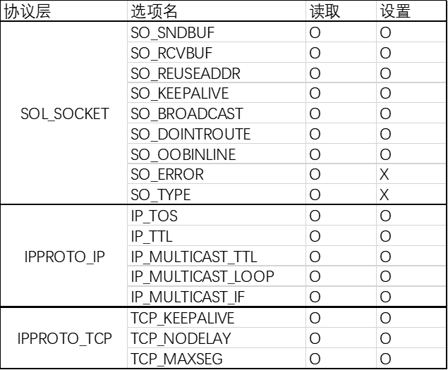
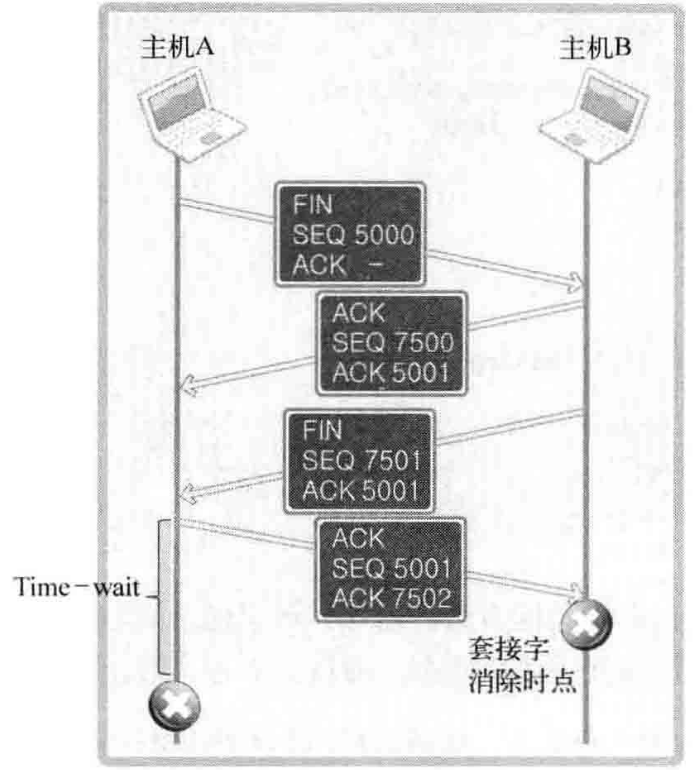
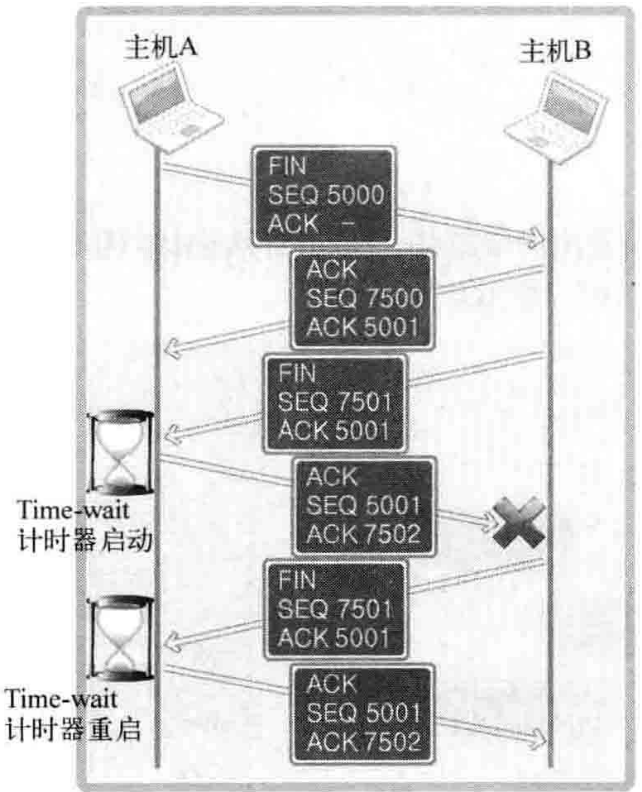

- # 套接字可选项和IO缓冲大小
	- 套接字有很多可选项，部分可选项如下表
	- 
	- 套接字可选项是**分层的**
	- ## 获取和设置可选项
		- 通过函数``getsockopt``获取可选项值
			- **头文件**：``<sys/socket.h>``
			- **参数**：``int sock, int level, int optname, void *optval, socklen_t *optlen``
				- level：协议层
			- **返回值**：成功返回0，否则-1
		- 通过函数``setsockopt``设置可选项
			- **参数**：``int sock, int level, int optname, const void* optval, socklen_t optlen``
			- **返回值：**成功0，否则-1
	- ## 输入输出缓冲
		- 通过参数SO_SNDBUF和SO_RCVBUF可以分别对输出和输入缓冲进行读写
		- 设置输入输出缓冲大小时，**[[$red]]==系统并不会完全按照给出的大小进行设置==**，调用设置函数对输入输出缓冲进行设置，实际上只是向系统给出了设置建议
- ##  SO_REUSEADDR
	- ## Time-wait状态
		- 套接字在经过四次握手之后并非立即消除，而是会**经过一段时间的time-waite状态**
		- {:height 264, :width 234}
		- 先发送FIN的一方都会进入time-wait状态，不论服务端和客户端
		- **处于time-wait状态种的端口仍然是被占用状态**，因此若立即重新绑定同一个端口会产生错误
		- ### time-wait状态的作用
			- 优先断开连接的一方最终需要ack对方的FIN帧，而这个ACK帧可能会丢失，对方收不到ACK帧便无法正常关闭连接
			- 因此流出一段时间(至少长于timeout时间)，便于在对方要求重传时重传ack帧
		- 处于time-wait状态的套接字，若收到了对方要求重传的帧，**则time-wait的等待时间会重置**
			- {:height 279, :width 218}
			  id:: 6450f8d6-0b67-410f-afa9-3f5ee1ab6cd5
		- ## 地址再分配
			- 如果服务器端出现了问题需要尽快重启，则time-wait会变成一个恼人的问题
			- **将套接字的SO_REUSEADDR设置为1**可以在服务器端发出FIN之后**不再进入time-wait状态**，而是可以将端口立即分配到其他套接字
- # TCP_NODELAY
	- ## Nagle算法
		- Naggle算法用于防止数据包过多而发生**网络过载**
		- 应用于TCP层
		- 若Naggle算法很简单，即：
			- **[[$red]]==只在收到前一帧的ACK后，发送下一帧==**
			- 在等待ACK的过程中，待发送数据进入缓冲，因此**Naggle算法可以减少需要发送的TCP包的总数**
		- TCP默认使用Naggle算法，最大限度进行缓冲
		- Naggle算法并不是在任何时候都是用
			- 例如在传输大文件时，输出缓冲可能很块就会满上，因此Naggle算法并不减少总包数，反而会让发送方白白等待ACK
		- ### 禁用Naggle算法
			- 将TCP_NODELAY置为1即可
- # 基于Windows的实现
	- 读写可选项的函数在linux和windows下没有区别，且本章介绍的可选项也是平台无关的