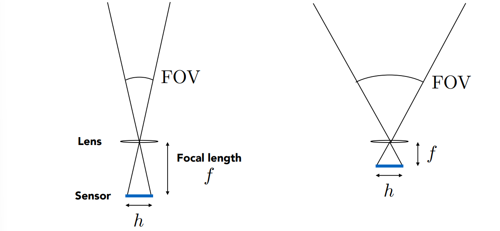
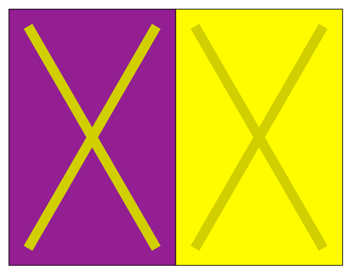

# 相机原理
	- 成像(Imaging) = 合成(Synthesis) + 捕捉(Capture)
		- 前者就是通过光栅化成像或光线追踪绘制出现实中不存在的东西
		- 后者就是照相
	- ## 小孔成像
		- 最基本的成像原理
		- {:height 222, :width 522}
		- 为什么没有小孔就不能获得清晰的成像？
			- {:height 259, :width 280}
			- 还是要回到辐射度量学中，因为传感器上每一个点收集到的是irradiance，而不是radiance，所以如果没有小孔做一定的过滤，传感器上任意一点对任何方向的光都全盘照收，结果就是整个画布一片白，也即过曝。
		- 之前提到的光线追踪模型实际上就是利用的小孔成像的原理，所以无法产生景深的虚化效果
	- ## 视场(Field of View)
		- 
		- 一般视场定义为一个角度，即$2\arctan(\frac{h}{2f})$
		- 对于给定的传感器大小$h$，焦距越小，视场越大，也就是所谓广角镜
		  collapsed:: true
			- 一般基于35mm胶卷，定义了一系列焦距和视场之间的关系
				- {:height 95, :width 221}
				- {:height 531, :width 205}
		- 对于给定的焦距，那么传感器越小，视场越小
			- {:height 265, :width 594}
			- 想获取相同的视场，小的传感器必须降低焦距
				- 
	- ## 曝光(Exposure)
		- $H = T\times E$
		- 曝光=时间 \times irradiance
			- 曝光时长(T)由快门控制
			- Irradiance(E)由镜头光圈和焦距(Focal Length)控制
		- ### 和曝光相关的，控制成像的三大因素
			- {:height 307, :width 502}
			- **光圈大小**(Aperture Size)
				- 由一个F-Stop(F-Number)来描述
					- 一般写作FN或F/N
						- 例如F32或F/32
					- 一个非正式的理解就是，N就是光圈直径的倒数
						- 所以N越大，光圈越小
				- 物理上通过打开或关闭光圈来控制
				- 一个作用是会控制进光量
					- {:height 299, :width 580}
					-
			- **快门速度**(Shutter Speed)
				- 改变传感器感光的时间
				- 感光时间越长或者说快门速度越慢，运动模糊越明显，
					- {:height 173, :width 499}
				- 由于机械快门的打开一定需要一定的时间，因此会造成Rolling Shutter现象
					- 
					- 图中飞机的螺旋桨被扭曲了，原因就是快门打开需要时间，同一张图中的不同部分其实是在不同时间被感光的
					- 这种现象一般出现在拍摄高速移动物体的情况
				- 快门速度如果变快，那么曝光的时间就会变短。回了获得相同的亮度，越快的快门速度需要越大的光圈或者感光度
					- 
				-
			- **ISO (gain)**(光感度)
				- 也叫增益
				- 胶片/传感器对于光的敏感程度
				- 实际操作中往往是在最后的感光数据上做一个线性的增强
				- 感光度越强整体照片看起来更亮，但是会出现一些副作用
					- 对于胶片来说，会出现颗粒
					- 对于数码传感器来说，会出现噪点
				- 是线性的，也就是说，ISO400就是比ISO200敏感一倍
				- {:height 337, :width 531}
	- ## 棱镜(Lens)
		- 我们一般认为棱镜能够把平行光全部集中到一个点，但实际上现实中的棱镜并不具备如此理想的性质
		- {:height 244, :width 427}
		- ### 理想薄棱镜(Ideal Thin Lens)
			- 满足三个性质
				- 所有进入棱镜的平行光都会比聚焦到焦点上
				- 所有穿过焦点进入棱镜的光离开棱镜之后都会变成平行光
				- 焦距可变(现实中也有棱镜能，不过是通过棱镜组做到)
			- **薄棱镜等式**
				- {:height 269, :width 451}
				- 穿过冷静中心的光不会被改变方向
				- $z_o$叫物距，也就是物体到棱镜的距离
				- $z_i$叫像距，也就是成像到冷静的距离
				- $f$是焦距
		- ### Defocus Blur
			- 即是进深/背景模糊的成因
			- **Circle of Confusion**
				- 在焦平面之后的物体，其成像在传感器之前，导致其光到达传感器之后已经发散，一个点会变成一个圆，这就是不在焦平面上的物体会模糊的原因
				- {:height 307, :width 494}
				- 其中，$C$的大小决定了物体的模糊程度，也就是CoC的直径越大，模糊程度越严重
				- 而$C$的大小和光圈大小成正比，因此光圈越大，模糊效果越明显
					- {:height 220, :width 559}
		- ### F-Stop(F-Number)
			- f数的正式定义是：**焦距和光圈直径的比例**
			- 常用的F数值：1.4，2，2.8，4.0，5.6，8，11，16，22，32
			- {:height 285, :width 437}
			- 想拍清楚就用更大F数的镜头
			- {:height 321, :width 461}
- # 光追中的理想薄棱镜
	- 模拟理想薄棱镜可以做出模糊效果
	- {:height 286, :width 634}
	- 设置棱镜所需的步骤：
		- 定好传感器大小，棱镜焦距和光圈大小
		- 定好物体到棱镜的距离z
			- 使用棱镜等式计算得到成像距离$z_i$
	- 算法主要是在投射光线时，多一部计算操作
		- {:height 342, :width 526}
- # 景深
	- 在哪个范围内的物体会被模糊，哪些范围内不模糊？
	- 实际上就是CoC足够小的范围内的物体不会模糊，之外的都会模糊
		- {:height 311, :width 450}
	- {:height 384, :width 616}
- # 光场(Light Field)
	- ## 全光函数(Plenoptic Function)
		- 记录了人在空间中某一点能看到的所有光的函数
		- 全光函数包含多个参数，每个参数的来历可以逐层理解
			- 如果只记录一个点能看到的所有无颜色的光，那么只需要两个参数，即方位角$\theta$和$\phi$
				- {:height 193, :width 367}
		- 追加记录颜色信息，需要知道光的波长$\lambda$，因为光的颜色其实和波长密切相关
			- {:height 253, :width 484}
		- 如果像记录一段时间内连续的信息，组成一段**电影(movie)**，那么需要增加时间($t$)参数
			- {:height 226, :width 442}
		- 如果像记录整个空间中每一个点，构成在空间上连续的全光函数，那么需要额外的位置参数的信息
			- {:height 243, :width 466}
			- 也被叫做全息电影(Holographic Movie)
	- ## 光场定义
		- ### 光线
			- {:height 101, :width 346}
			- 一个五维组合
				- 三维发射点
				- 二维方向
			- 实际上只用四维就能确定一条光线
- # 颜色
	- 一束光的一个突出性质就是其是由哪些波长的光组成的
	- 常用Spectral Power Distribution (SPD，谱功率密度)来描述
		- {:height 362, :width 387}
		- 不同的SPD会导致不同的颜色
	- SPD有一个很好的性质，即线性
		- {:height 298, :width 352}
	- ## 颜色的本质
		- 颜色并不是一种物体的物理性质，而是人的主观感知
		- ### 人眼对于颜色的感知
			- 人眼内有两种感观细胞，分别是**视杆细胞(Rod Cell)**和**视锥细胞(Cone Cell)**
				- 视杆细胞负责感受光的强度，视锥细胞负责感受光的波长，也就是负责颜色
			- 视锥细胞又分为三类，分别对不同波长的光更敏感
				- {:height 282, :width 377}
			- 然而视锥细胞最终感知到的也不是真正的波长，而是一个积分
				- {:height 216, :width 455}
			- 随意大脑最终收到的关于颜色的信息仅仅是三个关于波长的积分值
				- {:height 219, :width 598}
		- ### 同色异谱(Metamerism)
			- 基于上一小节所提到的人眼对于颜色的感知方式，很有可能出现明明光的光谱不同，但是最终人眼的感知结果相同，也就是说，光谱不同，但是最终积分得到的三个值，$S,M,L$相同
			- {:height 358, :width 395}
			- 基于这一现象，在实际模拟颜色时，不用完全复刻光谱，只需要调和得到的S,M,L三个数值相同即可
				- {:height 267, :width 444}
		- ### 颜色再生/匹配(Color Reproduction / Matching)
			- **加色系统(Additive)**
				- 将颜色相加得到要模拟的颜色
				- 首先需要指定一组原色光(Primary Lights)，每一种原色光都是一个关于波长的分布函数
					- 常用的RGB三原色，就可以看作三个分布函数$s_R(\lambda),s_G(\lambda),s_B(\lambda)$
				- 增减每一中原色光的亮度，并且把这些光积分起来相加就是最终的颜色
					- $Rs_R(\lambda)+Gs_G(\lambda)+Bs_B(\lambda)$
					- 其中，$R,G,B$就是每种原色光的亮度
				- 所以一个颜色最终可以通过$R,G,B$这三个数值来表示
			- **减色系统(Subtractive)**
				- 典型的是CMYK系统
	- ## 颜色空间
		- 常用的颜色空间为**sRGB(standardized RGB)**
		- ### 通用颜色空间：CIE XYZ
			- {:height 257, :width 355}
			- 使用三个匹配函数模拟所有可见光
			- 其中Y代表的是亮度
			- 这三个matching function并没有匹配的原色
			- 固定一个亮度Y，再做一个归一化得到x,y,z值，可以在二维平面上画出所有颜色
				- {:height 281, :width 422}
			- 这个颜色空间(色域，Gamut)包含了所有人眼可识别的颜色，其他的颜色空间都只是这个颜色空间的一个子集
				- {:height 324, :width 456}
		- ### HUV颜色空间
			- PS里会用到的一种颜色空间
		- ### CIE LAB颜色空间
			- {:height 171, :width 263}
			- L是亮度，a控制偏向红色还是绿色，b控制偏向蓝色还是黄色
		- 如此安排的原因是基于**互补色原理(Opponent Color Theory)**
			- 黑-白，红-绿，蓝-黄，均为互补色
		- ### 颜色是相对的
			- 由于颜色并不是物体的自身物理属性，人眼对于颜色的感知有相当的主观性
			- {:height 311, :width 428}
				- A，B的颜色是相同的
			- {:height 233, :width 281}
				- 左右X的颜色实现共同的
		-