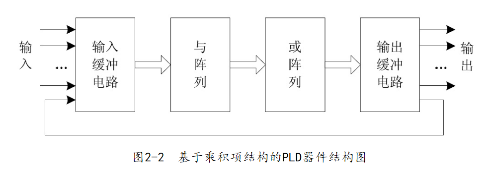

- # PLD
  collapsed:: true
	- **Programmable Logic Device**
	- FPGA是PLD的一种
	- 包括：
		- PLA: Programmable Logic Array
		- PAL: Programmable Array Logic
		- GAL: Generic Array Logic
		- PROM: Programmable Read-Only Memory
		- EPLD: Erasable PLD
		- CPLD: Complex PLD
		- FPGA: Field Programmable Gate Array
	- **分为两种类型**
		- 基于**乘积项（Product-Term）**
			- 任何组合逻辑电路函数均可化为析取范式
			- 因此该实现基于与阵列和或阵列实现
			- {:height 141, :width 438}
			- PROM、PLA、PAL、GAL、EPLD和绝大部分CPLD器件都是采用乘积项（Product-Term）结构的PLD
			- 这类器件多采用EEPROM或Flash工艺制作，掉电后不会丢失配置数据
			- 器件规模一般**小于5000门**
		- 基于**查找表（Look-Up Table，LUT）**
			- 函数值放在SRAM中
			- 不同的输入通过MUX找到对应的函数值并输出
			- N个输入项的逻辑函数可以由一个$2^N$ 位容量的SRAM实现
			- {:height 213, :width 448}
			- 绝大多数FPGA器件都是基于SRAM查找表结构实现的
			- 特点是集成度高（可实现百万逻辑门以上设计规模）、逻辑功能强
			- [[$red]]==掉电后会丢失配置数据==
- # 基于PLD的设计流程
  collapsed:: true
	- {:height 277, :width 325}
	- ## 设计输入
		- 将所设计的电路以某种方式表达出来
		- **常用方法：**
			- 原理图
				- 使用元件符号和连线来描述设计
				- 直观，适合描述连接关系和接口关系
				- 描述逻辑功能则**比较烦琐**
				- 需要设计工具提供必要的**元件库**或**逻辑宏单元**
				- 可**重用性**、**可移植性**[[$red]]==差==
			- HDL文本
				- **Hardware Description Language**
				- 可以进行各个层次的逻辑设计
					- 算法级（Algorithm Levels）
					- 寄存器传输级（RTL）
					- 门级（Gate Levels）
				- 可以进行仿真验证、时序分析等
	- ## 综合
		- **Synthesis**
		- 将较高级抽象层次的设计描述[[$blue]]==自动转化为较低层次描述==的过程
		- 三种形式
			- 将算法表示、行为描述转换到寄存器传输级（RTL），即从行为描述到结构描述。
			- 将RTL级描述转换到逻辑门级，称为逻辑综合。
			- 将逻辑门表示转换到PLD器件的配置网表表示，有了配置网表就可完成基于PLD器件的系统实现。
	- ## 布局布线
		- 将综合生成的电路网表映射到具体的目标PLD器件，并[[$red]]==产生最终可下载文件==的过程
		- **布局**：
			- 将已分割的逻辑小块放到PLD器件内部逻辑资源的具体位置，并使它们易于连线
		- **布线**
			- 利用PLD器件的布线资源完成各功能块之间、反馈信号之间的连接
		- 布局布线完成之后生成的重要文件
			- 芯片资源耗用的情况报告
			- 延时网表结构
				- 便于进行精确的时序仿真，能比较精确地预测未来芯片的实际性能。
			- 器件编程文件
				- 用于CPLD编程的JEDEC、POF等格式的文件
				- 用于FPGA配置的SOF、JAM、BIT等格式的文件
	- ## 下载
		- 把布局布线过程中产生的器件**[[$red]]==编程文件放入PLD==**的过程
		- 对CPLD器件的下载称为**编程**
		- 对FPGA器件的下载称为**配置（Configuration）**
		- 下载后，PLD内部的与或门（对FPGA而言就是查找表）会按照编程文件的要求变化，从而实现了设计的电路
	- ## 仿真
		- **Simulation**
		- 包括
			- 功能仿真，前仿真
				- 不考虑信号时延等因素
			- 时序仿真，后仿真
				- 选择具体器件并完成布局布线后进行的包含时延的仿真
			-
	- ## 本书使用工具
		- 设计输入工具：UltraEdit
		- 仿真工具：ModelSim
		- 集成工具：QuarrtusII
			- 选择该集成工具是因为该工具为FPGA芯片厂商Altera提供的，一般应该选择芯片厂商提供的集成工具
- # Verilog 简介
	- ## 模块
		- {:height 278, :width 291}
		- ### 模块声明
			- 模块声明包括模块名字，以及输入、输出端口列表
			- ``module 模块名(端口1, 端口2, 端口3…);``
		- ### 端口定义
			- 明确说明模块端口的方向（输入、输出、双向等）
			- ```
			  input   端口1, 端口2, 端口3 …;         // 输入端口
			  output  端口1, 端口2, 端口3 …;         // 输出端口
			  inout   端口1, 端口2, 端口3 …;         // 双向端口
			  ```
		- ### 数据类型说明
			- 对模块中所有用到的信号（包括端口信号、节点信号等）都必须进行数据类型的定义
			- 对于端口：
				- 可以将数据类型说明与端口定义放在一条语句中完成
				- ```
				  module add32(in1, in2, out);
				      
				        input  wire[31:0] in1, in2;    // 将端口定义与类型说明放在一条语句中
				        output wire[31:0] out;
				      
				        assign out = in1 + in2;
				      
				  endmodule
				  ```
				- 还可以将端口定义、数据类型说明都放在模块声明中，而不再放在模块内部
					- ```
					  module add32(input  wire[31:0]  in1, 
					                 input  wire[31:0]  in2,
					                 output wire[31:0]  out); 
					      
					        assign out = in1 + in2;
					      
					  endmodule
					  ```
			- ### 逻辑功能描述
				- 模块最核心的部分
				- 三种描述和定义逻辑的常用方式
					- 用assign持续赋值语句定义
					- 用always过程块定义
					- 调用元件（也称为元件例化）
	- ## 基本要素
		- ### 常量
			- **整数**
				- {:height 145, :width 361}
				- 如果没有明确指明位宽，默认32位
				- 如果没有明确指明进制，默认为十进制数
				- 进制和单引号必须同时出现，若不指定位宽，可以表示为：```d20``
				- 符号在最前面，即位宽之前
				- 可以插入下划线，用于分割较长的数字
			- **实数**
				- 参照标准：IEEE754-1985
				- 仅用于电路仿真
				- 使用十进制表示或科学计数法
					- `1.0`
					- `123e-5`
			- **字符串**
				- 用双引号括起来
				- 用8位表示一个ASCII字符
		- ### 变量
			- 数据类型、变量名是必要的
			- 省略符号和位宽，则根据数据类型设置为默认值
			- 省略元素数，则默认元素数为1
			- {:height 178, :width 450}
			- **两种变量类型**
				- **net类型**
					- 相当于硬件电路中各种物理连接
					- 输出的值紧跟输入值的变化而变化，没有储存值的功能
					- {:height 231, :width 491}
					- [[$red]]==上拉==：当开关打开时（z）稳定到高电平，当开关闭合时读到低电平
					- [[$red]]==下拉==：当开关打开时（z）稳定到低电平，当开关闭合时读到高电平
					- 模块中的输入、输出信号在没有明确指定数据类型时，都被[[$blue]]==默认为wire型==
					- wire型信号可以用作**任何表达式的输入**，也可以用作**assign语句和实例元件的输出**
					- wire型的取值可为0, 1, x, z，未被赋值时默认为高阻态
				- **variable**
					- 可以保存上次写入数据
					- 一般对应硬件上的一个触发器或锁存器等存储元件
						- 综合的时候，会根据其被赋值的情况来具体确定是映射成连线还是映射为存储元件
					- {:height 143, :width 513}
					- 必须在过程语句（initial或always）中实现赋值，这种赋值方式称为**过程赋值**
		- ### 向量
		  collapsed:: true
			- 如果定义了位宽不为1即为一个向量
				- 格式：`[MSB : LSB]`
				- 例子：
					- ```
					  wire [3:0]  bus;     // 4位的wire型向量bus，其中bus[3]是最高位，bus[0]是最低位
					  reg  [31:5] ra;      // 27位的reg型向量ra，其中ra[31]是最高位，ra[5]是最低位
					  reg  [0:7]  rc;      // 8位的reg型向量rc，其中rc[0]是最高位，rc[7]是最低位
					  ```
				- 两种向量
					- vectored：packed，位访问和部分位访问被禁止，只能进行整体操作
					- scalered：unpacked，可以位选择（bit-select）和域选择（part-select），可以对位进行操作
						- ```
						  A = rega[6];         // 位选择，将向量rega的其中一位赋值给变量A
						  B = rega[5:2];       // 域选择，将向量rega的第5、4、3、2位赋值给变量B
						  ```
					- 不指明则默认为标量类
					- 可以定义多维向量(**实际上可以理解为向量数组**)
						- ``reg [31:0] mem[63:0];``
						- 数组方括号中的索引可以通过任意顺序给出
		- ### 运算符
		  collapsed:: true
			- {:height 864, :width 429}
			- **=\=和===**
				- ==：参与比较的两个操作数必须逐位相等，其结果才为1，如果某些值是不定态X或高阻态Z，那么得到的结果是不定值X
				- ===：对参与运算的操作数中为不定态X或高阻态Z的位也进行比较，两个操作数必须完全一致，其结果才为1，否则结果为0
				- ```
				  reg [4:0] a = 5'b11x01; //结果为X
				  reg [4:0] b = 5'b11x01; //结果为1
				  ```
			- **缩位运算符**
				- 对单个操作数进行与、或、异或的递推运算
				- 放在操作数的前面，能够将一个向量减为一个标量
				- ```
				  reg [3:0] a;
				  b = &a;                 // 等效于b = ((a[0] & a[1]) & a[2]) & a[3]
				  ```
			- **位拼接运算符**
				- 将两个或多个信号的某些位拼接起来
				- ``{比特序列0, 比特序列1,…… }``
				- ```
				  input  [3:0] ina,inb;             // 加法输入
				  output [3:0] sum;                 // 加法的和
				  output cout;                      // 进位
				  assign {cout, sum} = ina + inb;   // 将和与进位拼接在一起
				  ```
				- 位拼接还可以**指定重复次数**
					- ``{重复次数{被重复数据}}``
					- ```
					  //将Data的符号位进行扩展,s_data = {Data[7],Data[7],Data[7],Data[7],Data}
					  wire [7:0]  Data;
					  wire [11:0] s_data;
					  s_data = {{4{Data[7]}},Data};
					  ```
			- **位运算的优先级**
				- {:height 279, :width 382}
	- ## 行为语句
		- ### 过程语句
			- 包括两种过程语句，initial和always
			- initial常用于仿真中的初始化，其中的语句**只执行一次**，是**[[$red]]==不可综合的==**
			- always中语句则是**不断重复执行**的，是**[[$red]]==可综合的==**
			- #### always过程语句
				- {:height 191, :width 277}
				- 句通常**带有触发条件**
					- 触发条件写在敏感信号表达式中，又称为事件表达式或敏感信号列表
					- 该表达式中变量的值改变时，会引发其中语句序列的执行
					- **[[$red]]==敏感信号表达式中应列出影响块内取值的所有信号==**
				- **敏感信号表达式格式**
					- 两个或两个以上的敏感信号时，[[$blue]]==使用“or”连接==
					- ```
					  module add32(input  wire[31:0]  in1, 
					                 input  wire[31:0]  in2,
					                 output reg[31:0]  out);
					  
					    always @ (in1 or in2)           //使用always过程语句实现加法
					        begin
					          out = in1 + in2;
					        end
					      
					  endmodule
					  ```
					- 多个敏感信号[[$blue]]==也可以使用逗号隔开==
					- ```
					  module add32(input  wire[31:0]  in1, 
					               input  wire[31:0]  in2,
					               output reg[31:0]  out);
					       
					    always @ (in1, in2)           //多个敏感信号使用逗号分隔
					        begin
					          out = in1 + in2;
					        end
					      
					  endmodule
					  ```
					- 敏感信号列表[[$blue]]==也可以使用通配符“*”==，表示过程语句中的所有输入信号变量
					- ```
					  module add32(input  wire[31:0]  in1, 
					               input  wire[31:0]  in2,
					               output reg[31:0]  out);
					       
					    always @ (*)           //多个敏感信号使用逗号分隔
					        begin
					          out = in1 + in2;
					        end
					      
					  endmodule
					  ```
				- **组合电路与时序电路**
					- 敏感信号分为两类
						- [[$blue]]==电平敏感性==
							- 一般对应组合电路，如上面加法器的例子
						- [[$blue]]==边沿敏感==
							- 一般对应时序电路
					- 时序电路的敏感信号通常是时钟信号
						- 两个用于**描述时钟信号的关键字**
							- [[$blue]]==posedge==，表示以时钟信号的上升沿作为触发条件
							- [[$blue]]==negedge==，表示以时钟信号的下降沿作为触发条件
					- ```
					  module add32(input  wire[31:0]  in1, 
					               input  wire[31:0]  in2,
					               input wire clk, 		//新增时钟信号
					               output reg[31:0]  out);
					       
					    always @ (posedge clk)           //时钟信号上升沿会出发always中的语句
					        begin
					          out = in1 + in2;
					        end
					      
					  endmodule
					  ```
					- 上面的加法器并不会在in1和in2变化的瞬间就改变输出，而是会等待时钟信号的上升沿才更新输出值
				-
			- #### initial过程语句
			  collapsed:: true
				- {:height 208, :width 234}
				- 不带触发条件
				- 语句序列**只执行一次**
				- 通常用于仿真模块中[[$red]]==对激励向量的描述==，或[[$red]]==用于给寄存器赋初值==
				- 面向模拟仿真的过程语句，**通常不能被综合**
				- 一个用于给储存器赋初值的例子
				  collapsed:: true
					- ```
					  initial
					    begin
					      for(addr = 0; addr < size; addr = addr+1) 
					       mem[addr] = 0;
					    end
					  ```
				-
		- ### 赋值语句
		  collapsed:: true
			- #### 持续赋值语句
			  collapsed:: true
				- 关键字：[[$blue]]==assign==
				- 主要用于对wire型变量的赋值
				- 左侧只能是net变量，不能是寄存器类型
				- 实际功能类似于always过程语句，当右侧表达式的操作数有事件发生（值的变化）时，立即重新计算值并赋值给左侧
			- #### 过程赋值语句
			  collapsed:: true
				- [[$blue]]==在always、initial过程中的==赋值语句
				- 多用于对reg型变量进行赋值
				- 分为[[$blue]]==非阻塞赋值==和[[$blue]]==阻塞赋值==两种方式。
				- **非阻塞赋值（Non-Blocking）**
				  collapsed:: true
					- 赋值符号为“<=”
					- ``b <= a``
					- 非阻塞赋值在整个过程语句结束时才会完成赋值操作（因为所有该语句块中的赋值操作[[$blue]]==都是同时进行的==，所以可以假定当整个语句块执行完毕之后，某一条非阻塞赋值才完成对于相关变量的赋值），即b的值[[$red]]==并不是立刻改变的==。
					- 可以理解为赋值语句[[$blue]]==并发执行==
				- **阻塞赋值（Blocking）**
				  collapsed:: true
					- 赋值符号为“=”
					- ``b = a``
					- [[$blue]]==顺序执行==，即下一条语句执行前，当前语句一定会执行完毕，因此可以看作[[$blue]]==该语句结束时就立即完成赋值操作==
					- 一个语句块中有多条阻塞赋值语句，那么在前面的赋值语句没有完成之前，[[$blue]]==后面的语句就不能被执行==
					- 
				- **对于阻塞赋值和非阻塞赋值的一些思考**
					- 一般来说，建议：
						- 在[[$blue]]==always时序逻辑块==中使用[[$blue]]==非阻塞==赋值
							- 为了[[$red]]==避免数据竞争==
							- ```
							  always @(posedge clk) begin
							      a = b ;
							  end
							   
							  always @(posedge clk) begin
							      b = a;
							  end
							  ```
							- 上述示例希望交换两个寄存器的值，但是因为使用阻塞赋值，两个语句之间总有一个执行顺序，最终的结果就是 不论以任何顺序执行，最后都会变成两个寄存器的值为同一值
							- 如果使用非阻塞赋值则可以达成目标
							- 使用阻塞赋值也能够达成目标，但是比较麻烦，如下
							- ```
							  always @(posedge clk) begin
							      temp    = a ;
							      a       = b ;
							      b       = temp ;
							  end
							  ```
						- 在[[$blue]]==always组合逻辑块==中使用[[$blue]]==阻塞==赋值
						- 在[[$blue]]==initial块==中使用[[$blue]]==阻塞==赋值
					- 不建议在某一块中混用阻塞和非阻塞赋值，容易产生意料之外的结果
					-
					-
					-
			- #### 赋值常数时位数不匹配的问题
				- **常数过长截断**
					- 无论左操作数、右操作数是有符号数还是无符号数，都是[[$blue]]==直接截断高位==
				- **常数过短扩展**
					- 短位宽赋值给长位宽的情况，需要对高位进行位扩展
					- [[$red]]==右操作数是无符号数==，则无论左操作数是什么类型，高位都扩展成0；
					- [[$red]]==右操作数是有符号数==，按右操作数的符号位扩展左操作数
			- #### 变量赋值时位宽不匹配问题
				- 和常量相同相同
				- **[[$red]]==注意==**：wire 和 reg没有用signed关键字描述时，均视为无符号数
		- ### 条件语句
			- #### if-else语句
				- 格式如下：
					- ```
					  (1) if(表达式)                语句序列1;             // 非完整性IF语句
					      
					  (2) if(表达式)                语句序列1;              // 二重选择的IF语句
					      else                       语句序列2;
					      
					  (3) if(表达式1)               语句序列1;             // 多重选择的IF语句
					      else if(表达式2)          语句序列2;
					      else if(表达式3)          语句序列3;
					        ......
					      else if(表达式n)          语句序列n;
					      else                        语句序列n+1;
					  ```
				- **表达式的构成**
					- 辑表达式
					- 关系表达式
					- 1位变量
				- **表达式的真假处理**
					- 0、X、Z按[[$red]]==假==处理
					- 1按[[$blue]]==真==处理
				- 语句如果有多句，需要用**begin-end语句块包起来**
				- 例：
					- ```
					  module add32(input wire        rst,       // 增加了一个复位信号
					               input wire[31:0]  in1, 
					               input wire[31:0]  in2,
					               output reg[31:0] out);
					       
					    always @ (*)
					      begin
					      	if(rst == 1) out <= 32'h0;
					          else out <= in1 + in2;
					      end
					      
					  endmodule
					  ```
				- 在组合逻辑中的if语句应该要有else语句，且不能在某一分支中将需要被赋值的变量赋予其自身的值。这样做是为了避免产生latch，case语句同理
			- #### case语句
				- 多用于**多条件译码电路**，如
					- 译码器
					- 数据选择器
					- 状态机
					- 微处理器的指令译码**等**
				- 格式：
					- ```
					  case(敏感表达式)
					    值1: 语句序列1;
					    值2: 语句序列2;
					    ......
					    值n: 语句序列n;
					    default: 语句序列n+1;
					  endcase
					  ```
					- 敏感表达式与值1～n之间的比较是一种全等比较，必须保证两者的对应位全等
				- **casez**
					- 如果比较的双方某些位的值为高阻Z，那么对这些位的比较结果就不予考虑，只需考虑其他位的比较结果。
				- **casex**
					- 如果比较的双方某些位的值为Z或X，那么对这些位的比较结果就不予考虑，只需考虑其他位的比较结果
				- 也可以用?表示无关值
					- ```
					  case(a)
					    2'b1x : out <= 1;    //只有a等于2'b1x时，out才等于1
					      
					  casez(a)
					    2'b1x : out <= 1;    //a等于2'b1x、2'b1z时，out等于1
					      
					  casex(a)
					    2'b1x : out <= 1;    //a等于2'b10、2'b11、2'b1x、2'b1z时，out等于1
					      
					  case(a)
					    2'b1? : out <= 1;    //a等于2'b10、2'b11、2'b1x、2'b1z时，out等于1
					  ```
				-
		- ### 循环语句
		  collapsed:: true
			- #### for语句
			  collapsed:: true
				- 格式与c的for语句相同
				- 例：
					- ```
					  module vote7(vote, pass);
					      
					    input  wire[7:1] vote;
					    output reg       pass;
					    reg[2:0]         sum;
					    integer          i;
					      
					    always @ (vote)
					      begin
					       sum = 0;
					       for(i=1; i<7; i=i+1)
					        if(vote[i])
					        sum = sum+1;     //如果vote[i]为1，那么sum加1，注意此处使用阻塞赋值
					       if(sum[2] == 1'b1)  //如果sum大于等于4，那么输出pass为1
					       pass = 1;
					       else
					       pass = 0;
					    end
					      
					  endmodule
					  ```
				- 若语句不止一句，则用begin，end包裹
			- #### forever语句
			  collapsed:: true
				- ```
				  forever begin
				   
				      语句序列
				      
				  end
				  ```
				- 连续不断地执行其中的语句序列
				- 常用来产生周期性的波形
			- #### repeat语句
			  collapsed:: true
				- ```
				  repeat(循环次数表达式) begin
				   
				      语句序列
				      
				  end
				  ```
			- #### while语句
			  collapsed:: true
				- ```
				  while(循环执行条件表达式) begin
				   
				      语句序列
				      
				  end
				  ```
				- 执行时，首先判断循环执行条件表达式是否为真，若为真，则执行其中的语句序列
				- 如此反复，直到循环执行条件表达式不为真为止
			-
		- ### 编译指示语句
			- **Compiler Directives**
			- 编译时，通常先对这些[[$blue]]==指示语句进行预处理==，然预处理的结果[[$blue]]==和源程序一起编译==
			- 编译语句以`` ` ``开始
			- #### 宏替换`define
				- 用一个简单的名字或有意义的标识（也称为宏名）代替一个复杂的名字或变量
				- 格式：`` `define 宏名 变量或名字 ``
				- 使用定义好的宏时需要在宏名前加`` ` ``
			- #### `incIude语句
				- 将一个文件全部包含到另一个文件中
				- `` `include "文件名" ``
				- 使用举例：
					- 所有宏的定义放在一个文件中，需要使用这些宏时使用include语句即可
			- #### 条件编译语句`ifdef、`eIse、`endif
			  collapsed:: true
				- **使用情景1**：
					- 当指定的宏在程序中**已定义**，那么其中的语句序列**参与源文件的编译**，否则，其中的语句序列不参与源文件的编译
					- ```
					  `ifdef 宏名
					      
					     语句序列
					      
					   `endif
					  ```
				- **使用情景2**：
					- 当指定的宏在程序中已定义，那么其中的语句序列1参与源文件的编译，**否则**，其中的**语句序列2参与源文件的编译**。
					- ```
					  `ifdef 宏名
					      
					     语句序列1
					      
					  `else
					      
					     语句序列2
					      
					  `endif
					  ```
					-
		- ### 行为语句的可综合性
			- 不是所有的行为语句都能够被综合，但是都能用于仿真
			- {:height 351, :width 356}
			-
- # 电路设计举例
  collapsed:: true
	- ## 元件例化
		- **[[$blue]]==调用功能单元的过程==**
		- {:height 240, :width 374}
	- ## Testbench
		- ### 系统函数
			- **$stop**
				- 暂停仿真
				- ```
				  $stop();          // 使用格式一，不带参数
				  $stop(n);         // 使用格式二，带参数n，n可以等于0、1、2等值，含义如下：
				                    // 0:不输出任何信息；
				                    // 1：给出仿真时间和位置
				                    // 2：给出仿真时间和位置，还有其他一些运行统计数据
				  ```
			- **$readmemh**
				- 从外部文件中读取数据并放入存储器中
				- ``$readmemh("数据文件名", 存储对象);``
				- 例子：
					- ```
					  reg[31:0]  rom[63:0];
					      
					  initial $readmemh ( "rom.data", rom );  // 读入文件rom.data的数据到rom中
					  ```
		- ## 测试编写
			- {:height 277, :width 456}
			- Test Bench只有模块名，没有端口列表
			- [[$blue]]==**激励信号**==（输入到待测试模块的信号）必须定义为reg类型，以**保持信号值**
			- 输出的信号（用户观察的信号）必须定义为wire类型
			- 在Test Bench中要调用被测试模块，即要实例化被测模块
			- 一般会使用initial、always过程块来定义、描述激励信号
			- 
		-
		-
- # 补充：时序逻辑电路的一些优化方法
	- ## 关键路径
		- 在时序逻辑电路中，组合逻辑时延最大的路径
		- 关键路径是对设计性能起决定性影响的时序路径
		-