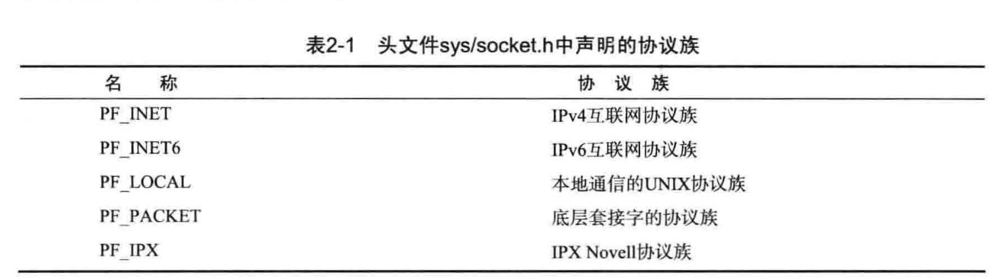
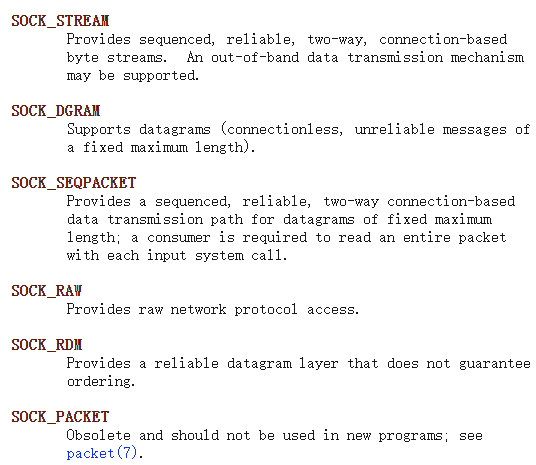
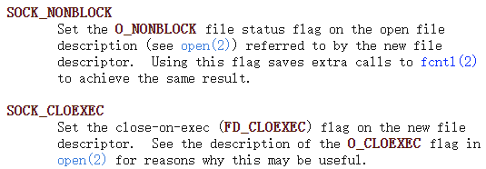

- # 套接字协议及数据传输特性
	- [[$red]]==个人理解==：协议族是选择网络成协议，套接字类型选择是传输层协议
	- ## 协议族(Protocol Family)
		- 创建socket时调用的socket函数的**第一个参数``domain``**，代表的是所使用的协议族，包含以下常用协议族
			- 
		- 在linux kernel中定义的所有协议族包括：
			- 
		- **[[$red]]==注意==**，根据BSD手册， AF_XX和PF_XX具有完全相同的值，因此可以混用，不过一般PF用于**协议族**，AF用于**地址族**
	- ## 套接字类型(Type)
		- socket函数的第**第二个参数``type``**，相同的协议族也有可能又不同的传输方式，标准库中定义的类型有：
			- 
			- 在linux2.6.27之后，类型可以和以下值进行或操作传入以修改socket的行为
				- 
		- ### SOCK_STREAM
			- 面向连接(TCP)，可靠的双向数据流
			- 收发数据的套接字内部都有缓存，因此write函数和read函数调用的次数无意义，即数据不存在边界
			- 即使缓存满了也不会发生数据丢失，当发送缓存被占满时发送方会停止发送数据(TCP协议的内容)
		- ### SOCKET_DGRAM
			- 数据报(UDP)，不可靠，无顺序
			- 发送发发送几次接收方 就需要接受几次，即数据有边界
			- 速度很快，无状态，不存在连接(状态机)
	- ##  协议(protocol)
		- socket**第三个参数protocol**将最终决定协议。
		- 大多数情况下，前两个参数已经唯一确定了可以采用的协议，因此此**参数传递进0即可**，但是在某些情况下前两个参数可能无法唯一确定一种协议，因此需要第三个参数予以确定
		- ### 常用的两种套接字
			- **IPv4协议族中面向连接的套接字**
				- 使用IP协议，数据流传输
				- ``int tcp_socket = socket(PF_INET,SOCK_STREAM,IPPROTO_TCP)``
				- 由于满足前两个参数的具体协议只有TCP，因此第三个参数可以直接给0
				- ``int tcp_socket=socket(PF_INET,SOCK_STREAM,0)``
				- 此种类型的套接字俗称**TCP套接字**
			- **IPv4协议族中面向消息的套接字**
				- 使用IP协议，数据报传输
				- ``int udp_socket = socekt(PF_INET, SOCKET_DGRAM, OPPROTO_UDP)``
				- 由于满足前两个参数的具体协议只有UDP，因此第三个参数可以置零
				- ``int udp_socket=socket(PF_INET,SOCK_DGRAM,0)``
				- 此种类型的套接字俗称**UDP套接字**
			-