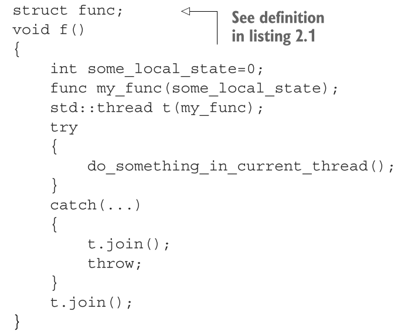

- 包括如何启动，等待线程，传递参数，已交线程所有权等
- # 线程基本操作
	- 每个程序至少有一个主线程用于执行main函数
	- 创建的线程和主线程一起执行
	- ## 启动线程
		- 简单来说，C++线程库启动线程就是构造``std::thread``对象
		- 构造thread对象一般需要传入一个执行**函数**，也可以传入一个实现了**函数操作符**的**class**
		- ```
		  class background_task {
		  public:
		  	void operator()() const {
		  		do_something(); 
		          do_something_else();
		  	} 
		  };
		  background_task f; 
		  std::thread my_thread(f);
		  ```
		- 提供的函数对象会被复制到新线程的存储空间中，函数对象的执行和调用都在线程的内存空间中进行
		- 若传入临时变量会导致编译器误以为你要声明一个返回对象为thread的函数，可以采取以下两种方式来避免
			- ```
			  std::thread my_thread((background_task())); // 1 
			  std::thread my_thread{background_task()}; // 2
			  ```
		- 也可以使用lambda表达式定义一个函数对象
		- 线程启动之后必须要在**等待其结束**或**让其自主运行**之间**做出决定**
			- 如果在thread对象被销毁之前还没有做出决定，程序会终止(thread的析构函数会调用`std::terminate()`)
			- 即便是存在异常，也要确保线程在``join``和``detach``两个操作之间二选一
		- ### 确保线程生命周期内访问数据的有效性
			- ```
			  struct func {
			  	int& i; 
			  	func(int& i_) : i(i_) {} 
			  	void operator() () {
			  		for (unsigned j=0 ; j<1000000 ; ++j) {
			  			do_something(i); 
			          } 
			      } 
			  };
			  void oops() {
			  	int some_local_state=0; 
			  	func my_func(some_local_state); 
			  	std::thread my_thread(my_func); 
			  	my_thread.detach();// 1 潜在访问隐患：空引用 // 2 不等待线程结束 
			  } // 3 新线程可能还在运行
			  ```
			- 上述例子在运行过程中很有可能出现问题，因为若oops函数已经返回，则新线程就会访问无效的地址
			- **避免用引用了局部变量的函数去创建线程**
			- 也可以通过join函数确保线程在oops函数返回之前结束
	- ## 等待线程结束
		- 调用对应线程的``join``函数完成，同时清理线程相关内存
		- 已经join过的thread对象不再和一个实际的线程有任何关联，此时调用``joinable()``返回false
	- ## 出现异常情况的等待
		- 若线程在join之前产生异常，则会直接抛出，跳过join
		- 因此为了避免抛出异常导致程序不正常结束，导致的生命周期问题，无异常情况下要调用join，异常处理中也要调用join
		- 以下代码试图通过try catch捕捉异常
			- {:height 308, :width 364}
			- 但是这种写法笨拙难写
		- 一个简单的，确保一个线程无论是在正常还是出现异常的情况下都会被join的方法是**RAII**(Resource Acquisition Is Initialization)，构造一个包裹现成的类，并在析构函数中调用join
			- 简单地说**RAII**就是**资源的有效期与持有资源对象[[$red]]==严格绑定==**，常用的手法是**构造函数完成资源分配(获取)，析构函数完成资源释放**
	- ## 后台运行线程
		- 使用``thread.detach``函数可以让thread对象在后台运行
		- 被detach的thread对象**无法和其直接通信**，也无法**再等待其执行结束**，因为已经无法再获取一个指向它的thread对象
		- 被detached的对象所有权和控制权交给了C++运行时库
		- 被detached线程也叫**守护线程**(daemon thread)
			- 与之类似的概念是UNIX中在后台运行的**守护进程**(daemon process)，其没有任何显式的用户接口
			- 守护线程的生命周期和整个应用保持一致，可以完成一些诸如监视文件系统的工作
		- 一个没有执行实际任务的线程是无法detach的，因此在detach之前可以使用``joinable``判断是否可以detach
- # 向线程函数传递参数
	- 如前所述，可以直接在thread的构造器中传入参数
		- 但是这种方法实际上是把参数复制到了新线程的内存空间中，然后将这些值作为右值(也就是临时变量)传递给线程函数，即使线程函数的形参中使用的是引用，**复制仍然会发生**
		- 在传入指针的时候尤其要注意：
			- ```
			  void f(int i,std::string const& s); 
			  void oops(int some_param) {
			  	char buffer[1024]; 
			      sprintf(buffer, "%i",some_param);
			  	std::thread t(f,3,buffer); 
			      t.detach();
			  }
			  ```
			- 上述代码传入了一个指针，虽然在实际运行时，该指针最终会被隐式转换为一个string对象传入函数f，但是很有可能函数会在隐式转换完成之前就退出，导致指针buffer不再有效。
			- 解决方法就是显式调用拷贝构造函数
			- ```
			  void f(int i,std::string const& s); 
			  void oops(int some_param) {
			  	char buffer[1024]; 
			      sprintf(buffer, "%i",some_param);
			  	std::thread t(f,3,std::string(buffer)); 
			      t.detach();
			  }
			  ```
		- 同理，由于一定会先复制再作为右值传入，因此如果线程函数本身的形参为引用，也无法实际将变量作为引用传进去。解决方法类似于std::bind的情况，使用std::ref包裹变量名
			- ```
			  void update_data_for_widget(widget_id w,widget_data& data); 
			  void oops_again(widget_id w) {
			  	widget_data data;
			  	std::thread t(update_data_for_widget,w,std::ref(data));
			      display_status(); 
			      t.join();
			  	process_widget_data(data); 
			  }
			  ```
		- 绑定类成员函数必须要要把一个对象指针也作为参数传入，绑定格式类似std::bind绑定类成员函数
		- 对于仅可移动，不可拷贝赋值的对象，在启动thread传参时需要使用``std::move``转移所有权，如``unique_ptr``对象
		-