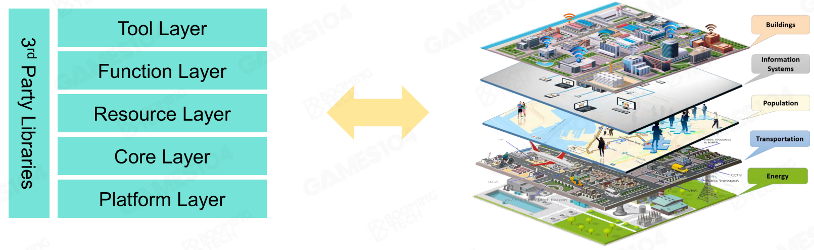
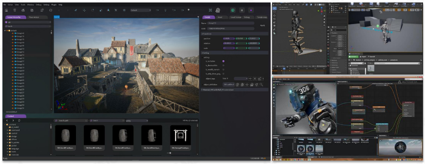
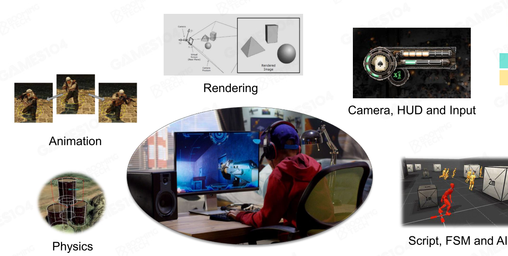
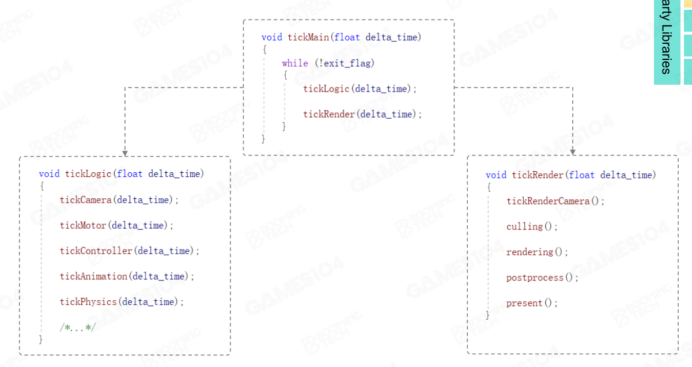
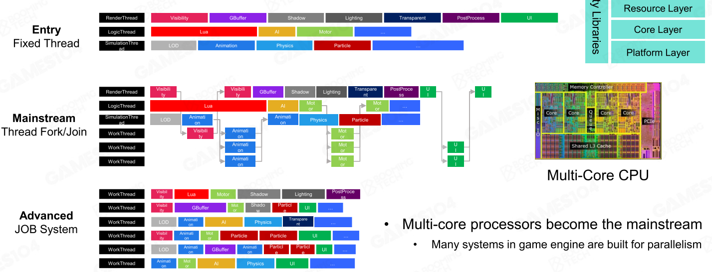
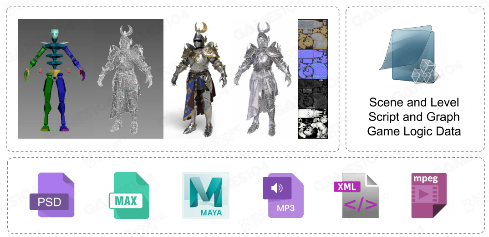
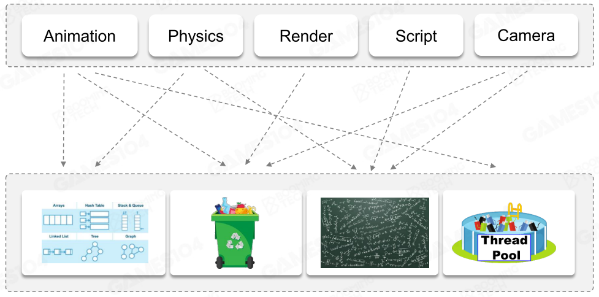
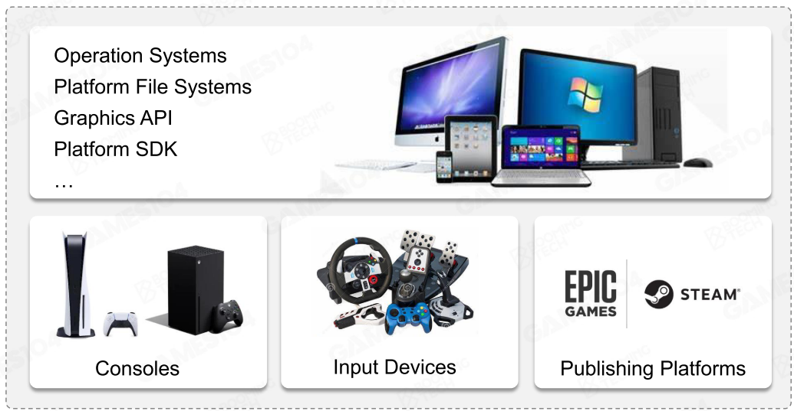

- 本课程认为游戏引擎可以被分为**[[$red]]==六层==**：
	- {:height 240, :width 759}
	- ## 工具层(Tool Layer)
		- 
		- 是游戏制作者对于游戏引擎最直接的印象
		- 在制作者看来，可能就是一系列编辑器，以地图编辑器为核心
		- 将引擎可用的功能通过可视化或接口的方式暴露出来，供游戏制作者使用
	- ## 功能层(Function Layer)
		- 实际的功能实现层，负责完成对于游戏中各种功能的支持，包括动画，物理，渲染等
		- {:height 294, :width 571}
		- 游戏世界是如何运作的？
			- 在每一个tic时间种去完成一系列的状态更新
				- 包括逻辑，输入，相机，渲染，动画，物理，网络等
			- {:height 257, :width 473}
			- 几乎所有的游戏引擎中都会有两个tic相关的函数，分别在一个tic事件中去完成逻辑计算和渲染
				- 在引擎的实际实现种需要区分这两步
		- 功能层实现的一大问题是，某些功能并不好区分是应该由游戏引擎来实现，还是应当有具体的游戏代码来实现
		- 功能层还需要为多线程性能负责，将一个个任务分配到每个线程上
			- {:height 260, :width 657}
	- ## 资源层(Resource Layer)
		- {:height 258, :width 512}
		- 将游戏中需要用到的各种资源统一管理
		- 需要和文件系统打交道
		- ### 核心思想
			- **离线资源导入**
				- 需要给每一个资源(文件)做一个indexing
					- 相当于需要定义一个meta-asset格式，在这个meta-asset详细记录asset的种类，路径，名称，大小等，便于管理
				- 通过meta-asset还可以将不同的资源文件**联系**起来构成一个组合asset
					- 例如一个机器人组合asset，可能包括它所使用的纹理，动画，声音等
				- 现代游戏引擎中往往会使用一个**全局唯一编号(Global Unique Identification，GUID)**来标识每一个asset，如此一来哪怕asset的路径右边，也能找到
			- **运行时资产管理**
				- 资产被导入进内存之后，需要去管理每一个资源的**生命周期**
					- 在游戏进行的过程中，有很多资产需要被无效化，又有很多其他的资产需要被载入
						- 例如关卡切换或地图切换
					- 因此每一个资源都有自己的生命周期
					- 很多游戏引擎都带有GC，就是为了在一定程度上解决这个问题
				- 通过**handle-system**来管理
	- ## 核心层(Core Layer)
		- {:height 243, :width 478}
		- 提供最基础的函数调用，为其之上的层服务
		- 包括线程管理，垃圾回收，数学库等
		- 核心层需要提供大量**高性能的数学库**，主要包括矩阵计算等
		- 核心层需要提供基础的数据结构和容器
			- vector，map，tree等
			- 可能还需要自己去改动STL，以达到更高效率
			- 一个很重要的指标就是要避免内存碎片
	- ## 平台层(Platform Layer)
		- {:height 288, :width 534}
		- 涉及到硬件平台和兼容性，也包括发行平台
		- 也就是说，需要做跨平台适配，用一些手法去**抹平平台差异**
			- 例如，不同硬件平台会使用不同的图形API，游戏引擎需要去兼容这些API
	- ## 三方库(3rd Party Libraries)
		- {:height 174, :width 462}
		- 有一些专门做某些事的第三方库，这些库提供了某一领域的现成解决方案
		- 某些库是直接参与源码编译，有的第三方工具则是在开发过程中帮助某一开发流程
-