- DONE 把这一课的第一部分听完
- DONE 完成作业0（配环境）
- **变换**就是一种函数，在线代上，指输入一个向量并且输出一个向量的函数
- **为什么需要变换？**
	- 对于模型(Modeling)来说：变换可以做到位移(translation)，旋转(rotation)和缩放(scaling1)
	- 对于视图(viewing)来说：变换可以做到3维到二维的投影(projection)，完成成像
- 对向量的变换可以看作平面的变换
- # 线性变换(二维)
	- **线性变换**是满足以下两点的变换：
		- **直线**依旧是直线，**不能弯曲**
		- **原点保持固定**
	- 总的来说，线性变换可以看作是保持网格线平行且等距分布的变换
	- 可以进行旋转，缩放，翻转等操作
	- 所有线性变换都可以用一个**转换矩阵**来表达
	- ## 缩放(Scale)
		- 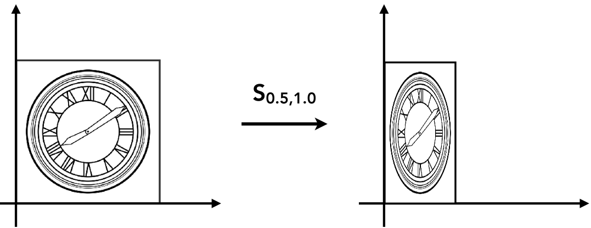{:height 131, :width 318}
		- $\begin{bmatrix}x'\\y'\end{bmatrix}=\begin{bmatrix}s_x & 0\\0&s_y\end{bmatrix}\begin{bmatrix}x\\y\end{bmatrix}$
		- $s_x$是x方向上的缩放，$s_y$是y方  向上的缩放
	- ## 翻转(Reflection)
		- 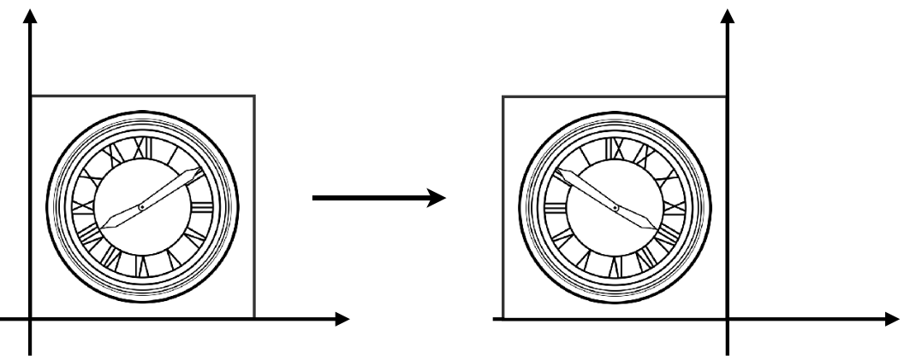{:height 127, :width 292}
		- 在哪个方向上需要翻转就在该方向上给出-1，其他方向保持1，例如，沿y轴做镜像的变换矩阵为：
			- $\begin{bmatrix}x'\\y'\end{bmatrix}=\begin{bmatrix}-1 & 0\\0&1\end{bmatrix}\begin{bmatrix}x\\y\end{bmatrix}$
			- y轴方向不变，x方向翻转
	- ## 切变(shear)
		- 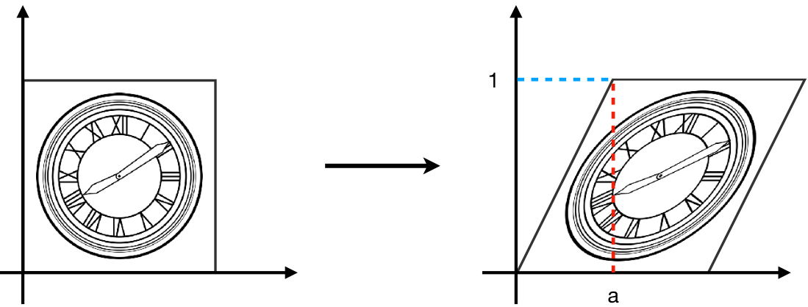{:height 173, :width 396}
		- 某一个轴的变化和另一个轴有关：y方向不变，x方向的偏移量随着y的增加而增加
			- 当y=0时，x没有变化(偏移)
			- 当y=1时，x便宜了a
		- 垂直方向(y轴)上的偏移一直是0
		- $\begin{bmatrix}x'\\y'\end{bmatrix}=\begin{bmatrix}1&a\\0&1\end{bmatrix}\begin{bmatrix}x\\y\end{bmatrix}$
	- ## 旋转（绕原点旋转，默认逆时针）
		- 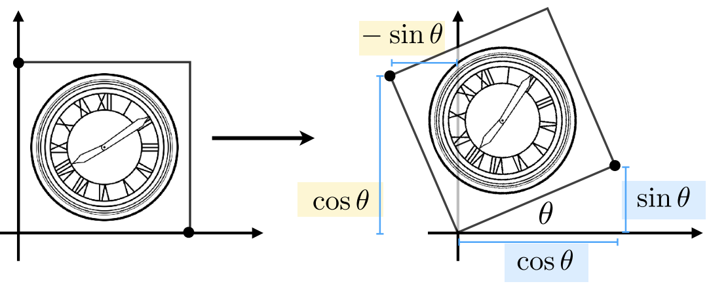{:height 159, :width 369}
		- $R_\theta = \begin{bmatrix}\cos \theta & - \sin \theta\\ \sin \theta & \cos \theta\end{bmatrix}$
		- ### 旋转矩阵的推导
			- 设旋转矩阵为$\begin{bmatrix} A& B\\C&D\end{bmatrix}$，分别带入(0,1)，(1,0)两个特殊点即可解出ABCD的值
		- ### 旋转矩阵的性质
			- 在二维中，如果要让一个图像旋转$-\theta$角度，那么其变换矩阵就等于旋转$\theta$角度的变换矩阵的转置矩阵
				- $R_{-\theta}=\begin{pmatrix}\cos\theta&\sin\theta\\-\sin\theta&\cos\theta\end{pmatrix}=R_\theta^\text{T}$
			- 又因为根据逆变换和逆矩阵的定义：$R_\theta^\text{T} = R_\theta^{-1}$
			- 所以二维下的旋转变换矩阵就是**正交矩阵**
	- ## 总结
		- 线性变换一定能被写作：$\begin{bmatrix}x'\\y'\end{bmatrix}=\begin{bmatrix}a & b\\c&d\end{bmatrix}\begin{bmatrix}x\\y\end{bmatrix}$
			- 即：$\vec{x'} = M\vec{x}$
		- $x'=ax+cy\qquad y' = cx+dy$
- # 非线性变换
	- **平移变换(translation)**无法用一个转换矩阵表示
	- 因此必须引入一个偏移量向量：
		- 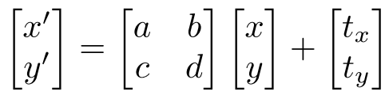{:height 62, :width 228}
	- 但是**为了不对平移变换进行[[$red]]==特殊处理==**，引入新的概念：齐次坐标系
	- ## 齐次坐标（homogeneous coordinates）
		- 对坐标向量加入一个**新的维度**
			- 对于二维的点：$(x,y,1)^T$
			- 对于二维的向量：$(x,y,0)^T$
				- 之所以向量的额外维度为0，是因为**[[$red]]==向量平移之后应该保持不变==**
		- 在齐次坐标下对于点的平移变换的描述：
			- $\begin{bmatrix}x'\\y'\\w'\end{bmatrix}=\begin{bmatrix}1 &0 &t_x\\0&1&t_y\\0&0&1\end{bmatrix}\begin{bmatrix}x\\y\\1\end{bmatrix}$
		- 齐次坐标下点和向量通过新增的维度进行了区别，那么对于点和向量之间的运算，其结果分别是：
			- 向量 + 向量=向量
			- (终)点 - (源)点=向量
				- 得到从源点指向终点的向量
			- 点+向量=点
				- 一个点沿着一个向量移动到了新的点上
			- 点+点=两点的中点
				- 需要扩充齐次坐标的定义：
					- $\begin{pmatrix}x\\y\\w\end{pmatrix}=\begin{pmatrix}x/w\\y/w\\1\end{pmatrix},w\ne 0$
	- ## 仿射变换（affine）
		- 仿射变换=**线性变换+平移变换**
		- 用齐次坐标表示为：
			- $\begin{pmatrix}x'\\y'\\1\end{pmatrix}=\begin{pmatrix}a & b &t_x\\c & d& t_y\\0& 0&1\end{pmatrix} \cdot \begin{pmatrix} x\\y\\1\end{pmatrix}$
			- 分别表示：
				- **缩放：**
					- $\begin{pmatrix}s_x & 0 &0\\0 & s_y& 0\\0& 0&1\end{pmatrix}$
				- **旋转(逆时针)**
					- $\begin{pmatrix}\cos\alpha & -\sin\alpha &0\\\sin \alpha & \cos\alpha& 0\\0& 0&1\end{pmatrix}$
				- **平移**
					- $\begin{pmatrix}1 & 0 &t_x\\0 & 1& t_y\\0& 0&1\end{pmatrix}$
				- [[$red]]==在仿射变换下==**变换矩阵的最后一行都是[[$red]]==001==**
					- 在其他变换情况下最后一行可能不为001，例如投影变换
- # 逆变换
	- 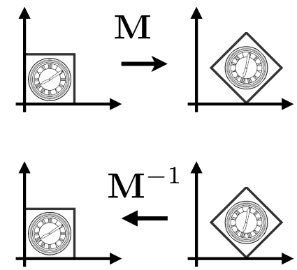{:height 206, :width 211}
	- 逆变换矩阵：$M^{-1}$
	- 如果**一个矩阵的逆等于他的转置**，那么这个矩阵叫做**[[$red]]==正交矩阵==**
		- 对于非齐次坐标旋转变换，$M^{-1}=M^T$
		- 因此非齐次旋转变换矩阵是正交矩阵
- # 变换的合成
	- 变换进行的顺序非常重要
	- 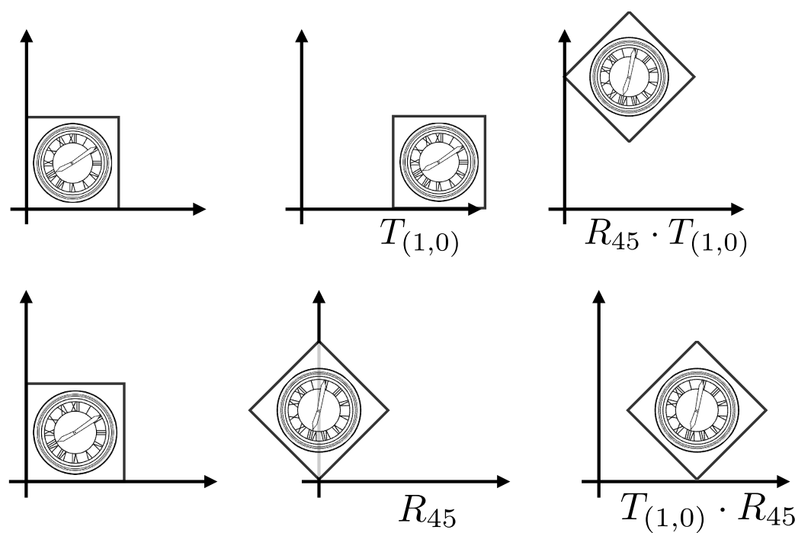{:height 193, :width 273}
	- 变换矩阵的应用顺序是**从右往左**
	- 从1到n的n次变换实际上等于：$A_n(\ldots A_2(A_1(x))) = \bold{A}_n\cdots \bold{A}_2\bold{A}_1\begin{pmatrix}x\\y\\1\end{pmatrix}$
		- 虽然矩阵没有交换律，但是有结合律，因此可以先计算$\bold{A}_n\cdots \bold{A}_2\bold{A}_1$的结果，即得到一个最终的变换矩阵，再作用到向量或点上
	- ## 变换合成的应用
		- 可以把复杂的变换分解为几个简单的变换，将这些变换矩阵乘起来可以**得到最终的变换矩阵**
		- 例如：某个图像想绕着某个非源点的点c旋转，可以：
			- 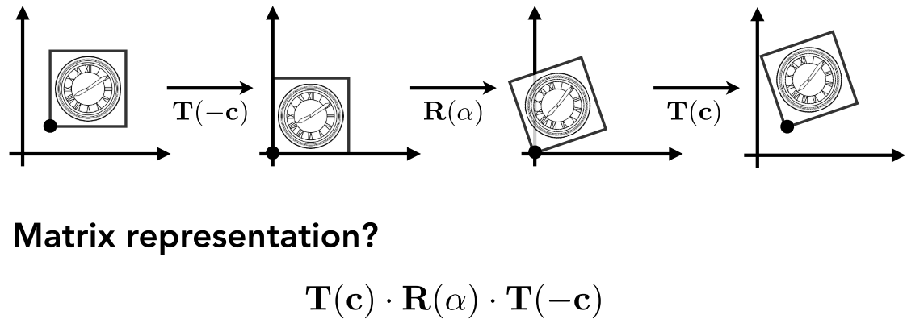{:height 157, :width 418}
			- 把该点c和图像一起移动到原点
			- 进行旋转变换
			- 进行平移的逆变换，将点和图像移回原位
- # 三维变换
	- 没有实质区别，增加一个维度
	- 三维的点：$(x,y,z,1)^\text{T}$
		- 任何$w$不为0的齐次坐标都表示一个点：$(x/w,y/w,z/w,1)^\text{T}$
	- 三维的向量：$(x,y,z,0)^\text{T}$
	- 三维的变换向量：$\begin{pmatrix}x'\\y'\\z'\\1\end{pmatrix}=\begin{pmatrix}a &b&c&t_x\\d&e&f&t_y\\g&h&i&t_z\\0&0&0&1\end{pmatrix}\cdot\begin{pmatrix}x\\y\\z\\1\end{pmatrix}$
		- **这个矩阵表示的是先线性变换再平移**
	- ## 三维中的缩放
		- $\bold{S}(s_x,s_y,s_z)=\begin{pmatrix}s_x&0&0&0\\0&s_y&0&0\\0&0&s_z&0\\0&0&0&1\end{pmatrix}$
	- ## 三维中的平移
		- $\bold{T}(t_x,t_y,t_z)=\begin{pmatrix}1&0&0&t_x\\0&1&0&t_y\\0&0&1&t_z\\0&0&0&1\end{pmatrix}$
	- ## 三维中的旋转
		- ### 绕x轴旋转：
			- x坐标不变
			- $\begin{pmatrix}1 &0&0&0\\0&\cos \alpha& -\sin\alpha&0\\0&\sin\alpha&\cos\alpha&0\\0&0&0&1\end{pmatrix}$
		- ### 绕y轴旋转
			- $\begin{pmatrix}\cos\alpha &0&\sin\alpha&0\\0&1&0&0\\-\sin\alpha&0&\cos\alpha&0\\0&0&0&1\end{pmatrix}$
			- 注意左下角和右上角的$\sin\alpha$的符号和另外两种旋转的符号相反
			- 根本原因是因为在三维坐标系中z轴是x轴叉乘y轴得到的，因此在x-z平面中，z是向下增长而不是向上增长
			- 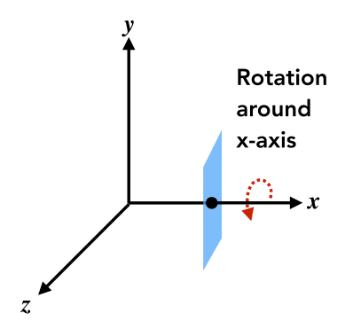{:height 191, :width 201}
			- 比较在x-y平面和x-z平面旋转点(1,1)便很好理解
				- 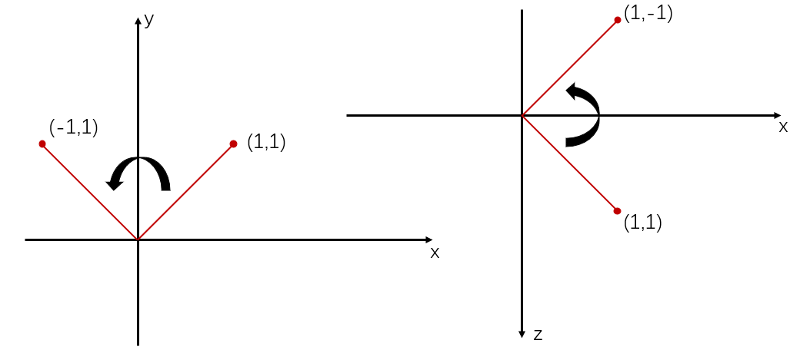
		- ### 绕z轴旋转
			- $\begin{pmatrix}\cos\alpha&-\sin\alpha&0&0\\\sin\alpha&\cos\alpha&0&0\\0&0&1&0\\0&0&0&1\end{pmatrix}$
		- ### [[$red]]==绕任意轴旋转的公式==
			- 任意旋转都能够分解为三个轴上的旋转
			- 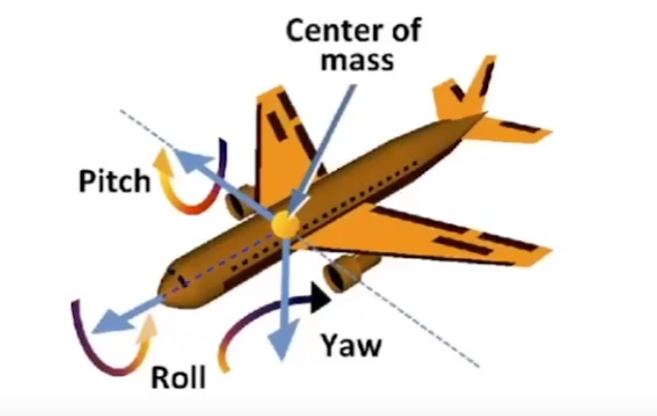{:height 212, :width 277}
			- 将绕任意轴的旋转分别分解为绕x，y，z轴旋转$\alpha,\beta,\gamma$角度
				- $\bold{R}_{xyz}(\alpha,\beta,\gamma) = \bold{R}_x(\alpha)\bold{R}_y(\beta)\bold{R}_z(\gamma)$
				- 这三个角度就被称作**[[$red]]==欧拉角(Eular's Angle)==**
			- **Rodrigues‘ Rotation Formula**
				- 绕n轴旋转$\alpha$角度的旋转矩阵,n轴用一个向量表示
				- $R(\bold{n},\alpha)=\cos(\alpha)I+(1-\cos(\alpha))\bold{nn}^T+\sin(\alpha)\begin{pmatrix}0&-n_z&n_y\\n_z&0&-n_x\\-n_y&-nx&0\end{pmatrix}$
				- 最后那个3*3的矩阵就是一个叉乘矩阵的形式
				- [[$red]]==**注意**==：$\bold{n}$是一个向量，因此这个公式实际上是**绕任意起点在源点的轴(向量)的旋转**
					- 如果要绕着旋转的轴起点不在源点，那么先把该轴平移到原点，做完旋转之后再移回去
				- 还有一种表示三维空间中绕任意轴旋转的表示方式叫做**四元数**，本课不涉及
- # 观测（Viewing）变换
	- 如何从三维空间**生成一张图片**？
		- 答案是使用**[[$red]]==MVP变换==**
		- **放置物品**（模型转换(Model Transformation)）
		- **找好相机角度**（视图变换(View Transformation)）
		- **照相**（投影变换(Projection Transformation)）
	- ## 视图变换（view/camera）
		- 在做视图变换时首先需要定义一台相机，主要是三个参数
			- 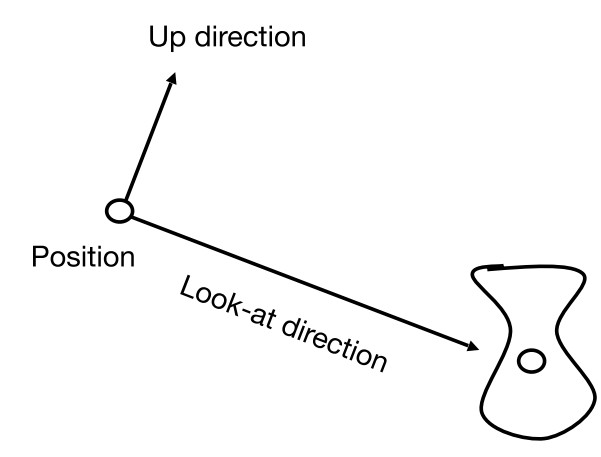{:height 189, :width 237}
			- **相机的位置**(Position)：
				- 一个向量$\vec{e}$
			- **朝向**(看向的方向，Look-at/Gaze Direction)
				- 一个单位向量$\hat{g}$
			- **向上的方向**(Up direction)
				- 一个单位向量$\hat{t}$
			- 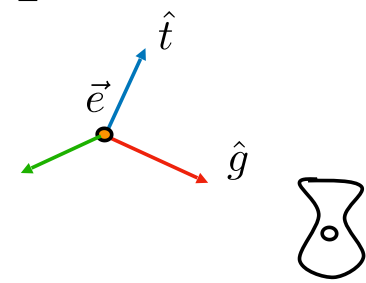{:height 151, :width 183}
		- 在实际操作中，**假设相机永远处在原点，看向-z方向，y为向上的方向**
			- 将其他所有物体随相机一起移动到对应位置
			- 变换过程：
				- 先平移到原点
					- $\begin{bmatrix}1&0&0&-x_3\\0&1&0&-y_e\\0&0&1&-z_e\\0&0&0&1\end{bmatrix}$
				- 将$\hat{g}$旋转到**-z**
				- 将$\hat{t}$旋转到$\bold{Y}$
				- $\hat{g}\times\hat{t}$对准x轴
				- 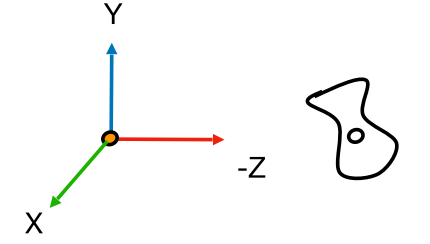{:height 131, :width 224}
			- 实际处理旋转时先写出将$-\bold{Z}$旋转到$\hat{g}$，其余同理的**逆旋转矩阵**，然后再通过转置得到真正的旋转矩阵
				- 因为逆矩阵更好求，只要把几个特殊点带入就能求出
				- $R_{view}^{-1}=\begin{bmatrix}x_{\hat{g}\times\hat{t}}&x_t&x_{-g}&0\\y_{\hat{g}\times\hat{t}}&y_t&y_{-g}&0\\z_{\hat{g}\times\hat{t}}&z_t&z_{-g}&0\\0&0&0&1\end{bmatrix}\Rightarrow R_{view}=\begin{bmatrix}x_{\hat{g}\times\hat{t}}&y_{\hat{g}\times\hat{t}}&z_{\hat{g}\times\hat{t}}&0\\x_t&y_t&z_t&0\\x_{-g}&y_{-g}&z_{-g}&0\\0&0&0&1\end{bmatrix}$
	- 到这一步为止，所有的操作都是作用在模型上的
	- ## 投影变换（projection）
		- 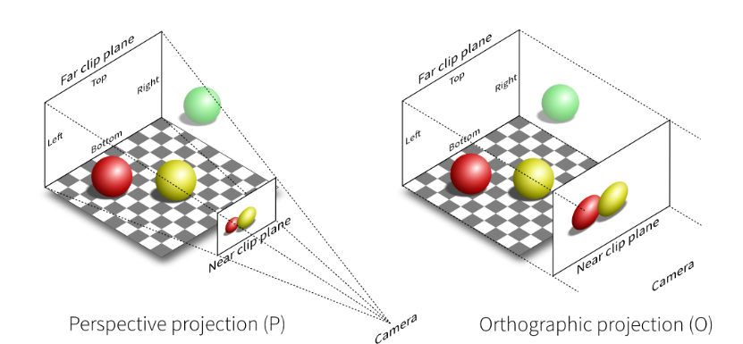
		- 分为透视投影和正交投影两种投影方式
		- ### 正交（orthographic）投影
			- **不会出现近大远小的现象**
			- **步骤：**
				- 把相机放到标准位置
				- 去掉z轴坐标
				- 把所有物体缩放到$[-1,1]^2$的一个小正方形上
			- **实际做法：**
				- 假设要把一个**立方体**进行正交投影：
					- 把中心移动到原点
					- 把长宽高都缩放到$[-1,1]$
				- 立方体的**表示方法**为：
					- x轴上的两点据原点距离l(eft),r(ight)
					- y轴上为b(ottom),t(op)
					- z轴上为n(ear),f(ar)
				- 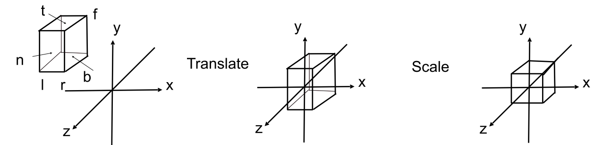
				- 转换矩阵如下，先位移，再缩放：
					- $M_{ortho}=\begin{bmatrix}\frac{2}{r-l}& 0&0&0\\0&\frac{2}{t-b}&0&0\\0&0&\frac{2}{n-f}&0\\0&0&0&1\end{bmatrix}\begin{bmatrix}1&0&0&-\frac{r+l}{2}\\0&1&0&-\frac{t+b}{2}\\0&0&1&-\frac{n+f}{2}\\0&0&0&1\end{bmatrix}$
				- **[[$red]]==补充==**：在右手系下，若摄像头看向-Z方向，那么越近的物体Z越大，越远的物体Z越小，因此OpenGL选择左手系为的是能够做到近大远小
		- ### 透视（perspective）投影
			- 首先**把远平面缩放到和近平面一样的大小**，然后**做正交投影**
				- 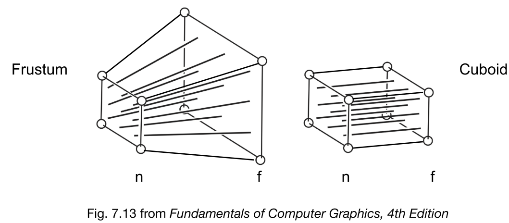{:height 226, :width 493}
				- 在积压的时候需要保证：
					- 近平面上的任何点都保持不变
					- 远平面和近平面上的点Z值不发生变化，仅在xy平面上发生收缩
					- 远平面的中心在挤压之后不发生变化
			- **[[$red]]==如何挤压？==**
				- **通过相似三角形求得**
				- 例如在y方向上，y在挤压后的值与其到成像平面(近平面)的距离有关，离近平面越远，y'越小
				- 而和近平面的距离就是z方向上的值，因此被挤压后的值和z成反比
				- 又因为近平面上的点要保持不变，所以分子就是近平面到相机的距离(n)，以此保证近平面上某个点的$y'=\frac{n}{n}y=y$
				- 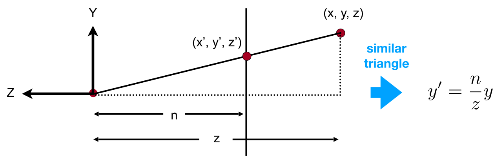
			- **求解变换矩阵**
				- 根据前文所述可以得到经过挤压之后的x和y的变化：$y'=\frac{n}{z}y,x'=\frac{n}{z}x$，即经过了如下变化
					- 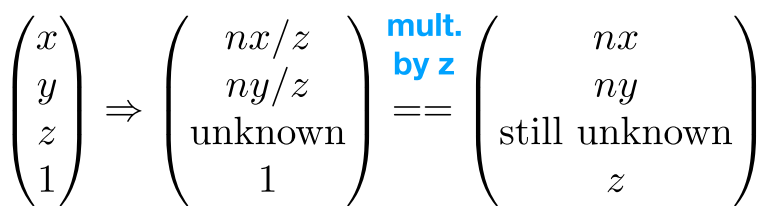{:height 97, :width 345}
				- 可以得到矩阵的部分元素：
					- 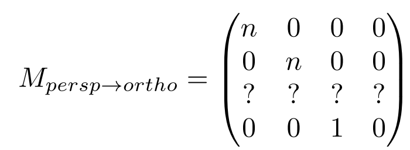{:height 107, :width 258}
				- 剩下一行的元素通过两个特殊点得到
					- 其一是近平面上任一点的任意xyz值都不发生变化，那么近平面上所有点的坐标可以表示为$(x,y,n,1)^\text{T}=(nx,ny,n^2,n)^\text{T}$
						- 所以可知第三行前两个元素一定为0，设后两个元素为A，B，有：
						- $An+B=n^2$
					- 其二是远平面的中心点，$(0,0,f,1)^\text{T}=(0,0,f^2,f)$，其在转换之后还是$(0,0,f^2,f)^\text{T}$，那么可以得到：
						- $Af+B = f^2$
				- 求解得到$A=n+f,B=-nf$
				- 因此，最终得到**[[$red]]==正交(前文所提到的第一步的缩放操作)变换矩阵==如下**：
					- $M_{persp\rightarrow ortho}\begin{bmatrix}n&0&0&0\\0&n&0&0\\0&0&n+f&-nf\\0&0&1&0\end{bmatrix}$
			- **透视变化的最终变化矩阵**
				- 求得正交变换矩阵之后，最终的透视变换矩阵就是**先做一次[[$red]]==正交变换==，再做一次[[$red]]==正交投影变换==**
				- $M_{persp}=M_{orthos}M_{persp\rightarrow ortho}$