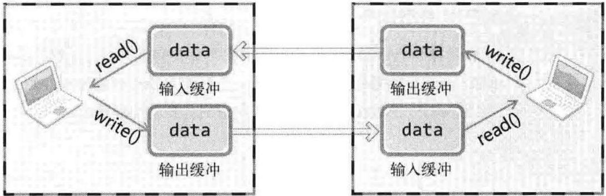

- # 回声客户端的完美实现
	- ## 客户端存在的问题
		- 由于可以提前确定接受数据的大小，因此只要使用一个循环确保接受到发送长度的数据即可
	- ## 真正的解决方案：定义应用层协议
		- 在实践中，提前知道将会收到的数据长度是几乎不可能的
		- 在应用层定义协议以让通信双方提前**知晓数据边界**
- # TCP原理
	- ## TCP套接字中的I/O缓冲
		- 
		- 针对TCP的write和read函数都不是立即发送或接受数据，而是将数据写入缓冲，或从缓冲读取数据
		- 缓冲拥有如下**特性**
			- 每一个TCP套接字拥有一个独立的缓冲
			- 缓冲在套接字创建时自动生成
			- 即使套接字被关闭，**输出**缓冲中的数据仍然会被继续传递
				- write在数据移动到输出缓冲后返回，而TCP协议保证对输出缓冲中数据的传输
			- 关闭套接字将丢失输入缓冲中的数据
		- TCP自带使用滑动窗口实现的数据流控制，不会出现输入缓冲被overflow的情况
	- ## 复习：TCP的建立
		- 通过三次握手(three-way handshaking)完成连接建立
		-
		-