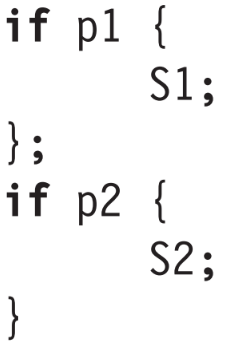

- # 竞争（冒险，hazard）问题
	- 竞争是当资源不足以满足需求时所形成的可能会危及流水线工作的情况
	- ## 结构冒险
		- 多条指令试图同时使用一个功能部件（结构不够用）
	- ## 控制（分支）冒险
		- 需要改变PC值的指令（正常改变（+4）除外）可能造成的冒险，可能导致下一条指令取值错误，即扰乱程序正常执行顺序。
	- ## 数据冒险
		- 一条指令执行时需要用到之前指令所产生的数据。因为流水线的缘故，之前的指令未必完全做完，因此一些状态可能还不可见，这将会导致一些不可预料的行为。
		  **分三种情况**：
			- [[$blue]]==RAW (Read After Write)== 先写后读，后面的指令试图读取前面指令修改的值，存在数据传递
			- [[$blue]]==WAR (Write After Read)== 先读后写，后面的指令试图覆写前面指令读取的地址，不存在数据传递，但不能打乱顺序
			- [[$blue]]==WAW (Write After Write)== 先写后写，两条只能怪试图覆写同一个地址，不存在数据传递，也不能打乱顺序
		- 为了应对数据冒险，MIPS会在ID段进行一些检查，如果存在数据冒险，那么就会暂停（Stall）指令的发射。
	- ## 冒险和依赖（dependency，相关）
		- 发生冒险是因为存在依赖
		- ## 数据依赖（Data Dependencies）
			- [[$red]]==详细记述参看计算机体系结构教材和笔记（Notion）==
			- 如果一条j依赖于指令i，那么说明存在如下两种情况中的一种：
				- 指令j所使用的一些结果由i产生
				- 指令j依赖于k，而k依赖于i（依赖的传递性）
			- 指令j应该在指令i之后（程序顺序）
			- 数据依赖可能会产生冒险，这取决于两条互相依赖的指令之间的距离，如果距离足够大，那么冒险便不会产生，反之则有可能发生，实际上加入stall就是认为加大距离。因此依赖，冒险，stall的关系为：
				- $\mathrm{Dependencies\mathop{\rightarrow}\limits^{might\ cause}Hazards\mathop{\rightarrow}\limits^{might\ cause}Stalls}$
			- ### 名依赖
				- 这种依赖其实是数据依赖的一种，也称为**伪依赖。**
				- 名依赖是指，两条指令使用了同一个寄存器或内存地址，但是这两条指令之间并没有产生数据流，即这两条指令并没有通过“变量名”产生数据交换，这是判别名依赖和数据依赖的关键。
				- 名依赖有**两种情况**，分别是：
					- **反依赖**：后续的指令覆写前方指令读取的寄存器或内存地址（WAR）
					- **输出依赖**：两条指令试图向同一个寄存器后内存地址覆写（WAW）
				- 这两种依赖都是可以消除的，因为并没有实际的数据交换产生，所谓的依赖只是单纯因为目标名字重叠，所以可以通过**重命名**的方式来消除。
		- ## 控制依赖
			- 一个程序中除了处于第一个BB中的指令，都在某种程度上控制依赖于一系列分支指令。因此为了保证程序执行顺序的正确性，必须保证这些控制依赖的正确结构不被改变。事实上，一个程序的正确执行就是保证了其数据依赖和控制以来的正确结构。
			- {:height 163, :width 104}
			- 在上述例子中，S1控制依赖于P1，S2控制依赖于P2。S2和P1无控制依赖。
			- 控制依赖带来的**限制**：
				- 一条指令不能比它控制依赖的分支指令更早执行，不然该指令不再控制依赖于该分支。
				- 一条指令不能比它不控制依赖的分支指令后执行，不然该指令便产生了对该分支的控制依赖
- # 竞争的解决
	- 在当前的原始流水线上，由于不存在乱序执行和speculation的情况，WAR和WAW的情况不存在
	- 只需考虑解决RAW
	- ## 解决方法
		- ### Stall
			- 检测到冲突之后插入展厅周期
		- ### 编译器调度
			- 编译器检测到依赖之后，可以改变部分指令的执行顺序
		- ### 转发（Forwading， 前推）
			- 将计算结果从其产生处直接送到其他指令需要处或所有需要的功能单元处
			- 反映在硬件上就是旁路，飞线
	- 对于当前的原始流水线，在执行和访存阶段做好数据转发就能解决数据竞争
		- 将访存和执行阶段的结果前推到译码阶段
		-