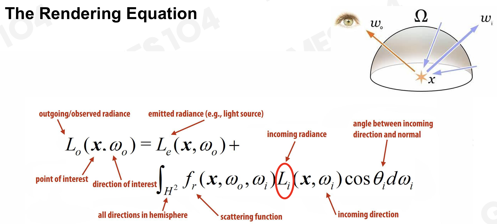
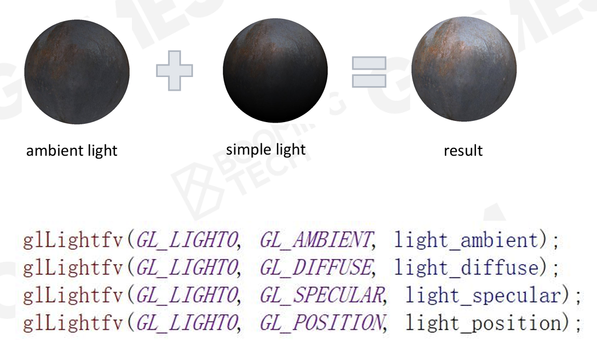

- 物理准确的渲染公式其实很早就已经被提出，但是对其解算几乎是不可能完成的
	- 渲染公式的本质是解析解析
- 
- 所以在实际应用中，尤其是游戏引擎这种实时性要求很高的senario中，会使用一些简化的方法
- # 简单的渲染解决方案
	- ## 光照
		- [[第四课：着色(Shading)]]中有详细讲解
		- 使用一个全局的常量近似环境光，然后对单点像素进行简单的光源计算，组合得到结果
		- 在很多图形API里都有原生支持
			- {:height 254, :width 437}
		- 最后再加一个环境放射贴图
	- ## 材质
		- 使用布林-冯模型
	- ## 阴影
		- 使用shadow map
- # 五到十年前，3A游戏的渲染解决方案
	- ## 光照
		- ### 静态
			- 引入**light map**做**全局光照**(Global Illumination，GI)
				- 仅能针对静态物体和场景
				- 需要消耗很长时间做pre-computation
				- 消耗存储空间
		- ### 动态
			- **light probe**
				- 空间中撒上足够的点，这些点采样空间中的光照。
				- 像素通过临近的采样点通过插值获取光照信息
			- **Reflection probe**
				- 类似于light probe的思路，将某一个空间中所有的反射做采样
			- light probe + reflection probe可以做出很不错的光照效果
				- light probe采样点密集，但采样精度低
				- reflection probe采样点少，但是采样精度高
		- ### [[$red]]==IBL(Image-Based Lighting)==
			- 现代3A游戏中广泛使用的，提升画质的常用方法
			- 可以很好地处理背光面地环境光照效果
			- 需要下来自己仔细理解
	- ## 材质
		- 使用基于物理(PBR)的材质。例如微表面模型。
		- 目前光放使用的PBR材质模型，包括**SG(Specular Glossiness)**模型
			- 所有的参数通过图来表达
			- 非常灵活，甚至过于灵活，导致一旦有某个参数没设置好，就会让菲尼尔项炸掉
		- 实际使用中更多倾向于**MR(Metallic Roughness)**模型
			- MR是在SG上包了一层，暴露出的参数更少，避免瞎调导致的混乱
	- ## 阴影
		- ### Cascade Shadow
			- 不同的距离上做不同精度的shadow map
		- ### PCF(Percentage Closer Filter)
			- 用来做软阴影的方法
			- **PCSS(Percentage Closer Soft Shadow)**
		- ### Variance Soft Shadow Map
			- 也能用来做软阴影
	- ## 总结
		- 总的来说，3A游戏中所使用的方法：
			- 光照：LightMap + Lightprobe
			- 材质：PBR+IBL
			- 阴影：Cascade shadow+VSSM
- # 最新技术
	- ## 实时GI
		- Screen-Space GI
		- SDF Based GI
		- Voxel-Based GI(SVOGI/VXGI)
		- RSM/RTX GI
	- ## Virtual Shadow Maps
	- ## Shader Management
		- Uber Shader生成各种分支下地Shader
		-