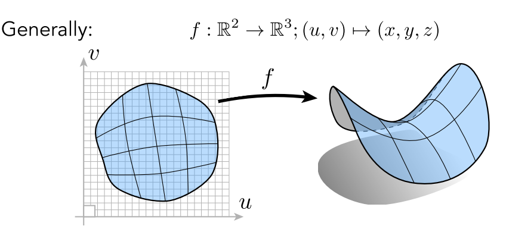

- 在图形学中，几何往往被分为两类：**隐式几何**和**显式几何**
- # 隐式几何(Implicit Geometry)
	- 核心是**不会直接告诉顶点的位置**，而是使用各种**关系**来描述顶点
		- 例如，一个单位球体**面上的所有的点**可以被表示为一个函数：$x^2+y^2+z^2=1$
	- 推广得到，任何一个$f(x,y,z)=0$的函数都可以被视作一个描述了一空间中一系列的点，这些点构成一个表面
		- {:height 260, :width 433}
		  id:: 656f164f-72b7-408f-af81-edeae274d6ef
	- [[$red]]==**缺点**==：难以从公式去判断实际形状，反过来也难以得到一个实际的复杂形状的隐式表达
	- [[$blue]]==**优点**==：非常容易判断一个点是否符合要求(在或不在表面之上，在物体内部还是外部)
	- ## 代数表面(Algebraic Surfaces)
		- 包括球体，圆环等明显可以使用代数几何表达的形状
		- {:height 163, :width 413}
	- ## Constructive Solid Geometry(CSG)
		- 将一系列的隐式几何表达结合起来得到新的几何形状，典型的包括**3D模型的布尔运算**
		- {:height 169, :width 569}
	- ## 距离函数
		- 对于任何一个物体，不去描述其点的位置，而是给出**任意点到物体的最短距离**，**[[$red]]==距离为0的地方就是物体的表面==**
		- 距离函数的一大用处是可以很方便地做**融合操作**
			- {:height 281, :width 331}
			- 假设有一个矩形在向右移动，上图展示的是实际图像，下图展示的是距离函数地融合，可以看到相较于直接在颜色上做插值，距离函数地融合可以更好的反应中间情况
			- 
		- 距离函数的表达能力很强，但是一般距离函数可能不太能直接写成公式的形式，因此可以采用**[[$red]]==水平集==**的方法来描述距离函数
			- {:height 191, :width 283}
			- 使用水平集还可以比较方便地模拟物理效果
				- {:height 161, :width 291}
	- ## 分形(Fractals)
		- 分型指不断以更小地尺寸重复自身形状地特殊形状
		- {:height 147, :width 584}
		-
- # 显式几何(Explicit Geometry)
	- 直接将所有点的位置记录下来，最典型的就是用各个具体的三角面去描述一个物体
	- 一种不太直观的“显式”表达方式是使用一个从而为平面到三维空间的映射函数来表示所有的点
		- 这种表示是用各种**参数**去表示
		- {:height 255, :width 549}
		- {:height 222, :width 364}
	- 显式表示的**[[$red]]==缺点==**和[[$blue]]==**优点**==同隐式相比刚好相反
		- 表示一个物体变得更简单，但是不好判断一个点在某个物体的内部还是外部
	- ## 点云(Point Cloud)
		- 最简单的一种几何表达方式，就是一堆点(x,y,z)的列表
		- 理论上可以表示任意几何形状，代价是需要使用大量的数据存储
		- 一般来说会转换为网格面(mesh)
	- ## 多边形面
		- 图形中最常使用的方式
		- 往往是四边形或三角形面
		- 比较好进行处理和模拟，但是需要使用到更加复杂的数据结构
		- ### Wavefront Object File(.obj)
			- 图形学中常用的一种模型格式，定义了若干顶点，法向量，纹理坐标和面
			- 
			- 上图的obj文件定义了一个正方体
			- 首先是八个顶点，以`v`开头，后跟xyz坐标
			- 然后是12个纹理坐标，以`vt`开头，后跟uv坐标
			- 接着是八个法向量，以`vn`开头
			- 最后是12个面，以`f`(ace)开头，每个面由三个`顶点index/纹理index/法向量index`来表示
- 在几何表示中，没有什么是**最好**的，只有根据不同的情况选择合适的表达方式
- # 曲面
	- ## 贝塞尔曲线(Bezier Curve)
		- {:height 276, :width 436}
		- 用**一系列的控制点**来描述曲线，每一个控制点都会描述曲线需要满足的一些**性质**
		- 曲线被要求**一定要通过[[$red]]==起始点==**
		- ### 一般公式
			- 为若干点的线性组合
			- {:height 290, :width 492}
			- 其中，$\begin{pmatrix}n\\i\end{pmatrix}$是二项式系数，及$C_n^k=\frac{n\times (n-1)\times \cdots\times (n-k+1)}{k\times (k-1)\times\cdots\times 1}= \frac{n!}{k!(n-k)!}$
		- ### 性质
			- **一定过起点和终点**
				- 对于三次贝塞尔曲线来说，$\bold{b}(0)=\bold{b}_0;\ \bold{b}(1)=\bold{b}_3$
			- **在起始点的斜率等于当前段的切线**
				- 同样以三次贝塞尔曲线来说：$\bold{b}'(0)=3(\bold{b}_1-\bold{b}_0); \bold{b}'(1) = 3(\bold{b}_3)-\bold{b}_2$
			- **仿射变换性质**(Affine Transformation Property)
				- [[$red]]==回忆==：仿射变换=线性变换+平移变换
					- 即MVP变换中的MV变换
				- 可以直接对控制点做仿射变换然后对得到的点做相同的计算可以得到仿射变换之后的曲线
				- [[$red]]==注意==：投影变换无法维持这一性质
			- **凸包性质**(Convex Hull Property)
				- 画出的贝塞尔曲线一定在控制点所形成的凸包内
					- 凸包是能够包围给定集合形体的**凸多边形**
				- {:height 199, :width 236}
				-
			-