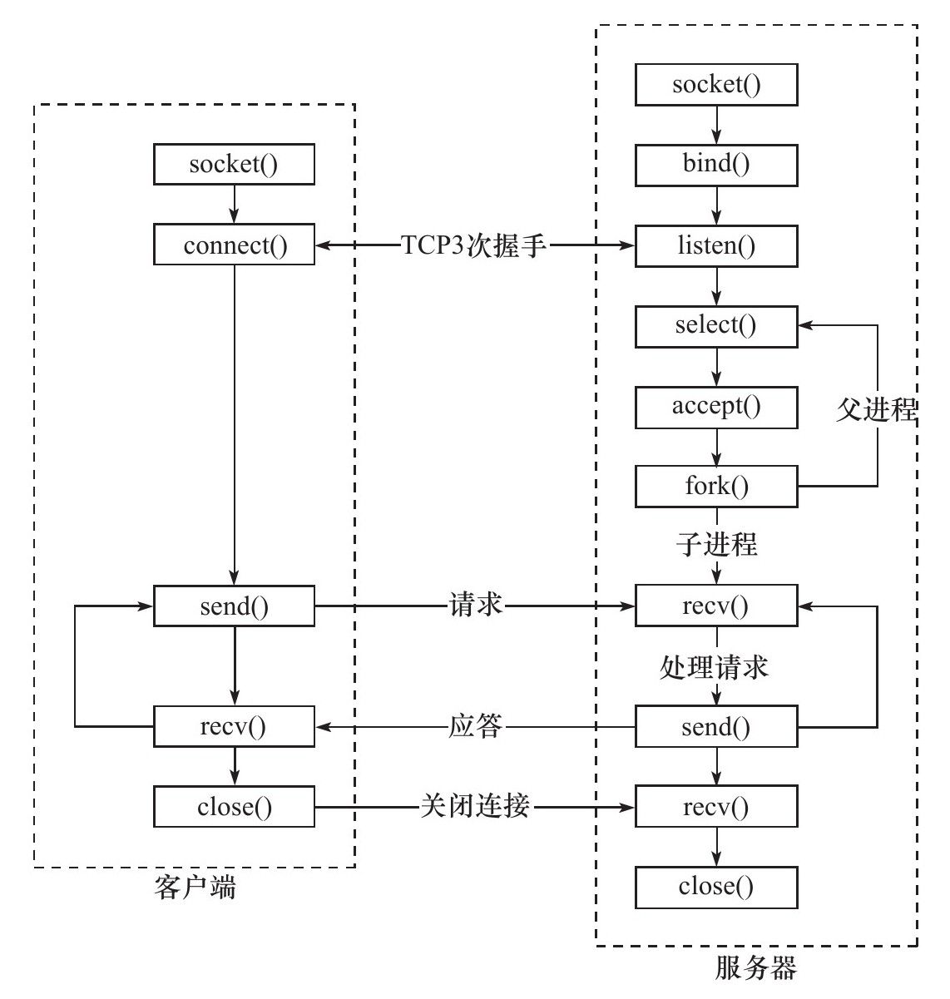
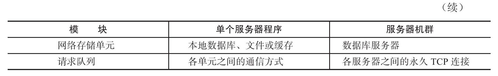

- # 服务器模型
	- ## C/S模型
		- {:height 217, :width 271}
		- TCP/IP协议在设计时**并没有服务器和客户端的概念**
			- 即通信过程中双方是对等的
		- 但由于资源被**提供方天然垄断**，所以几乎所有网络应用程序都很自然地采取了**[[$red]]==C/S(Client / Server)==**模型
			- 即，[[$red]]==**所有客户端都通过访问服务器来获取所需资源**==
		- ### C/S模型的工作流程
		  collapsed:: true
			- {:height 458, :width 431}
			- 逻辑相当简单，图中服务器端使用``select``完成IO复用(同时监听多个服客户端)
				- **更高级的IO复用应该使用``poll``或`` epoll``**
			- 新建立的连接会分配一个新的逻辑单元负责服务，可能是进程，也有可能是线程
				- 父进程则返回继续监听新的请求
		- C/S模型适合**资源集中**的场合，且实现简单
		- [[$red]]==缺点==
			- 服务器为中心，**访问量过大时会导致[[$red]]==响应变慢==**
	- ## P2P模型
		- 
		- P2P各电脑之间地位对等，**云计算机群可以看作P2P模型的一个典范**
		- [[$red]]==**当用户之间传输的请求过多时，网络负载将加重**==
		- 由于各主机之间很难互相发现，因此一般使用的P2P模型通常带有一个专门的**发现服务器**，用于帮助客户尽快找到需要的资源
- # 服务器编程框架
	- 不同的服务器实际框架都大差不差
	- 
	- 
	- 
	- 实际的数据传输可能发生在逻辑单元，也有可能发生在IO处理单元，具体如何依赖于**事件处理模式**
	- 网络存储单元对于某些服务类型来说并非必须，例如**ssh，telnet**
	- 请求队列通常被实现为**池的一部分**
		- 对于服务器机群来说，请求队列是各台**服务器之间预先建立的，永久的，静态的TCP连接**。这种处理方式能提高服务器之间数据交换效率，避免 动态建立TCP导致的额外系统开销
- # I/O模型
	- 
	- ## 阻塞和非阻塞IO
		- socket创建时默认为**阻塞式**，若需改为非阻塞式
			- 可以在创建时给第二个参数传递``SOCK_NONBLOCK``标志
			- 也可以通过``fnctl``系统调用设置``F_SETFL``，设置非阻塞
		- 所有文件描述符都有**阻塞**和**非阻塞**的概念，并非socket独有
		- 在socket的**基础API**中，以下系统调用可能被阻塞
			- ``accespt``
			- ``send``
			- ``recv``
			- ``connect``
		- 非阻塞的IO调用总是会立即返回，无论事件是否发生
			- 通常这种情况IO函数的返回值都会被置为-1，需要通过**``errno1``**来区分具体情况
			- 对于``accept``,``send``,``recv``，事件未发生时，``errno``通常被设置为**``EAGAIN``**或者**``EWOULDBLOCK``**
				- 在POSIX.1-2001中描述为，**[[$red]]==EAGAGIN和EWOULDBLOCK的值可能相同==**
			- 对于``connect``，通常被设置为``EINPROGRESS``
		- 非阻塞IO一般需要与阻塞IO**一起使用**，单独使用非阻塞IO[[$red]]==**可能导致错过事件或处理不及时**==
	- ## IO复用
		- **IO复用**是最常用的IO通知机制
		- 应用程序通过IO复用函数向内核注册一组事件，当任意已组测事件发生时，内核将通过IO复用函数通知应用程序
		- Linux下**[[$red]]==常用IO复用函数包括==**：``select``, ``poll``和``epoll_wait``
		- [[$blue]]==**IO复用函数本身是阻塞的**== ，其提高效率的原因在于它们具有同时监听多个IO事件的能力
	- ## 信号驱动IO
		- **``SIGIO``**信号亦可用于报告IO事件
			- 为一个文件描述符指定宿主进程，指定宿主进程将能捕获到该文件描述符的``SIGIO``信号
			- 可以在该进程中注册处理``SIGIO``信号的函数
	- 理论上讲，**阻塞IO，IO复用和信号驱动IO都是[[$red]]==同步IO模型==**
		- IO的读写操作都是发生在IO事件之后，**由应用程序完成**
	- ## 异步IO
		- POSIX有异步IO的相关定义
		- 用户在直接对IO进行读写操作的同时，告知内核读写缓冲区的位置和完成之后通知应用程序的方式
		- 异步IO**总是直接返回**，不论阻塞与否，**[[$red]]==因为真正的IO操作已经被内核接管==**
		- 可以简单理解为，
			- 同步IO要求用户代码自行讲数据从内核缓冲区读入用户缓冲区
				- 即，**同步IO向用户通知的是IO就绪事件**
			- 异步IO将以上工作交由内核在后台完成
				- 即，**异步IO向用户通知的是IO完成事件**
		- Linux环境提供的异步IO函数在头文件**``<aio.h>``**
- # 两种高效的事件处理模式
	- ## Reactor模式
		- **常用于[[$red]]==同步IO==**
		- 要求**主线程**(IO处理单元)只负责监听文件描述符的事件，在事件发生时通知**工作线程**完成工作
			- 除了监听事件之外主线程不做任何其他实质性工作
		- 此模式的**一般工作流程为：**(以使用``epoll_wat``为例)
			- 
			- 主线程往``epoll``内核事件表中注册socket上的**读就绪事件**
			- 主线程调用``epoll_wait``**等待**socket上有数据可读
			- socket上有数据可读时，`epoll_wait`返回，主线程将**socket可读事件放入请求队列**
			- **请求队列**上的某个睡眠线程被唤醒，其从socket读去数据，处理客户请求，然后**往epoll内核事件表中注册**该socket上的**写就绪事件**
			- 主线程调用``epoll_wait``通知主线程，主线程将**可写事件**放入请求队列
			- **请求队列**上的某个工作线程被唤醒，其负责处理往socket上写入服务器处理客户端请求的结果
		- 任何一个工作线程都既可以处理写也可以处理读，因此**不用区分**读工作线程和写工作线程
	- ## Proactor模式
		- **主要用于[[$red]]==异步IO模式==**
		- 所有IO操作都交由**主线程**和**内核**处理，工作线程**仅负责业务逻辑**
		- Proactor模式的典型工作流程为(以``aio_read``和``aio_write``为例)：
			- 主线程调用``aio_read``函数向内核注册socket上的读完成事件，告诉