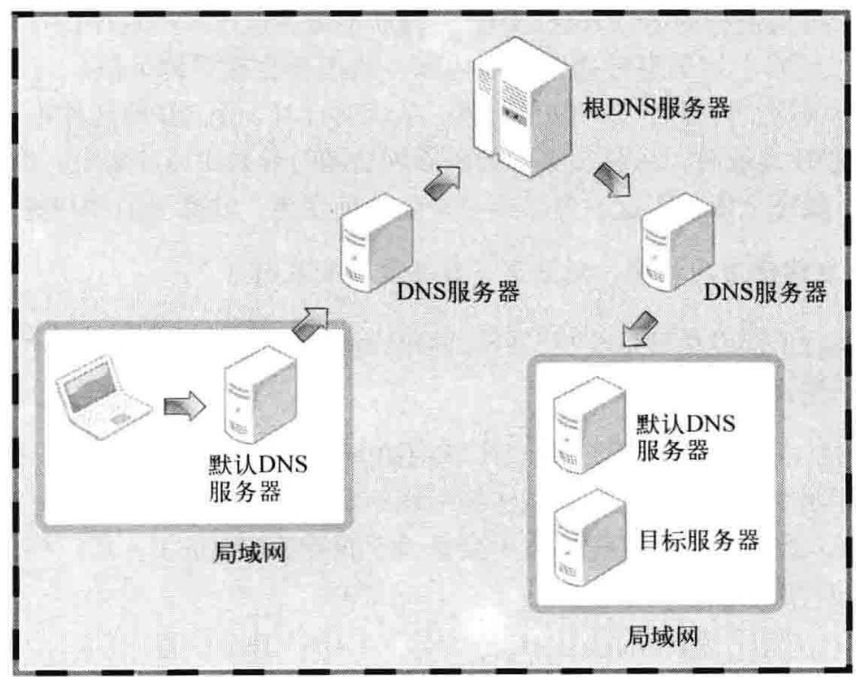
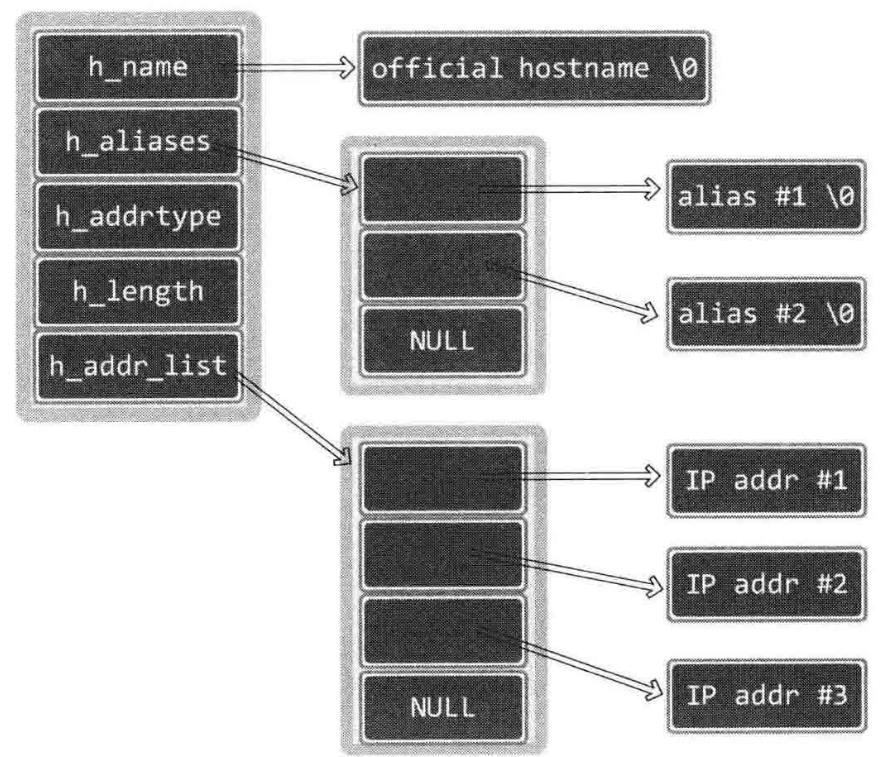

- # 域名系统
	- DNS是对IP地址和域名进行相互转换的系统，核心是**DNS服务器**
	- **域名**就是一些相较于ip地址更便于识别和记忆的，人类可读的网络地址
	- ## DNS服务器
		- 计算机内部有一个自己的dns服务器，linux下使用``nslookup``，查询server可查看本机的默认dns服务器地址
		- 若某一个DNS服务器无法解析，则会询问上级DNS服务器并提供给用户
		- 
		- DNS服务器系统可以看作一个**层次化管理的分布式数据库系统**
- # IP地址和域名之间的转换
	- ## 利用域名获取IP地址
		- linux下可以使用函数``gethostbyname()``从域名得到IP地址
			- **头文件**：``<netdb.h>``
			- **参数**：``const char* name``
			- **返回值**：成功时一个`struct hostent*`，失败返回空指针
			- ``hostent``结构体成员如下
				- char* h_name
					- **官方域名(official domain name)**
					- 代表某一主页，并不一定和公司域名保持一致
				- char** h_aliases
					- 同一个IP可以绑定多个域名，这些都能够访问到同一个网站的域名就是alias
				- int h_addrtype
					- 地址族信息，例如若地址为IPv4，则此项为AF_INET
				- int h_length
					- IP地址的长度，单位是字节。若是IPv4则为4，IPv6则为16
				- char** h_addr_list
					- 最重要的成员。
					- 一整数形式保存域名和对应的IP地址。
					- 某些网站可能分配有多个IP地址
					- **类型是char\*\*是因为本函数并非仅为某一种协议所设计，在使用时需要自行进行类型转换**
					- 实际上此项的类型为void*更为合理，但是在设计此函数时void指针尚未被标准化定义
				- {:height 303, :width 342}'
	- ## 利用IP地址获取域名
		- 函数``gethostbyaddr``可以通过IP地址获取域相关信息
			- **参数**：``const char* addr, socklen_t len, int family``
				- addr就是一个in_addr结构体指针
			- **返回值**：成功返回hostent结构体指针，失败NULL
- # Windows下的实现
	- windows下有两个同名函数，其参数和返回值都和linux保持完全一致