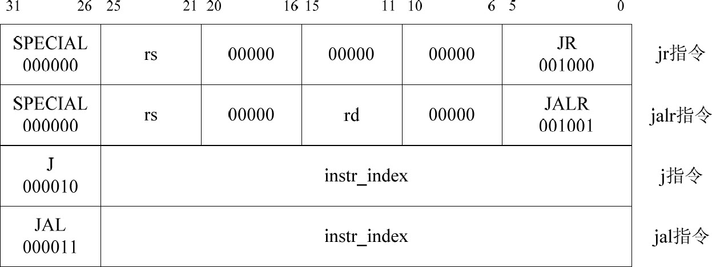
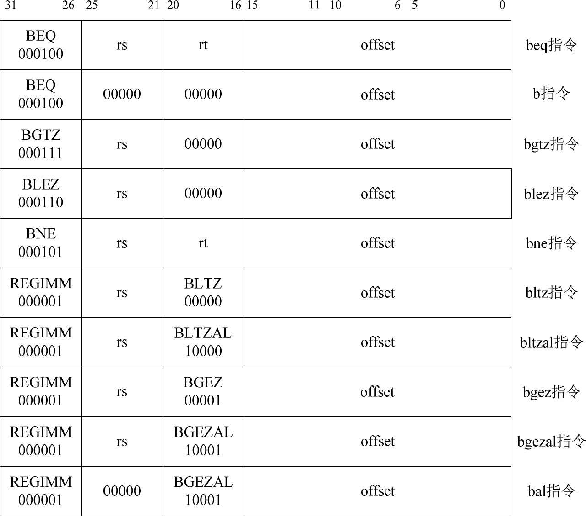
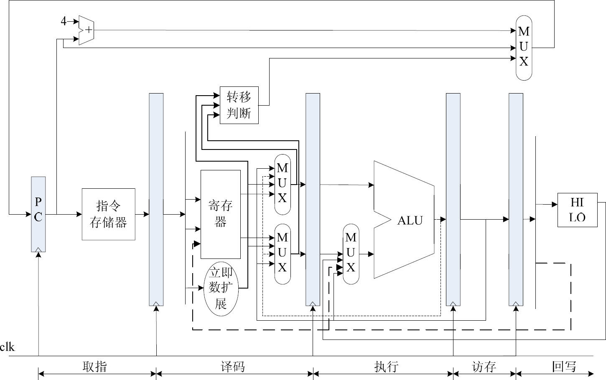
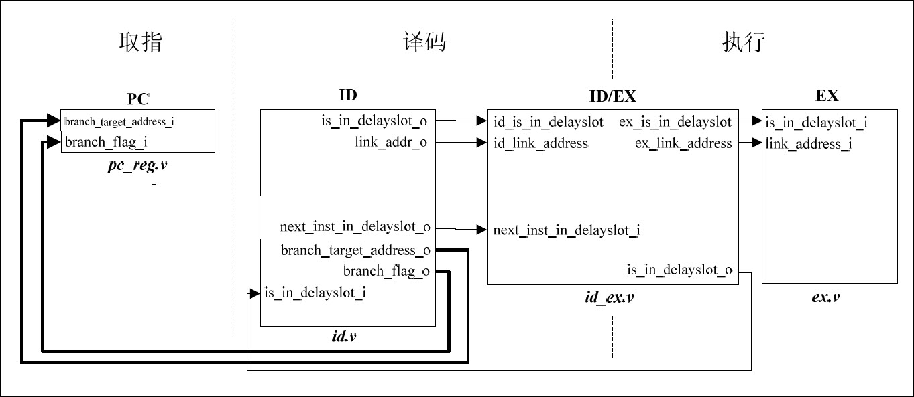

- # 延迟槽
	- 因为在执行阶段才进行转移判断的原因，会损失跳转指令之后紧跟的两条指令（两个时钟周期）
	- 因此：
		- 规定跳转指令之后的一条指令为延迟槽，延迟槽中的指令不管跳转指令是否执行，永远会执行
		- 将跳转指令的判断提前到译码阶段
	- 如此以来便可以做到不浪费时钟周期
- # 转移指令说明
	- ## 跳转指令
		- 
	- ## 分支指令
		- 
- # 实现
	- 加入转移指令之后，系统数据流图进一步改变
	- 
	- 现在PC在每一个时钟周期可能发生三种赋值：
		- 正常顺序执行：pc+4
		- 转义条件成立，使用译码阶段给出的pc值
		- stall，保持pc值不变
	- 为了完成转移指令的实现，需要对系统结构作出修改
	- {:height 333, :width 746}
	-
-