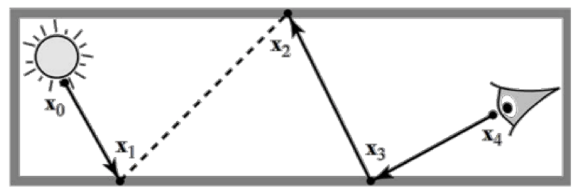
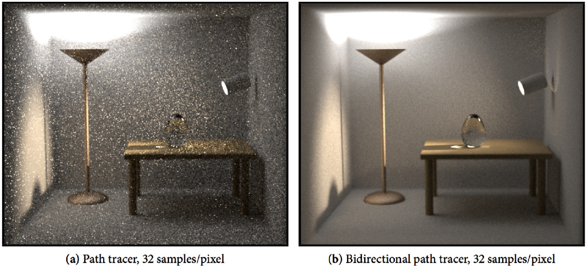
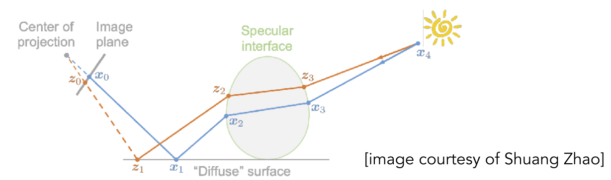
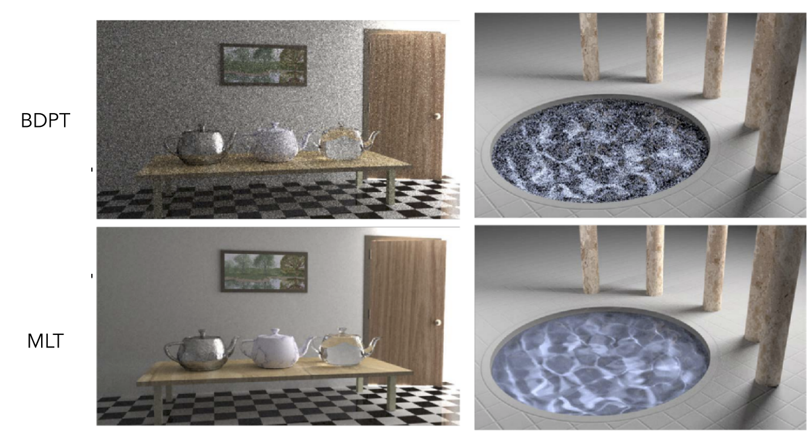
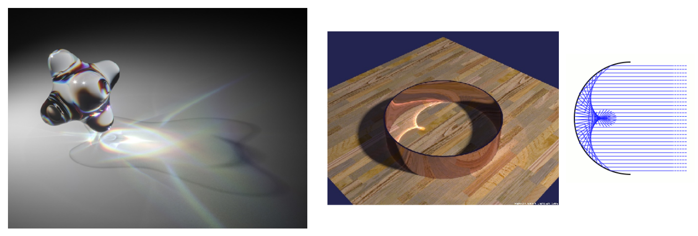
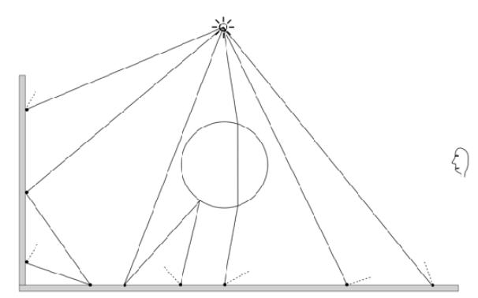
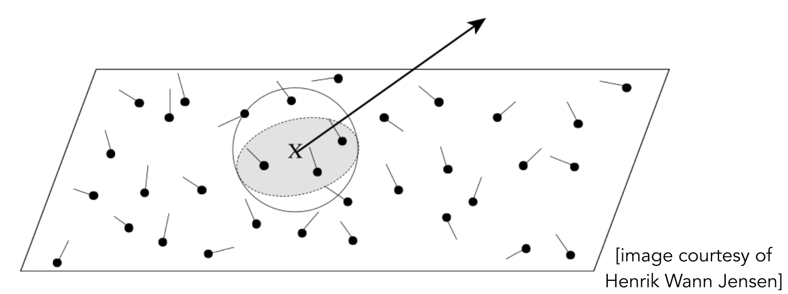
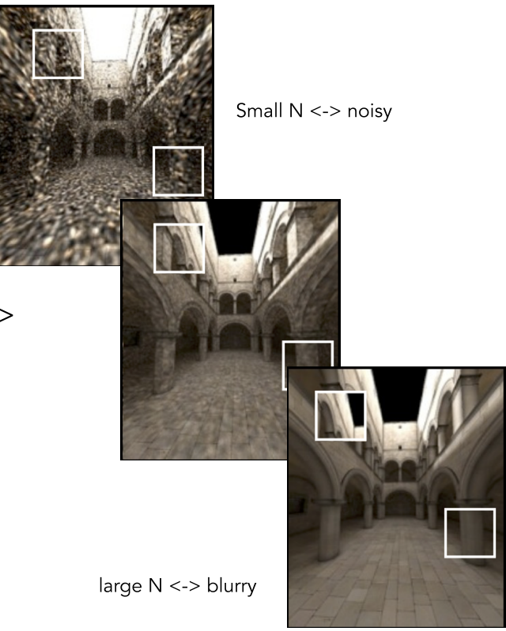
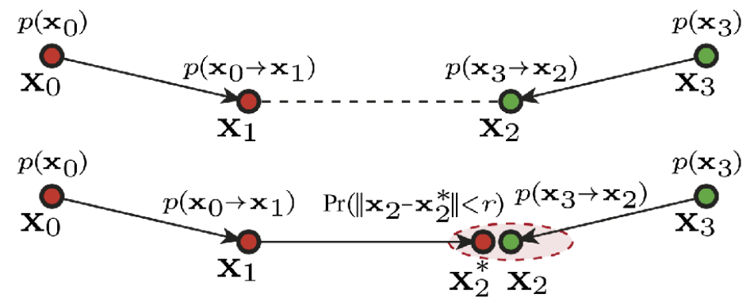
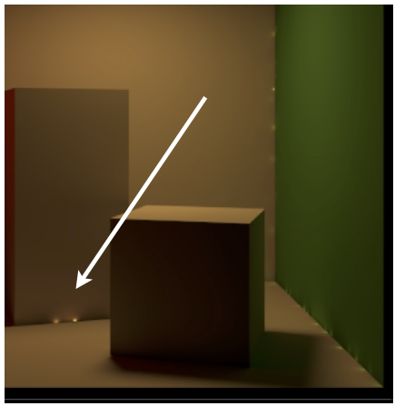

# 高级光线传播(Advanced Light Transport)
	- ## 将会被介绍的概念
		- **无偏光线传播方法**(Unbiased Light Transport Methods)
			- 双向路径追踪(Bidirectional Path Tracing)，**BDPT**
			- Metropolis Light Transport， **MLT**
		- **有偏光线传播**(Biased Light Transport Methods)
			- 光子映射(Photon Mapping)
			- Vertex Connection and Merging(**VCM**)，结合了双向路径最终和光子映射
		- **实时辐射度**(Instant Radiosity)
			- VPL / many light methods
		- **一种简单的理解是否有偏的方法**
			- 有偏==**会模糊**
			- 一致==当有**无限次采样时**，不再模糊
	- ## 无偏光线传播
		- 所谓**无偏**，是一种MC采样定积分的属性
		- 若某种MC采样计算定积分**不存在系统错误**，则这样的MC就是无偏的
			- 即，此方法的期望值总是正确的，与采样次数的多少无关
		- 相较之下，**只有不是无偏的**MC都是有偏的
			- 特殊的，如果在无限次采样的情况下期望收敛于正确的值，那么这样的有偏叫做**[[$red]]==一致的(Consistent)==**
		- ### 双向路径追踪(BDPT)
			- {:height 236, :width 688}
			- 不仅仅只从摄像机射出光线，而是从光源和相机处都射出所谓**子路径(sub-path)**
			- 将两个方向的子路径的重点连接起来得到完整的路径
			- **[[$red]]==很难实现，且效率低下==**
			- [[$blue]]==**在光源的光线传播非常复杂的情况下效果很好**==
				- 
				- 这幅图中，光源基本只照亮某个角落，场景中大量的光都是间接光
			- ### Metropolis Light Transport(MLT)
				- 通过**马尔科夫链**(Markov Chain)进行MC采样
					- 通过特定的PDF，从当前的采样跳到下一个样本
				- 在路径追踪上，即得到一条valid的路径，进行**轻微扰动(Perturb)**生成近似的其他路径
					- {:height 170, :width 543}
				- **[[$blue]]适合==局部(Locally)==的路径生成**
					- {:height 304, :width 561}
						- 对于复杂光路效果很好
				- [[$red]]==**缺点**==也不少
					- 很难估计其**收敛的速度**
					- 不能保证对于每一个像素都有**相同的收敛速度**，这是MLT的局部性导致的
						- 因此常常会产生**dirty results**
					- 一般不会被用于渲染动画
	- ## 有偏光线传播
		- ### 光子映射(Photon Mapping)
			- 一种有偏的双阶段(Two-Stage)方法
			- 非常适合用于做**Specular-Diffuse-Specular，SDS**的路径
				- 这样的路径往往会产生**caustics**，即各种复杂折射，聚焦形成的光晕
				- {:height 192, :width 550}
			- **Stage 1**：光子追踪(Photon Tracing)
				- 从光源处辐射出若干光子，这些光子会进行路径弹射，记录在漫反射表面上的光子
				- {:height 186, :width 279}
			- **Stage 2**：光子收集(Photon Collection)
				- 从相机处射出若干光线，计算弹跳路径，直到击中漫反射表面
				- 计算击中处(Shade Point)的光子**局部密度估计(Local density estimation)**
				- {:height 179, :width 435}
				- 光子密度越大的地方应该越亮
					- 对于每一个着色点，找到其最近的$N$个光子，找到它们分布的面积即可计算出密度
			- **[[$red]]==为什么是有偏的？==**
				- 因为随着$N$的增大，效果会明显不同
				- {:height 352, :width 274}
				- $N$越小噪声越大，$N$越大越模糊
				- 但是当光子足够多时，附近$N$个光子所覆盖的面积会足够小，直到最后完全收敛到着色点上
				- 因此光子映射是有偏但是**一致**的
			- 如果确定面积而不是附近的光子数量，那么将不是一致的，再多的光子也无法收敛到正确结果
		- ### Vertex Connection and Merging(VCM)
			- 结合了BDPT和光子映射
			- 在BDPT中，有的从光源处发散出来的光线无法和相机处出现的光线进行连线
				- 对于这些无法连接的路径，不要浪费他们，而是通过光子映射的方式，将他们融合起来
				- {:height 193, :width 453}
	- ## 实时辐射度(Instant Radiosity)
		- 也被叫做**Mani-Light**方法
		- ### 核心思想
			- 把已经被照亮的表面当作光源，继续照亮其他物体
		- 从光源射出若干光线，将光线的重点当作**虚拟点光源(Virtual Point Light)**
			- 然后正常渲染这个场景
		- **优点**
			- 很快
			- 在漫反射材质上往往有不错的效果
		- **缺点**
			- 如果VPL很靠近着色点，那么往往会产生尖刺噪声
				- {:height 316, :width 306}
			- 无法处理金属材质