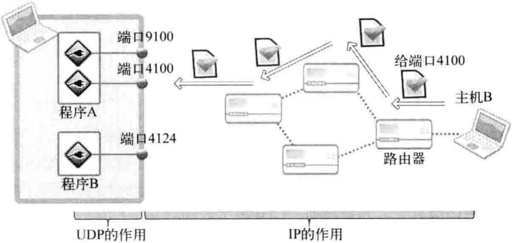

- UDP的特性和邮政系统十分相似
- UDP相较于TCP，**牺牲了可靠特性换取了极高的性能**，无状态，没有流控制
- 
- UDP非常合适用于传递实时多媒体数据，因为少数数据的丢失并不会对多媒体数据产生太大影响
- UDP**并非总是慢于**TCP，一般来说TCP比UDP慢基于以下两点：
	- 收发数据前后进行的连接设置和清除过程
	- 收发数据过程中为保证可靠性而添加的流控制
- 收发数据量少且频繁连接时，UDP比TCP高效
- # 实现基于UDP的服务器端/客户端
	- UDP不需要连接，因此不存在listen和accept函数的调用
	- 一个UDP套接字就可以和多台主机通信，类似于邮筒
	- ## 基于UDP的数据IO函数
		- sendto
			- **头文件**：``<sys/socket.h>``
			- **参数**：``int sock, void* buff, size_t nbytes, int flags, struct sockaddr* to, socklen_t addrlen``
			- **返回值**：成功返回传输字节数，失败返回-1
		- recvfrom
			- **参数**：``int sock, void* buf, size_t nbytes, int flags, struct sockaddr* from, socklen_t *addrlen``
			- **返回值**：成功返回接受字节数，失败返回-1
	- ## 基于UDP的echo服务器/客户端
		- 由于不存在请求连接和受理过程，因此无法也不用取法传统意义上的服务器端和客户端，只要是负责提供服务的一方就可以成为服务器端
		-