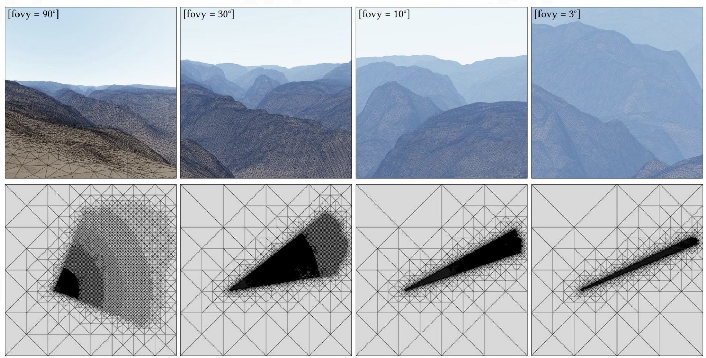

# 游戏中地形的表示方式
	- ## Heightmap(Heighfield)
		- 最简单的表示方式，将每一个点的高度存储下来
		- ### heightmap的渲染方式
			- **最基础**
				- 按照一定的步长生成网格，每个网格的顶点的高度由heightmap中对应点的高度决定
			- **引入LOD**
				- 如果要渲染一个巨大的地图，全都按照很高的精度就会导致面熟过高
				- 进出使用高精度生成网格，远处使用低精度生成网格
				- 更进一步：只有在视野之内的才使用高精度
				- 在地形渲染中，这种技术被叫做：**Adaptive Mesh Tesselation**
				- 
				- 精度不仅和距离相关，fov越低，精度也应该提升
				- 在降低精度时，降低的量和视空间的误差有关，即在降低采样率时，结果误差不会超过多少像素点而不是一个集合空间中的高度差值
				- **基于三角形的细分(Triangle-Based Subdivision)**
					- 地形渲染中的核心就是控制三角形的密度，而使用的工具就是三角形细分
					-
				-