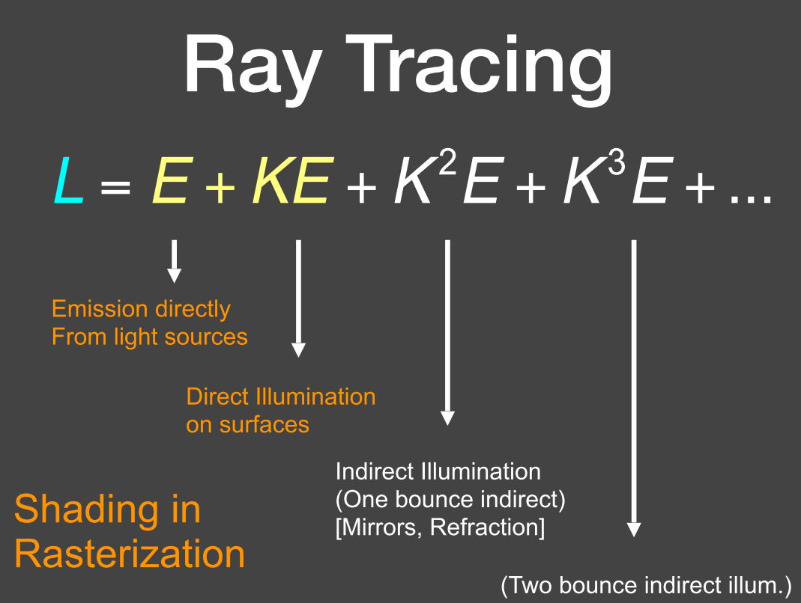

# 关于光线(Light Ray)的一些认知
collapsed:: true
	- 光线**沿直线传播**
		- 在现实中是不对的，应为光实际上是电磁波。但是认为其是沿直线传播所得到的模拟效果已经够好了
	- 光线之间**不会互相碰撞而产生干扰**
		- 也是不对的，但是效果已经够好
	- 光线从光源传递到眼中，使人眼成像
		- 但是在实际操作中往往是从摄像机处射出光线，看能够达到哪些物体，在这些物体上又会产生折射，反射等情况。这么做的正确性是应为光线路径的**可逆性**
- # 光线投射
  collapsed:: true
	- {:height 235, :width 327}
	- 光追的基本原理就是从眼睛(摄像机)处向场景中投射光线，并记录这些光线击中的第一个物体
	- 对击中的物体进行渲染过程，计算颜色，生成像素点信息
- # 递归式(Whitted-Style)光追
	- 由T.Whitted提出，是一种递归式(Recursive)的光追方法
	- {:height 239, :width 402}
	- 光线可能会产生**折射**，**反射**等，这些情况会产生子光线
		- 子光线在能量上会有损耗，在最后合并计算颜色时每产生一次子光线，子光线的贡献都会被降低
		- 颜色是在击中物体表面时产生的，对每一个集中的点，都要计算其是否和光源有通路，如果有，纳入计算
	- ## 判定光面相交(Ray-Surface Intersection)
		- ### 光线的表示方式
			- 每一条光线由两个元素定义：源点和方向
				- {:height 132, :width 158}
			- 光线可以被定义为一个函数，光线在$t$时刻传播所在的位置使用一个函数表示，即：
				- $\bold{r}(t)=\bold{o}+t\bold{d}\qquad 0\le t<\infin$
				- $\bold{d}$表示方向
		- ### 光线和球的相交求解
			- 一个球体可以表示为一堆点的集合，其中每一个点$\bold{p}$都满足：
				- $\bold{(p-c)}^2 = R^2$
				- 其中$\bold{c}$是球心，$R$是半径
			- 求解一条光线是否击中球体，就是求方程$(\bold{o}+t\bold{d-c})^2 = R^2$对$t$是否有解，根据二次方程求根公式，解析原方程得到：
				- $a=\bold{d\cdot d}$
				- $b = 2(\bold{o-c})\cdot \bold{d}$
				- $c = \bold{(o-c)\cdot(o-c)}-R^2$
			- 因此有：
				- $t = \frac{-b\pm\sqrt{b^2-4ac}}{2a}$
				- 但是我们只关注**正的实数**解，因为光线只沿一个方向传播
				- 如果两个解都是正的，那么去最小的那个，因为我们只关心光线第一次击中的点
		- ### 光线和隐式(implicit)表面的相交求解
			- 所有的隐式表面都可以表达为一个关于其表面任意一个点的方程：$f(\bold{p}) = 0$
			- 只需将光线表达式代入$\bold{p}$，对$t$求解方程$f(\bold{o}+t\bold{t})$即可
		- ### 光线和网格的相交求解
			- **[[$red]]==如何判断一个点是在物体内部还是外部？==**
				- 在该点发送一条射线，如果和物体有奇数个交点，那么就说明该点在物体内部
				- 前提是物体不能有洞，必须是封闭的
			- 光线和三角形是否相交可以转换为**光线是否和某个平面相交**的问题
				- 先判断光线是否和三角形所在的平面相交
				- 在判断相交的点是否在三角形内
			- **平面如何定义？**
				- {:height 208, :width 247}
				- **一个方向**(法向量$\bold{N}$)和**一个点**(平面内任意一个点$\bold{p}'$)
					- 由于平面内任意一个点和法向量都是平行的，因此可以通过减去平面内某个点并和法向量求点积，如果为零则表示在平面内
				- $\bold{p-p'} \cdot \bold{N} = 0$，本质上可以写成：
					- $ax+by+cz+d = 0$
			- 求解时，仍然将光线带入，即可得到光线和平面的交点
				- $\bold{o}+t\bold{d-p'\cdot N}=0$
				- $t = \frac{\bold{(p'-o)\cdot N}}{\bold{d\cdot N}}$
				- 需要判断：$t\le t<\infin$
			- 一个更快的算法可以直接求得$t$和交点的三角形重心坐标表示，这就是**Moller Trumbore**算法
				- {:height 319, :width 325}
				- 求解之后只需要判断$b_1,b_2,1-b_1-b_2$是否都是非负值即可判断点是否在三角形内部
			- 最简单的想法就是和物体的每一个三角形都求解一次
				- 十分缓慢，不可能
			- 注意到，光线和一个三角形的交点只有可能为0或1
				- 不考虑平行的情况
			- 需要使用**AABB**来提升速度
	- ## Bounding Volumes
		- 用一个形状把物体包起来，如果击中了这个形状再计算是否击中物体，否则直接不计算，一般常用的就是**包围盒(Bounding Box)**
		- 一个盒子再表达上就是三个**对面**形成的**交集**
		- 更常用的是**轴对齐包围盒(Axis-Aligned Bounding Box)**
			- 和轴对齐的面叫做**Slab**
			- **Slab**更好求解：
				- 例如，和x垂直的面的求解方式为：$t = \frac{\bold{p'}_x-\bold{o}_x}{\bold{d}_x}$
		- ### 求解光线是否击中AABB
			- 对每一组对面，分别求解两个$t$，即$t_\text{min}$和$t_\text{max}$
			- 最后计算出光线进入盒子的时间$t_\text{enter} = \text{max}\{t_\text{min}\}$，和离开盒子的时间$t_\text{exit} = \text{min}\{t_\text{max}\}$
			- 如果$t_\text{enter}<t_\text{exit}$，则击中，否则未击中
			- 如果$t_\text{exit}<0$，则盒子在光线后面，也不可能击中
			- 如果$t_\text{exit}\ge 0, t_\text{enter}<0$，则光线起点在盒子内部，一定击中
			- 所以最终得到光线击中盒子的条件：$t_\text{enter}<t_\text{exit} \wedge t_\text{exit}\ge 0$
	- ## 使用grid加速求交计算
		- {:height 219, :width 358}
		- 将场景分割成若干cell，记录每个cell和物体表面的相交情况
		- 将光线和cell求交，对于不和物体表面相交的cell，直接略过；如果穿过了和物体表面有交点的cell，那么在去和物体求交
		- ### 分出多少个格子才合适？
			- 格子过少会导致和物体求交的次数上升，对于加速没有太大效果
			- 格子过多会导致和格子求交的次数变多，对于加速也会产生负面效果
			- 最合适的格子数量为：物体数量$\times C$
				- $C$是一个常数，在三维下的通常取值为27
		- [[$red]]==**如果场景内物体分布很不均匀**==，那么格子法的效果并不好
- # 用于光追的加速结构
  collapsed:: true
	- ## 空间划分(Spatial Partition)
		- 空间上不会有重叠，一个物体可能会存在于多个节点中
		- 用一些成熟的空间划分方式，可以很好的平衡不均匀物体分布带来的问题
		- {:height 238, :width 558}
		- 八叉树(Oct-Tree)基本没有实际应用，常用的是KD-Tree，可以保持类似于二叉树的性质
		- ### KD-Tree
			- 先垂直划分，再在每一个划分出来的子节点中进行轴对称的水平划分，循环往复
			- {:height 284, :width 473}
			- 叶子节点存储对象列表
			- 当一束光线和某个盒子有交点时，判断其和两个子节点有没有交点，循环往复，直到叶子节点
				- 到叶子节点时，在和其中所有的物体求交点
			- 现代图形学KD-Tree用得并不多，因为非常难判断一个三角形是否和一个盒子有交集
	- ## 物体划分(Object Partition)
		- 物体划分可以避免在构建时耗费大量资源去计算包围盒和物体的交际
		- 将物体划分为**不重叠**的子集，但是不同的子集在空间上可能有重叠
		- 业界常用的物体划分就是**[[$red]]==Bounding Volume Hierarchy==**
		- {:height 258, :width 542}
		- 一个物体只可能出现在一个格子里
		- [[$red]]==**缺点**==就是BVH的分割在空间上可能并不均匀
		- ### 如何分割？
			- 选择某一维进行分割
			- 提示1：总是选择更长的轴进行分割
				- 例如，一个盒子在x，y，z轴上的长度分别是2，10，1，那么就在y轴上分割
				- 可以让划分出的节点在空间的分布上稍微均匀一些
			- 提示2：选择**中点(median)**物体(以某个轴排序)，进行分割，使最后建出来的树尽量平衡
				- 使用快选可以快速得到中点物体
		- ### 递归构建的结束条件？
			- 当某个节点中所包含的物体小于一个阈值时即停止构建，称为叶子节点
		- ### 用于BVH的数据结构
			- **内部节点**
				- 包围盒
				- 子节点的指针
			- **叶节点**
				- 包围盒
				- 物体列表
		- ### 光线和BVH求交
			- {:height 224, :width 471}
			- 类似于遍历二叉搜索树
- # 辐射度量学(Radiometry)
	- bling-phong模型中的光线强度就是一个数，但这个数到底是什么单位？
	- 辐射度量学的一大贡献就是精确定义光照强度的**单位**，并精确度量光照的**空间属性**
		- Radiant Flux
		- Intensity
		- Irradiance
		- Radiance
	- 在物理上以**准确的方式**定义光照，并进行准确的计算
	- ## 一些基本概念
		- **辐射能量(Radiant Energy)**
			- 向外的电磁辐射能量，**单位是焦耳(Joule, J)**
			- 常用**符号**：$Q$
		- **Radiant Flux(Power)**
			- **单位时间内**发散，反射，传播或收到的**能量**
			- $\Phi \equiv \frac{\text{d}Q}{\text{d}t} \text{[W=Watt] [lm = lumen]}$
			- 方括号括起来的为单位
		- **Flux**
			- 中文也称流量
			- **单位时间内**流经某个传感器的**光子(Photon)数量**
	- ## 一些光照的重要测量指标
		- {:height 290, :width 510}
		- ### Radiant Intensity
		  collapsed:: true
			- 也称**光照强度(Luminous Intensity)**
			- 即由某个点光源在每**单位立体角(Solid Angle)**散发出的能量(Power)
			- $$I(\omega) \equiv \frac{\text{d}\Phi}{\text{d}\omega}\qquad [\frac{\text{W}}{\text{sr}}]\ [\frac{\text{lm}}{\text{sr}}=\text{cd}=\text{candela}]$$
			- **立体角**
			  collapsed:: true
				- **二维的角(Angle)**一般定义为此角度的圆弧和半径的比值
					- {:height 205, :width 223}
					- $\theta = \frac{l}{r}$
					- 一个圆(Circle)有$2\pi$的**弧度(radian)**
				- **立体角(Solid angle)**定义为该角度在球面上所对的(subtended)面积和半径平方的比值
					- {:height 215, :width 211}
					- $\Omega = \frac{A}{r^2}$
					- 一个球体(Sphere)有$4\pi$的**球面度(steradian)**
				- **单位立体角(Differential Solid Angles)**
					- 一般会使用球面坐标$\theta$，$\phi$来定义一个球体中唯一的方向
					- {:height 296, :width 496}
					- {:height 263, :width 465}
					- 可以直接使用立体角标识空间中的一个方向
			- **各项同性点源(Isotropic Point Source)**
				- {:height 289, :width 433}
				- 能量均匀地分布在表面，那么其在某个方向的强度就是$I=\frac{\Phi}{4\pi}$
				- {:height 285, :width 441}
		- ### Irradiance
			- 某个表面每单位区域接收到的能量(Power)
			- {:height 201, :width 431}
			- 注意这里的区域必须是和光线垂直的区域，如果光线和区域不垂直，那么要进行换算
				- 回想之前学习的labert法则，其表面接收的能量和夹角余弦成比例就是这个原因
				- {:height 249, :width 484}
			- 同理，之前提到的光线的**强度**会随着距离衰减，在这个视角下也不再正确
				- {:height 252, :width 393}
				- 实际上衰减的并不是光线的**强度(intensity)**，而是单位面积内所能接收到的强度会随着距离衰减，即**Irradiance会随着距离衰减，和距离的平方成反比**
		- ### Radiance
			- {:height 223, :width 492}
			- 物体表面在每单位立体角，每单位面积上发出，反射，传播或接收到的能量
			- 如上图，一个光源向某个立体角投射出去的面积上的能量分布
			- 回想：
				- Irradiance是**每单位面积**的能量
				- Intensity是**每单位立体角**的能量
			- 那么：
				- Radiance可以表示为**每单位立体角的Irradiance**
					- $L(p,\omega) = \frac{\text{d}E(p)}{\text{d}\omega \cos\theta}$
					- 相较于Irradiance，Radiance增加了对于**方向性**的考虑
				- Radiance可以表示为**每单位面积的Intensity**
					- $L(p,\omega) = \frac{\text{d}I(p,\omega)}{\text{d}A\cos\theta}$
			- 一般考虑接受能量使用Radiance和Irradiance，考虑能量辐射使用Intensity
	- ## Irradiance和Radiance之间的关系
		- {:height 190, :width 443}
		- Irradiance就是上图中$\text{d}A$这块区域中收到的所有能量
		- Radiance是上图中$\text{d}A$这块区域在每个单位立体角($\text{d}\omega$)上收到的能量
			- 如上文所述，增加了对于方向的考虑
		- {:height 115, :width 338}
			- 上面两个公式，第一个公式表示对Irradiance在$\omega$上做微分就等于Radiance乘上特定的角
			- 对微分表达式积分就得到Irradiance，即第二个公式
				- 即，每个面积的Irradiance等于该面积下对所有立体角求积分的Radiance
				- 就是把单位面积上每个方向的Radiance的算上就得到单位面积的Irradiance
- # BRDF
  collapsed:: true
	- **[[$red]]==Bidirectional Reflectance Distribution Function==**，**双向反射分布函数**
	- ## 某个点的反射
		- {:height 184, :width 354}
		- 从某个方向进来，反射到另一个方向的光线能量是多少
		- 对于反射，有多种理解
			- 最简单的理解就是**光线本身**射到某个平面之后改变了路径
			- 另一种理解就是某个表面吸收了能量之后向其他方向发射出光线
		- 以第二种理解方式为基准，那么有：
			- {:height 70, :width 521}
		- 那么需要有一个函数来描述反射在方向角上的分布，这个函数就是BRDF
	- ## BRDF的定义
		- {:height 294, :width 562}
		- 即出射方向上Radiance的微分除以入射点上的Irradiance的微分
		- 也即规定了，入射的光线会怎样被反射，例如
			- 对于镜面反射，反射出来的光线只会分布在反射方向上，其他方向上的分布为0
			- 对于漫反射，吸收到的能量会向所有方向均匀地反射出去
		- 因此，对于镜头处所能看到地反射光线，就是针对某一个点所吸收的来自所有方向的能量在镜头方向上的反射之和，即：
			- {:height 297, :width 422}
				- 这个公式最后的$L_i(p,\omega_i)\cos\theta_i\text{d}\omega_i$求的就是Irradiance，乘上BRDF之后就变成了对于出射方向的贡献，然后把这些所有贡献积起来(在离散状态下就是求和)就是最终镜头方向能看到的反射
	- ## 使用BRDF计算的问题
		- 会遇到递归计算的问题
		- {:height 181, :width 370}
		- 能到达着色点的光不仅是光源的光，其他物体也有可能会反射光到达着色点
			- 由于互相照射的存在，有可能出现递归计算的情况
			- 你照射了我，我又照射了你
- # 着色(渲染)方程
  collapsed:: true
	- **The Rendering Equation**
	- 发射的光加上自发光就是一个general的着色方程
	- 
		- 其中$L_e(p,\omega_o)$就是自发光项(Emission Term)
		- 所有的$\omega$代表的方向都是**从着色点朝外**，哪怕入射的光线实际上是从外射向着色点的
		- $n\cdot \omega_i$就是法线$n$点成方向$\omega$，实际上等于$\cos\theta$
	- 这个公式本质上就是所有该点反射的光加上自发光
		- 反射代表吸收了别的光之后发出的的光
	- ## 理解着色方程
		- {:height 289, :width 495}
		- 如果有多个光源，那么把所有光源的贡献加起来即可
		- 如果存在**面光源**，那么先把面光源上的所有强度积分起来再进行后续计算
			- {:height 286, :width 439}
		- 我们可以进一步简化着色方程，注意到等式右边只有一项，也即所有物体发出的，到达着色点的光的积分是未知的，其余包括自发光项，BRDF，$\cos\theta$都是已知的，因此可以简化一次为：
			- {:height 102, :width 408}
			- 其中$u$和$v$是两个不同的位置，在此处忽略**方向**
		- 然后还可以进一步简化，将Kernel of Equation看作**Light Transport Operator**，或又称反射操作符，那么我么你可以进一步简化方程为：
			- {:height 192, :width 336}
			- 此处的$L$可以理解为一个场景中所有的光的向量，$E$也是环境中所有自发光光源的向量
			- $K$是一个转换矩阵
		- 写成$L=E+KL$的形式是为了简化求解，其可以进一步被规约为：
			- {:height 93, :width 163}
			- 根据**二项式定理(Binomial Theorem)**，进一步展开为：
				- {:height 69, :width 301}
		- 这个形式就逐渐明了了，而且非常适合计算机进行迭代计算
			- {:height 307, :width 400}
			- 其中，来自光源的光线加上表面接收到的直接光照，就是光栅化中的着色会计算的部分，使用光追方法相当于补齐了剩下的若干次间接光照，也称**全局光照**
- # 有关概率论的简单回顾
	- ## 随机变量
		- $X$是一个随机变量，标识某个值得可能分布
		- $X\sim p(x)$ 是**概率密度函数(Probability Density Function, [[$red]]==PDF==)**
			- 表示随机选取值得过程的相关概率
		- 例如对于一个色子，它能投出六种结果，每种结果的概率都是相等的，那就是：
			- $p(1)=p(2)=p(3)=p(4)=p(5)=p(6)=\frac{1}{6}$
		- 也有出现各种概率不相等的情况，例如：
			- {:height 168, :width 231}
			- 此时，各种取值的概率就不尽相同
		- 但是不管怎么取概率，对于给定的概率分布，一定有：
			- $p_i \ge 0$
			- $\sum\limits_{i=1}^n p_i = 1$
	- ## 期望(Expected Value)
		- 不停地取值最后所得到的平均
		- 对于离散的随机变量来说，有：
			- $E[X] = \sum\limits_{i=1}^n x_ip_i$
		- 还是掷色子的例子，其期望是3.5
	- ## PDF
		- 在连续情况下，使用PDF $p(x)$描述概率的分布，PDF一定有：
			- $p(x) \ge 0$，且 $\int p(x)\ \text{d}x = 1$
			- 期望为：$E[X] = \int xp(x)\ \text{d}x$
		- 在连续情况下，任何确定值的被取概率都为0
			- 其在pdf上的面积大小表示概率，单一点的面积为0因此概率为0
			- 如果取一个极小量$\Delta$，可以根据PDF算出在这个$x \pm \Delta$区间中的概率(积分)
	- ## 函数和随机变量
		- 假设有一个随机变量$X\sim p(x)$和一个函数$Y = f(X)$，如何求函数的期望？
			- $E[Y] = E[f(X)] = \int f(x)p(x)\ \text{d}x$
- # MC积分
	- **Monte Carlo Integration**
	- MC采样可以用于算**定积分**
	-