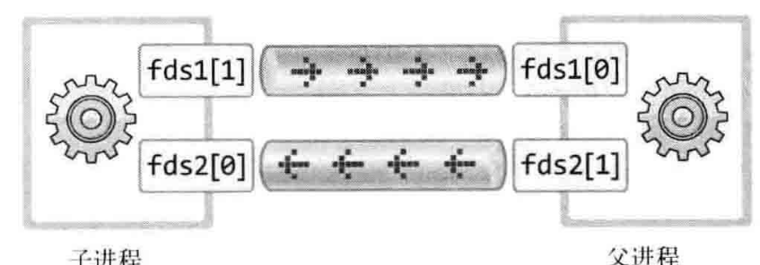

- #[[TCP/IP 网络编程]]
- # 进程间通信
	- ## 通过管道实现进程间通信
		- 管道和文件，套接字一样，**是属于操作系统的资源**
		- 使用函数``pipe``以创建一个管道
			- **头文件**：``<unistd.h>``
			- **参数**：``int filedes[2]``
				- ``fileds[0]``，通过管道接收数据所使用的描述符，管道出口
				- ``fileds[1]``，通过管道发送数据所使用的描述符，管道入口
			- **返回值**：成功返回0，否则-1
		- 在**fork**之前创建管道，**则管道出入口对父子进程都可见**
			- 虽然这一点使得父子进程可以通过一根管道实现双向通信，**[[$red]]==但并不推荐==**
			- 因为数据一旦进入管道便会称为**[[$red]]==无主数据==**，此时任何进程都可以通过read获取其中的数据，而已被获取的数据将不会再保存于管道中
			- 所以使用一根管道进行双向通信的时候，很容易出现**[[$red]]==某一进程读取了自己写入其中的数据==**的问题
	- 如果向进行父子进程双向通信，建议创建两个管道
		- 
- # 运用进程间通信
	- 改造回声服务器，让另一个进程专门负责保存客户端传来的信息
	-
	-