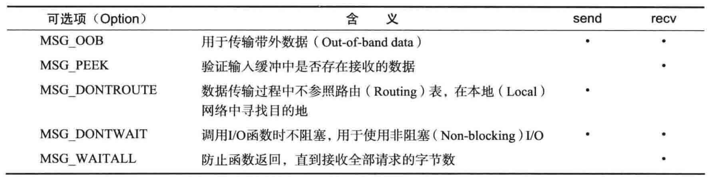

- # send 和 recv函数
	- 实际上linux下也有send和recv函数，且整体上来说，参数和行为没有较大差别
	- ``send``
		- **头文件**：``<sys/socket.h>``
		- **参数**：``int sockfd, const void* buf, size_t nbytes, int flags``
		- **返回值**：成功返回发送字节数，否则-1
	- ``recv``
		- **参数**：``int sockfd, void* buf, size_t nbytes, int flags``
		- **返回值**：成功返回接收字节数(收到EOF时返回0)，失败返回-1
	- send和recv最后的flag参数可以使用按位或同时传递多个信号
		- 
		- [[$red]]==**注意**==：不同的操作系统支持的可选项和可选项的行为可能有所不同，接下来介绍的部分可选项基本没有平台差异
	- ### MSG_OOB
		- 用于发送**带外数据(Out-of-bound)**，即不占用一般信道和缓存的紧急消息
		- 携带带外数据的包，所有
		- ### 发送带外数据
			- 只需要将此option作为传输传入即可
		- ### 接收带外数据
			- 接收带外数据比发送要复杂很多
			- **使用fcntl函数指定某文件描述符发生异常时的处理进程**
				- 函数fcntl有多种使用方式，此处只介绍其中一种
				- **``fcntl(fd, F_SETOWN,getpid())``**
					- 表示当文件描述符fd所指向的文件发生异常时，设置负责实际处理异常的进程，getpid函数得到的是当前进程的pid，因此实际上就是代表当异常发生时，由当前进程负责处理
			- **注册SIGURG发生时的回调函数**
			- **在SIGURG信号处理函数中，使用flag参数设置了MSG_OOB的recv函数接收紧急信息**
		- [[$red]]==**注意：**==事实上会发现，使用MSG_OOBflag**[[$red]]==发送和接收的数据都只能是1字节==**
			- 真正意义上的带外数据意味着需要额外的信道，但是**TCP并不提供**
			- TCP**[[$red]]==只提供利用紧急模式(Urgent mode)==进行数据传输**
		- ### 紧急模式
			- MSG_OOBflag的真正含义在于督促数据接收对象尽快处理数据，而且**TCP顺序传递**的特性依然成立
			-
			-