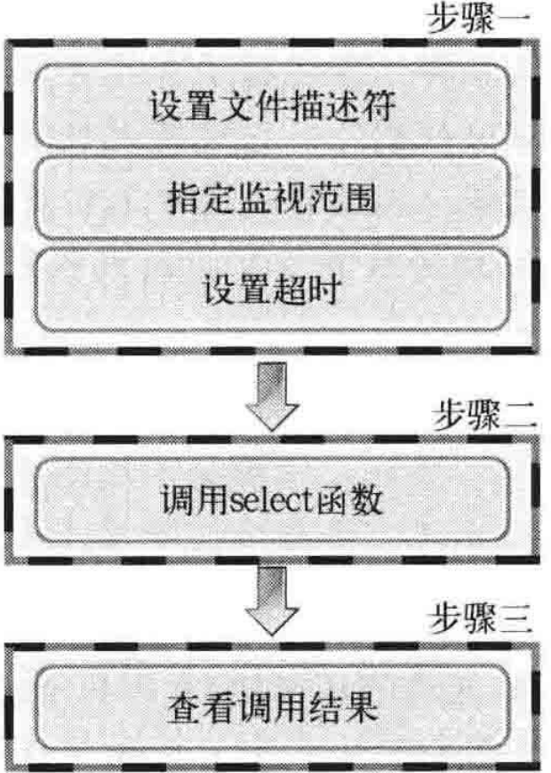

- 多进程并发服务器有诸多缺点，包括但不限于：
	- 创建和运行进程的开销大
	- IPC（进程间通信）复杂且开销大
- # IO复用
	- 在一个信道上传输多组数据
	- 码分，频分，时分
- # 理解select函数
	- select函数是最具代表性的实现复用服务器端的方法
	- select函数可以**[[$red]]==将多个文件描述符集中到一起统一监视==**，包括如下类似事件：
		- 是否存在套接字有输入数据
		- 无需阻塞传输数据的套接字有哪些
		- 哪些套接字发生了一场
	- select函数使用较为复杂，一般需要经过如下三个步骤 ：
		- {:height 274, :width 189}
	- ## 设置文件描述符
		- 使用结构体``fd_set``设置要监视的文件描述符，包含在头文件``<sys/select.h>``中
		- fd_set机构体是位结构，每一个位代表某文件描述符是否需要被监视
			- 1标识被监视，反之为0
		- fd_set的设置需要调用相关函数，相关函数也都包含在``<sys/select.h>``中
			- ``FD_ZERO(fd_set *fdset)``：将所有位初始化为0
			- ``FD_SET(int fd, fd_set* fdset)``：将文件描述符加入监视
			- ``FD_CLR(int fd, fd_set* fdst)``：取消对文件描述符的监视
			- ``FD_ISSET(int fd, fd_set* fdset)``：若fdset将fd加入了监视则返回1
	- ## 设置监视范围和超时
		- 函数``select``定义如下
			- **头文件**
				- 函数本身定义在``<sys/select.h>``中
				- 其定义包含了对头文件``<sys/time.h>``中某些定义的依赖，要使用select也必须包含此头文件
			- **参数**：``int maxfd, fd_set* readset, fd_set* writeset, fd_set* exceptset, const struct timeval* timeout``
				- ``maxfd``：所有被监视的文件描述符中数值最大的文件描述符的值**[[$red]]==加一==**
				- ``readset``：监视此fd_set中所有包含的文件描述符是否包含**[[$red]]==待读取数据==**
				- ``writeset``：监视此``fd_set``中所有包含的文件描述符是否[[$red]]==**可传输无阻塞数据**==
				- ``exceptset``：监视此fd_set中所有包含的文件描述符[[$red]]==**是否发生异常**==
				- ``timeout``：调用select函数后，为防止陷入无限阻塞状态，使用此参数传递最大等待时间
					- struct timeval结构体包含如下成员：
						- long tv_sec，秒
						- long tv_usec，毫秒
					- 若不想设置超时事件，此参数传入NULL
			- **返回值**：**超时**返回0，**发生错误**返回-1，**发生关注事件**返回大于0的发生相关事件的文件描述符
				- 传入的所有fd_set都会被置0，那些发生了变化(触发了事件)的文件描述符所代表的位除外，通过这些信息可以获知是哪些文件描述符触发了事件
- # 基于windows的实现
	- windows下的select函数和linux下的参数和行为完全一致，但是有如下不同：
		- windows下的 timeval结构体为全大写，且声明时使用了typedef，因此定义时只需要`TIMEVAL t`即可
		- windows下的select函数第一个参数仅仅是为了和linux保持兼容性，没有任何实际用处
		- windows下的``fd_set``结构体的实际结构和linux完全不同，结构如下：
			- u_int fd_count;
			- SOCKET fd_array[FD_SETSIZE];
			- 可以看到并不是一个位数组，因为windows下的句柄分配并不连续，使用位数组并不明智
			- 不过好在并不需要实际和fd_set结构内部成员打交道，windows下的FD_XXX型的四个宏，名称，行为和参数和linux完全保持一致