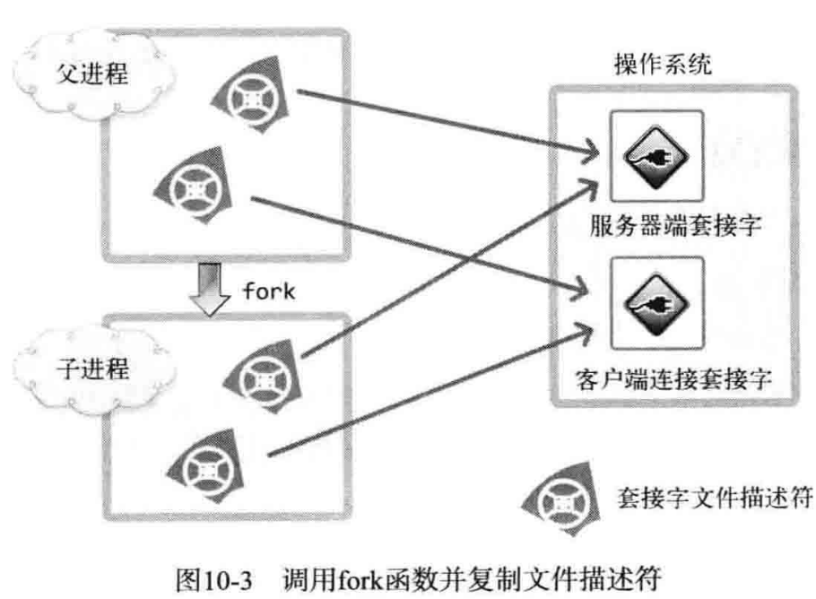
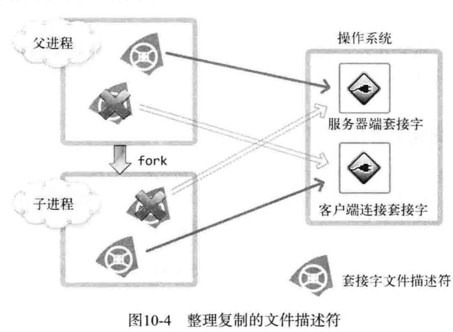
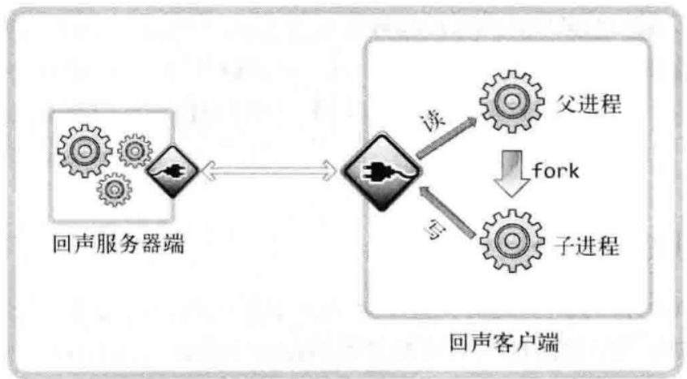

- 并发服务器一般有如下实现方式
	- 多进程服务器：创建多个进程提供服务
	- 多路复用服务器：通过捆绑并统一管理IO对象提供服务
	- 多线程服务器：通过生成与客户端等量的线程提供服务
- 本章简单讲解多进程服务器的实现方法
	- [[$red]]==**注意**==：windows下并不支持此方法
- # 进程
	- 进程ID是大于2的整数
	- 使用``fork``函数创建当前正在运行(调用fork函数的)进程的副本并执行
		- **头文件**：``<unistd.h>``
		- **参数**：void
		- **返回值**：成功返回进程ID，失败返回-1
			- 实际上父进程和子进程的返回值亦有区别：
				- 父进程：返回子进程ID
				- 子进程：返回0
			- 可以通过这一点在后续处理中区分父子进程
- # 僵尸进程
	- 执行完后本应被销毁的进程继续在系统中留存并占用资源的进程就是僵尸进程
	- ## 产生僵尸进程的原因
		- 已经在主函数种返回的子进程不会被操作系统销毁，而是保留其返回值和资源，直到父进程接受了其返回值
		- 若父进程一直不接受返回值(有可能没有等待子进程返回值而直接终止)，则这些子进程就一直不被释放，成为了僵尸进程
	- ## 销毁僵尸进程的方法：
		- 有两个函数可以让父进程获取子进程的返回值，自然也销毁了子进程
		- 调用函数``wait``获取子进程返回值
			- **头文件**：``<sys/wait.h>``
			- **参数**：``int* statloc``
				- 接收子进程返回值的变量的指针
				- 返回值通过两个宏解读
					- **WIFEXITED**，如果子进程正常终止，为真
					- **WEXITSTATUS**，返回子进程的返回值
			- **返回值**：成功时返回终止的子进程的PID，失败返回-1
			- wait函数**[[$red]]==是阻塞式的==**，会阻塞直到任意子进程返回
		- 调用``waitpid``获取指定pid子进程的返回值
			- **参数**：``pid_t pid, int* statloc, int options``
				- pid是等待终止的子进程id，如果为-1，则此函数退化为wait函数，等待任意子进程解说
				- options用于传递头文件``sys/wait.h``中声明的常量**WNOHANG**，如果传入此项，则**不会进入阻塞状态**，**如果没有已终止的子进程，则返回0**
			- **返回值**：成功返回终止的子进程的ID，失败返回-1
- # 信号处理
	- wait系列函数只能做到等待，要么阻塞，要么循环等待，限制了父进程完成自己的操作
	- 操作系统实际上会捕获子进程结束的事件，向父进程**以[[$red]]==信号==的方式通知**
	- 调用函数``signal``注册在收到指定信号之后的回调函数
		- **头函数**：``<signal.h>``
		- **参数**：``int signo, void (*func)(int)``
		- **返回值**：参数为一个int，返回值为void的函数指针
		- 这是一个非常经典的复杂定义函数，完整定义为：
			- **``void(*signal(int signo, void(*func)(int)))(int)``**
	- 部分信号如下：
		- ``SIGALRM``，已经经过了之前调用alarm函数注册的时间
		- ``SIGINT``，输入``CTRL-C``
		- ``SIGCHLD``，子进程终止
	- 调用函数``alarm``设置闹钟
		- **头文件**：``<unistd.h>``
		- **参数**：``unsigned int seconds``
			- 若传入0，则之前设置的闹钟将会被取消
		- **返回值**：返回0或以秒为单位的，距SIGALRM信号发生所剩的时间
	- 调用回调函数的**主体[[$red]]==是操作系统==**，但是**实际执行这些函数的是用户进程**
		- 因此为了执行回调函数，若用户进程此时处于睡眠状态，则会唤醒用户进程
		- 被唤醒的用户进程哪怕还没有睡够时间也不会再重回睡眠状态，而是继续执行接下来的语句
	- ## 更加跨平台和稳定的函数
		- ``sigaction``函数是跨平台的，再所有的UNIX系统上的表现一致(相较于``signal``)
			- **头函数**：``<signal.h>``
			- **参数**：``int signo, const struct sigaction* act, struct sigaction* oldact``
				- act：需要注册的操作
				- oldact：如果需要之前注册的操作，通过此参数获取，若不需要直接传入NULL
					- 也能提取到之前调用signal注册的回调函数
			- **返回值**：成功返回0，失败返回-1
			- struct sigaction有如下成员：
				- ``void (*sa_handler)(int)``：对应signal中传入的hanlder函数
				- ``sigset_t sa_mask``
					- 此成员无法直接赋0，需要通过函数``sigemptyset``置0
				- ``int sa_flags``：此成员和上一个成员主要用于指定信号相关的选项和特性，目前不太需要，全部置零即可
		- 实际上，除非为了兼容老程序，**目前已经很少会使用signal函数编程**，都是使用sigaction
		- [[$red]]==**注意**==：虽然此函数是跨平台的，但是提供了很多不同版本的实现，需要使用**``feature_test_macros``**来确定使用的版本
			- 例如，在include signal.h之前，``#define _GNU_SOURCE``
- # 简单实现多进程并发服务器
	- ## 关于fork之后被复制的文件描述符
		- fork创建的子进程会复制父进程的所有资源，包括**[[$red]]==文件描述符==**
		- 要所有持有某一个文件描述符的进程都销毁了文件描述符，系统才会关闭该文件
		- 因此要在fork之后，关掉和本进程工作无关的文件描述符
		- {:height 359, :width 479}
		- {:height 366, :width 489}
- # 分割TCP的I/O routine
	- 目前的客户端实现，读写IO都有一个进程完成，客户端发送消息之后将立即调用若干次read阻塞直到上一条信息中的所有数据传回
	- 可以分割读写，达到更高效率
	- {:height 281, :width 489}
	-