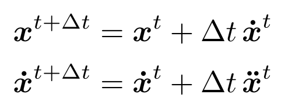
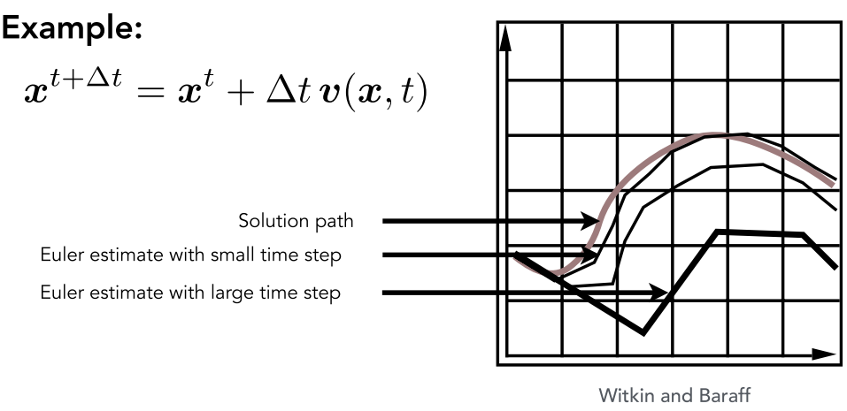
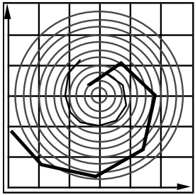
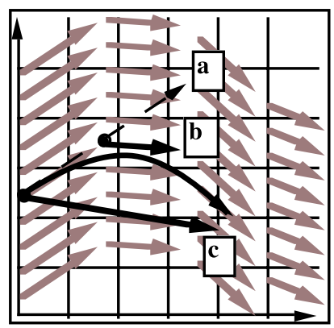
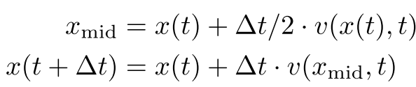
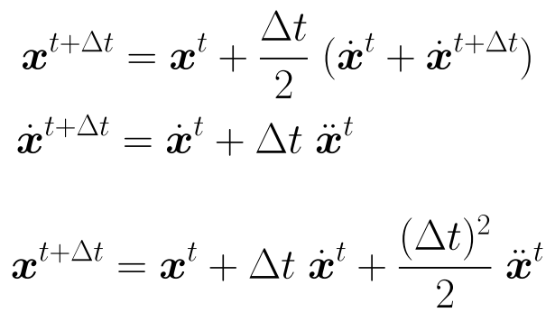
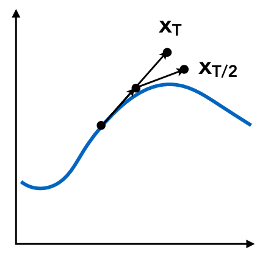
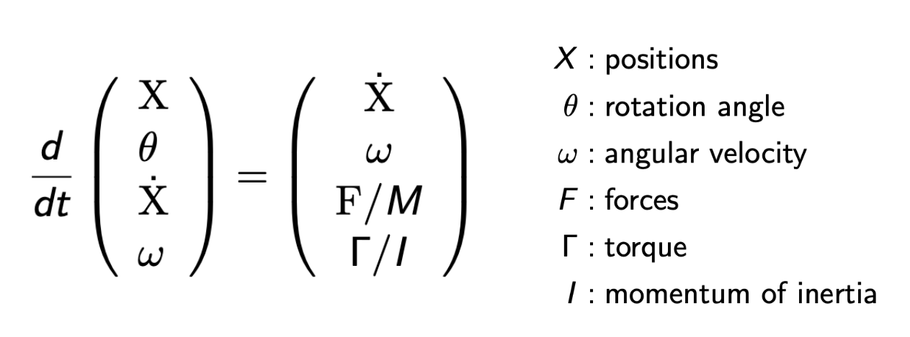

- 在计算机图形学中，动画可以被认为是一个和模型相关的，在时间上的一个函数
- 世界上第一部手绘的剧场版动画，长度达到Feature Length(>40 min)的是迪士尼的白雪公主
- 世界上第一部全CG Feature Length电影是玩具总动员
- # 关键帧动画(Key Frame Animation)
	- {:height 212, :width 480}
	- 由大神绘制出关键帧，苦力们填充关键帧之间的画面
	- ## 关键帧插值(Interpolation)
		- 最简单的插值就是线性插值，但是如果想做出自然的自动插值，简单的线性插值并不足够
			- {:height 310, :width 415}
- # 物理模拟
	- 主要是通过牛顿力学来根据物体的受力来计算物体的下一时刻位置
	- {:height 230, :width 434}
	- ## 质点弹簧系统(Mass Spring System)
		- 是物理模拟中最常用的一种模型
		- ### 简单弹簧
			- 两个质点之间由一个弹簧链接，每个质点所受的力和它们之间的距离有关
				- {:height 128, :width 342}
			- 但是弹簧一般都有一个rest length，在rest length下两个质点都不会受到来自弹簧的力
				- {:height 223, :width 359}
				- 但是这个模型还是存在问题，那就是稍有变动之后会一直震动下去
				- 所以要加入摩檫力，也就是势能或动能的损耗
		- ### 一种常用记法
			- 在一个变量上加一个点表示这个变量的导数(Derivative)
			- 假设$x$表示空间中的一个位置，该位置是一个在时间t上的函数，那么
			- $\dot{x}=v$表示速度
			- $\ddot{x}=a$表示加速度
		- ### 带有内部损耗的弹簧
			- 为了让弹簧停下，给所有质点都添加一个和运动方向相反的力，这个力叫**damping force**
			- 假设一个质点的位置为$b$，那么$f = -k_d\dot{b}$
				- $k_d$就是damping coefficient
			- 但是会导致一个问题，那就是所有的运动都会被减慢甚至是停止
				- 例如，$a$，$b$都在像一个方向同步运动，这种情况下$a$，$b$之间的弹簧并没有任何拉伸或挤压，但还是会受到一个反方向的力，这明显不合理
		- ### 考虑两个被链接的质点之间相对运动所带来的损耗
			- 将damping force设置在两个质点之间的相对运动上
			- {:height 156, :width 473}
			- 注意红框中的东西最后计算出来是一个标量值，因为两个元素之间是做的点乘
			- 因为相对速度中，只有分解到弹簧方向上的部分才会导致损耗，所以要先做一次投影
		- ### 使用弹簧构成各种解构
			- 例如，可以用弹簧构成布料的结构
				- {:height 194, :width 429}
	- ## 粒子系统(Particle System)
		- 常用于建模大量粒子所构成的系统，应用广泛
		- 粒子之间的作用力有很多来源
			- 引力，电磁力，摩擦力，碰撞
		- 可以被用于建模：
			- 云雾
			- 火焰
			- 水体
			- 人群
			- 。。。
- # 运动学(Kinematics)
	- ## 正向运动学(Forward Kinematics)
	- 运动学分为正向和逆向(Inverse)，逆向更难
	- 运动学的本质还是希望指导动画的制作，方法是通过一个骨骼系统
	- 一个骨骼系统的核心是各种**关节(Joint)**，各种骨骼通过关节形成**拓扑结构**，并往往使用树状结构来存储
	- ### 关节
		- 关节可以被分为三种类型
			- Pin(一维)
				- 只能在某一个平面内旋转
			- Ball(二维)
				- 球形关节，可以不仅仅在一个平面内旋转
			- Prismatic Joint
				- 关节本事不是完全固定的，可以有一些位移(Translation)
				- {:height 98, :width 166}
		- 正向运动学的本质是，给出一个若干由关节连接的结构，告诉每个关节旋转多少角度，然后计算出每个结构旋转之后的位置
	- ## 逆向运动学(Inverse Kinematics)
		- 正向运动学不利于艺术家们的表达
		- 因此一般采用逆向运动学，先将某个结构拖到想要的位置，再计算怎么到这个位置
		- 逆向运动学的问题是可能会出现多解和无解的情况
			- 多解即一个终端位置可能有多种运动方案
			- 无解即某个终端位置根本不可达
		- 用梯度下降法求解优化问题
			- 牛顿法
- # Rigging
	- 对于某种形状的控制
	- {:height 242, :width 244}
- # 动作捕捉(Motion Capture)
	- 把真人的动作通过控制点转移到虚拟任务上
	- {:height 314, :width 180}
	- 动作捕捉分为：光学(Optical)，电磁学(Magnetic)，机械(Mechanical)
		- 目前使用最广泛的还是光学
- # 动画电影生产流水线
	- {:height 498, :width 570}
- # 欧拉方法(Euler Method)
	- ## 单个粒子模拟
		- 考虑有一个所谓的**速度场**，任何粒子在其中都可以通过位置和事件得到一个速度
			- $v(x,t)$
		- 求解一个例子在时加上的不同位置需要解**一阶常微分方程(First Order Ordinary Differential Equation)**
			- $\frac{dx}{dt} = \dot{x} = v(x,t)$
			- 一阶指的是一阶导数
			- 常指的是单变量，导数，没有偏分(Partial)
		- 为了求解在未来某一时刻的位置，首先需要指定一个**起始位置**$x_0$
		- 欧拉方法即是迭代地去求，把之间分为若干小块，不停的去求下一个时间中例子所在的位置
			- 又叫**正向欧拉(Forward Euler)**或**显式欧拉(Explicit Euler)**
			- 一种点简单的**迭代**方法
			- 很常用，但是非常**[[$red]]==不准确(Inaccurate)==**，经常会出现**不稳定(Unstable)**的情况
			- {:height 108, :width 269}
			- 可以看到，求解当前时刻的值，一直在使用上一时刻的值
		- **不精确**是指在使用欧拉方法时，如果步长过小，很容易出现不理想的结果
			- {:height 213, :width 421}
		- **不稳定**是指，欧拉方法中，某一时刻只能拿到一个近似切线方向的值，无论步长多小，都无法得到理想的结果，例如，在一个螺旋型的速度场中，粒子应当做圆周运动，但是使用欧拉法求解，粒子一定会飞出去
			- {:height 156, :width 149}
			- 也即，对于导数变化程度比较剧烈的运动，不好模拟，误差会越来越大，形成**正反馈**
		- ### 误差(Error)和不稳定(Instability)
			- 在欧拉法中误差和不稳定是两个最重要的缺点
			- **误差**
				- 每一步都会产生误差，且误差会累积。
					- 随着模拟的过程继续，精确度会下降得越来越严重
				- 但是，在图形学应用中，精确度并不是那么关键
			- **不稳定**
				- 误差组合起来便会导致模拟**发散(Diverge)**
				- 不稳定性才是欧拉法最严重的问题，且不能被忽略
	- ## 减缓不稳定性
		- 有很多方法可以用于减缓不稳定性带来的影响
		- ### 中点法(Midpoint Method)
			- 核心思想是使用起始点和结束点的**平均速度**
			- 步骤：
				- {:height 186, :width 180}
				- 进行一次欧拉计算步骤，得到一个点a
				- 计算其实出发点到a点的中点b的导数(速度)
				- 使用中点速度从原始点出发，得到一个新的点c，c点就是最终的点
				- {:height 75, :width 340}
			- 基于中点法的欧拉方法的计算公式：
				- {:height 183, :width 309}
			- 中点法更准确的原因是多了一个二次项，能够一定程度上模拟抛物线
		- ### 自适应步长(Adaptive Step Size)
			- 根据预估误差大小来选择合适的步长长度
			- 非常实用的技巧，但可能导致出现非常小的步长
			- 步骤：
				- {:height 200, :width 205}
				- 基于步长T计算得到一个点$x_T$
				- 基于步长$\frac{T}{2}$计算两次得到一个点$x_{T/2}$
				- 如果两个点之间的误差大于一个阈值，那么减少步长，并重复上述步骤
		- ### 隐式欧拉法(Implicit Euler Method)
			- 也被叫做逆向法(Backward Methodo)
			- 对当前步骤使用未来的导数
			- 需要使用一些方程求解方法，例如牛顿法等
			- **如何量化“稳定性(Statbility)”**
				- 用局部(每一步)的误差(truncation error)和全局累积误差来量化稳定性
				- 这两个东西的值意义不大，但是这两个的阶(Order)很重要，也就是和$\Delta t$有关系
				- 隐式欧拉法是一阶的，也即：
					- 局部误差：$O(h^2)$
					- 全局误差：$O(h)$
					- $h$就是步长，也即$\Delta t$
				- $O(h)$是指，如果将步长减小为一般，那么误差也为减少一半
		- ### Runge-Kutta Families
			- 一类擅长解常微分方程(ODE)的方法，尤其是针对非线性的函数
			- 四阶版本的Runge-Kutta方法是最常用的，也称**RK4**
		- ### Position-Based / Verlet Integration
			- 在使用正向欧拉得到下一位之之后，限制粒子的位置以阻止发散
			- 快并且简单，但是并不是基于无力的，会损耗(Dissipate)能量
- # 刚体模拟(Rigid Body Simulation)
	- 和粒子模拟类似，但是需要考虑更多性质
	- {:height 163, :width 438}
- # 液体模拟
	- ## Position-Based Method
		- 认为水是由很多细小的刚体球组成的
		- 认为水不能被压缩，也即密度是常数
		- 因此如果某处的密度有所变化，应当通过改变粒子的位置来纠正这种密度变化
		- 需要知道所有位置处小球位置的密度梯度
		- 求解方式就是梯度下降算法
- # 拉格朗日法(Lagrangian)和欧拉法(Eulerian)
	- 是两种模拟大量物体的方法，此处的欧拉法并不是之前的欧拉求解发
	- 拉格朗日法又称**质点法**，也即通过很多质点去模拟
	- 欧拉法又称**网格法**，将空间划分为若干网格，考虑网格每时每刻离开和进入的物体
	- ## Material Point Method(MPM)
		- 将质点法和网格法混合在一起的方法
		- 每个点具有一定的性质，但是性质的计算在网格上完成，最后将性质从网格写回每一个粒子
		-