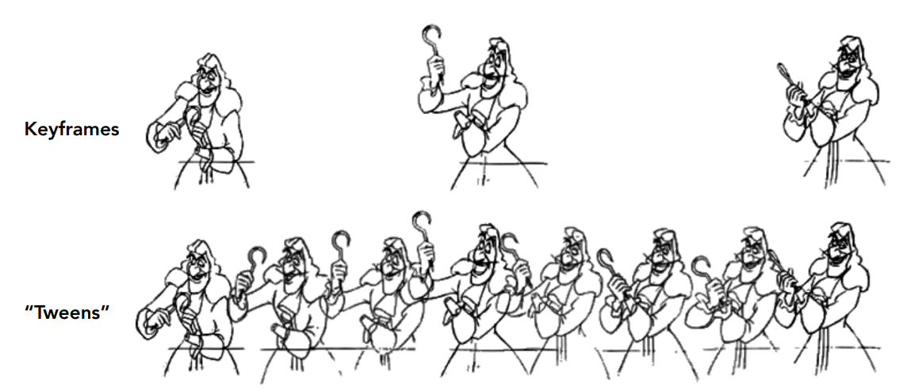
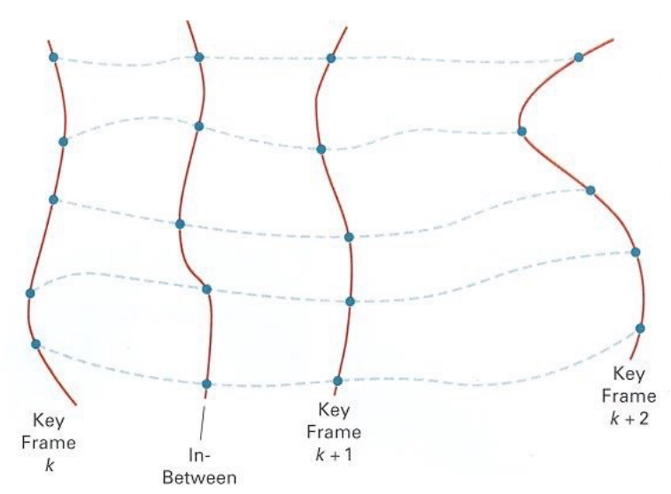
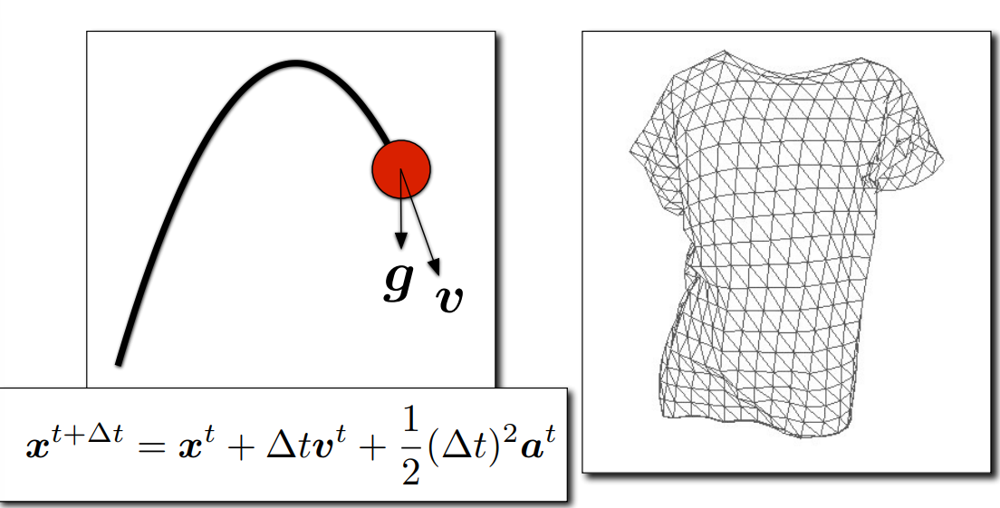
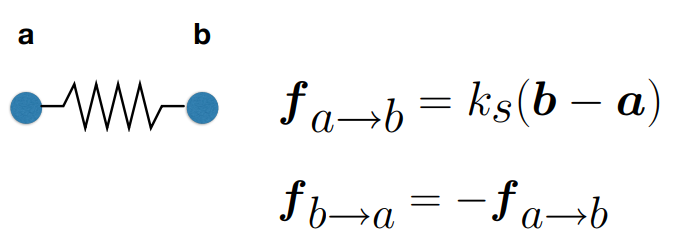
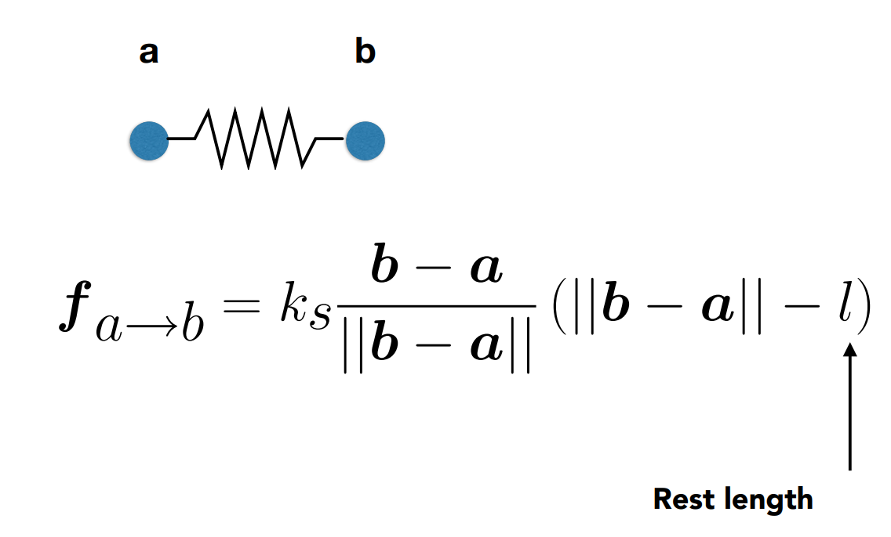
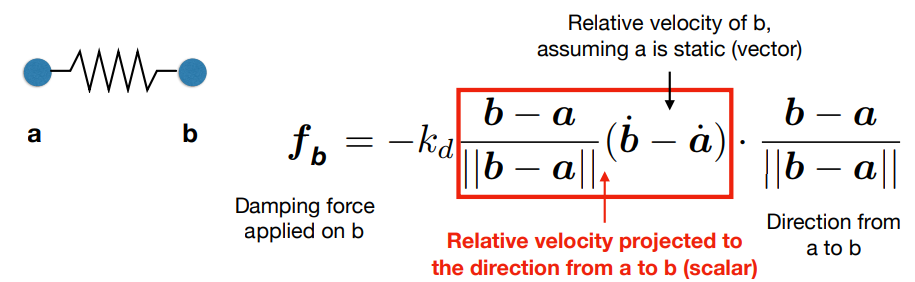
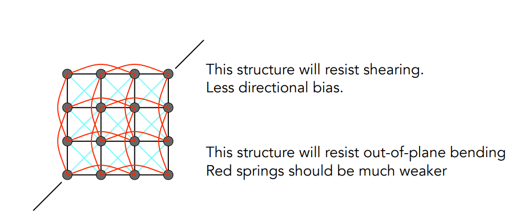

- 在计算机图形学中，动画可以被认为是一个和模型相关的，在时间上的一个函数
- 世界上第一部手绘的剧场版动画，长度达到Feature Length(>40 min)的是迪士尼的白雪公主
- 世界上第一部全CG Feature Length电影是玩具总动员
- # 关键帧动画(Key Frame Animation)
	- {:height 212, :width 480}
	- 由大神绘制出关键帧，苦力们填充关键帧之间的画面
	- ## 关键帧插值(Interpolation)
		- 最简单的插值就是线性插值，但是如果想做出自然的自动插值，简单的线性插值并不足够
			- {:height 310, :width 415}
- # 物理模拟
	- 主要是通过牛顿力学来根据物体的受力来计算物体的下一时刻位置
	- {:height 230, :width 434}
	- ## 质点弹簧系统(Mass Spring System)
		- 是物理模拟中最常用的一种模型
		- ### 简单弹簧
			- 两个质点之间由一个弹簧链接，每个质点所受的力和它们之间的距离有关
				- {:height 128, :width 342}
			- 但是弹簧一般都有一个rest length，在rest length下两个质点都不会受到来自弹簧的力
				- {:height 223, :width 359}
				- 但是这个模型还是存在问题，那就是稍有变动之后会一直震动下去
				- 所以要加入摩檫力，也就是势能或动能的损耗
		- ### 一种常用记法
			- 在一个变量上加一个点表示这个变量的导数(Derivative)
			- 假设$x$表示空间中的一个位置，该位置是一个在时间t上的函数，那么
			- $\dot{x}=v$表示速度
			- $\ddot{x}=a$表示加速度
		- ### 带有内部损耗的弹簧
			- 为了让弹簧停下，给所有质点都添加一个和运动方向相反的力，这个力叫**damping force**
			- 假设一个质点的位置为$b$，那么$f = -k_d\dot{b}$
				- $k_d$就是damping coefficient
			- 但是会导致一个问题，那就是所有的运动都会被减慢甚至是停止
				- 例如，$a$，$b$都在像一个方向同步运动，这种情况下$a$，$b$之间的弹簧并没有任何拉伸或挤压，但还是会受到一个反方向的力，这明显不合理
		- ### 考虑两个被链接的质点之间相对运动所带来的损耗
			- 将damping force设置在两个质点之间的相对运动上
			- {:height 156, :width 473}
			- 注意红框中的东西最后计算出来是一个标量值，因为两个元素之间是做的点乘
			- 因为相对速度中，只有分解到弹簧方向上的部分才会导致损耗，所以要先做一次投影
		- ### 使用弹簧构成各种解构
			- 例如，可以用弹簧构成布料的结构
				- {:height 194, :width 429}
	- ## 粒子系统(Particle System)
		- 常用于建模大量粒子所构成的系统，应用广泛
		- 粒子之间的作用力有很多来源
			- 引力，电磁力，摩擦力，碰撞