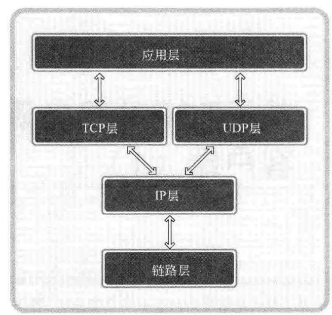
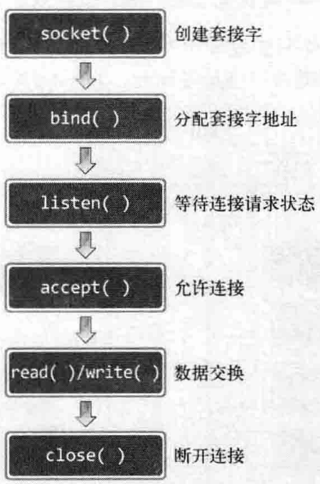
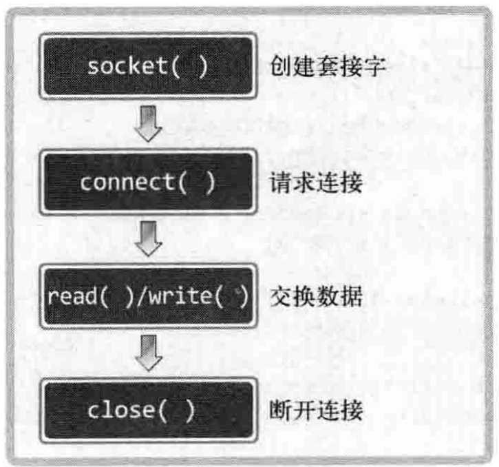

- # 复习TCP和UDP
	- TCP面向连接，且为流式传输
	- TCP全程**Transmission  Control Protocl**
	- ## TCP/IP协议栈
		- {:height 425, :width 440}
- # 实现 基于TCP的服务器端/客户端
	- {:height 246, :width 156}
	- 在绑定地址之后调用``listen``函数监听请求
		- **头文件**：``<sys/socket.h>``
		- **参数**：``int sock, int backlog``
			- backlog代表请求队列的长度
				- 此参数的实际值根据服务器段特性决定，像平凡接受请求的Web服务器段至少应该将此参数设置为15
		- **返回值**：成功0，否则-1
		- 调用了此函数的socket进入了**等待连接请求状态**
	- ## 受理客户端连接请求
		- 进入等待连接请求状态的socket，应该对于新的连接请求**按序受理**
		- 调用函数``accept``函数接受连接
			- **参数**：``int sock, struct sockaddr* addr ,socklent_t* addrlen``
				- sock是服务器端的套接字
				- addr是一个地址指针，用于保存发起请求的客户端socket地址
				- addrlen在调用完成之后储存addr的长度
			- **返回值**：成功返回可用于传输数据的套接字文件描述符，否则-1
		- 由于服务器段的套接字已经用于处理连接强求，因此如果要进行数据读写，应该使用另外的套接字进行
	- ## 客户端请求连接并接收数据
		- {:height 251, :width 254}
		- 调用``connect``函数**请求**连接
			- **参数**：``int sock, struct sockaddr* servaddr, socklen_t addrlen``
			- **返回值**：成功返回0，失败返回-1
		- connect函数只有发生以下情况之一才会返回
			- 服务器段接受连接请求(进入等待队列)
			- 发生断网等异常情况而**终端连接请求**
		- 客户端建立连接时似乎只提供了服务器的地址信息，那么其自身的IP和端口在**何时分配**？
			- **答**：在**调用connect**函数时分配，由**操作系统内核**直接分配，IP分配自身IP，端口随机
- # 实现迭代服务器端/客户端
	- ## 目前代码中存在的问题
		- 传输数据时以字符串作为单位：
			- ``write(sock, message, strlen(message));``
			- ``read(sock,message, BUF_SIZE-1)``
		- 由于TCP实际是流式传输，上述代码在实际执行时很有可能出现一次性读取多个字符串或只读取到字符串片段的情况
-