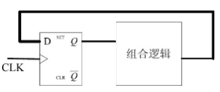
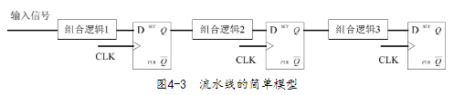
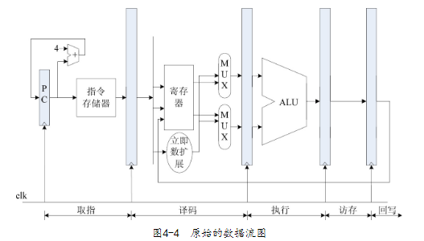
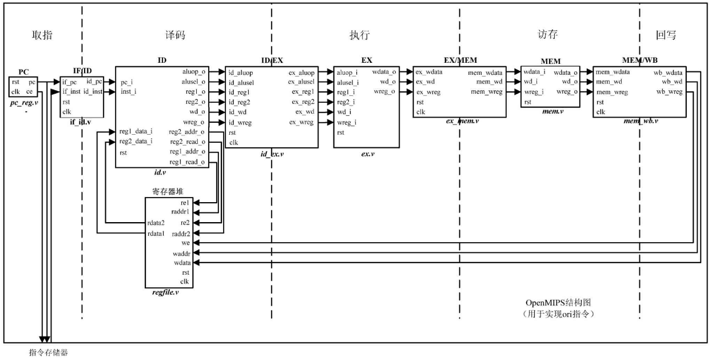

- 符号扩展：使用最高位填充
- 无符号扩展：均使用0填充
- # 流水线
	- ## 流水线的电路概念
		- 寄存器按照给定时间脉冲来进行时序同步操作，其使得时序逻辑电路具有**记忆功能**
		- 组合逻辑电路则由逻辑门组成，提供电路的所有逻辑功能
		- 实际的数字电路一般是组合逻辑与时序逻辑的结合
		- ### 状态机
			- 如果寄存器的输出端和输入端存在环路，这样的电路称为“状态机”
			- 
		- ### 流水线
			- 寄存器之间有连接，但没有环路
			- 
			- 信号**在寄存器之间传递**，每传递到一级都会引起相应的组合**逻辑电路变化**
			- 对这种模型进行抽象描述就是**寄存器传输级（RTL）**
	- ## 原始OpenMIPS五级流水结构
		- 
		- 深色部分对应D触发器
		- {:height 426, :width 829}
		  id:: 62b68f49-f0d4-4921-b244-4552cfa0b72d
- # 补充：ELF文件格式
	- **Executable and Linkable Format**
	- UNIX系统实验室（USL）开发和发布的，作为应用程序二进制接口（Application Binary Interface，ABI）的文件格式
	- 分为**三种类型**
		- [[$blue]]==可重定位（Relocatable）文件==：保存着代码和适当的数据，用来和其他Object文件一起创建一个可执行文件或共享文件。
		- [[$blue]]==可执行（Executable）文件：==保存着一个用来执行的程序，该文件指出了如何来创建程序进程映象。
		- [[$blue]]==共享目标文件：==包含了在两种使用环境中链接的代码和数据。首先链接器（ld）可以将它和其余可重定位文件和共享目标文件一起处理，生成另外一个目标文件
			- 比如：编译器和链接器把*.o和*.so一起装配成一个*.exe文件。
			- 动态链接器（Dynamic Linker）可将它与某个可执行文件以及其他共享目标文件组合在一起创建进程映像（比如：动态加载器把*.exe程序和*.so加载进内存执行）。
	- **组成**
		- ELF header
		- Program header table
		- Sections
			- **代码段**：.text
			- **只读数据段**：.rodata
			- **数据段**：.data
			- **未初始化全局数据段**：.bss(block starting symbol)
		- Section header table
	- **mips-sde相关工具使用**
		- [[$blue]]==编译==
			- ``mips-linux-gnu-as –mips32 [源文件路径] -o [目标文件路径]``
		- [[$blue]]==链接==
			- ``mips-linux-gnu-ld -T [脚本名] [源文件路径] -o [目标文件路径]``
		- [[$blue]]==阅读ELF文件==
			- ``mips-linux-gnu-readelf``
			- ``-h``，阅读文件头
			- ``-l``，阅读program header
			- ``-S`` 阅读分段信息
	-