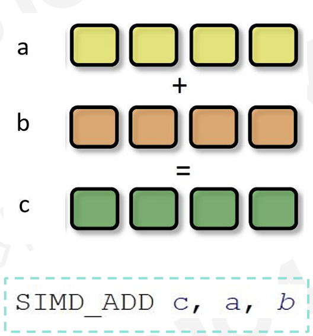
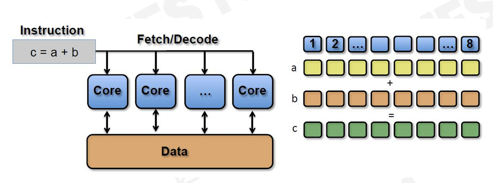
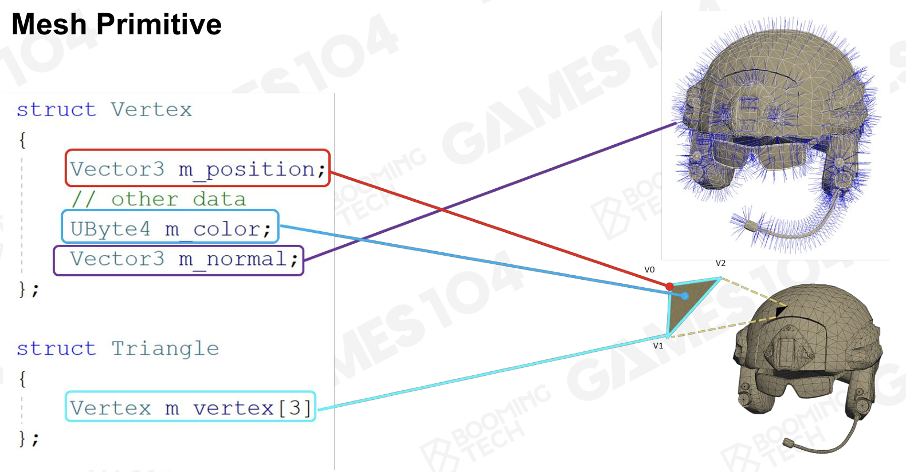
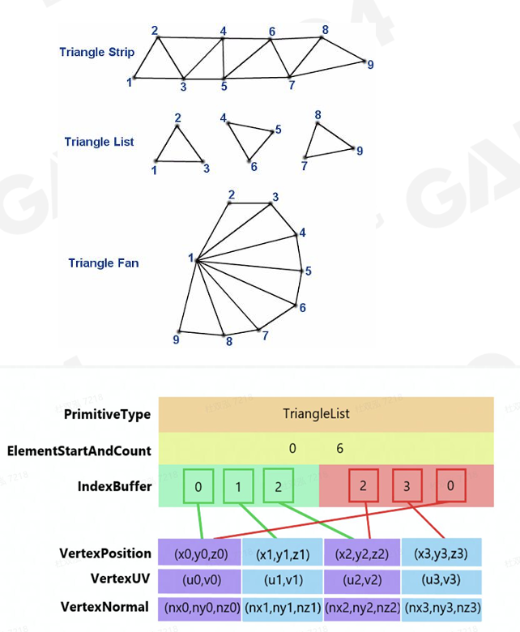
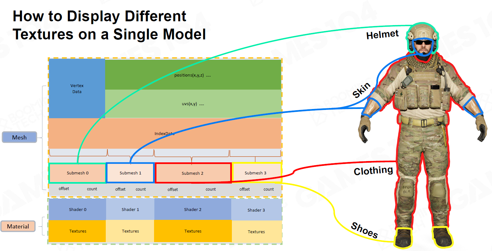

- 游戏引擎中的渲染需要做到高度**实时化**(Realtime)
	- 至少要做到30FPS以上才能叫作“**实时**”
- # 渲染管线和计算
	- 
	- 绘制系统实际上是要做大量的运算，包括：
		- ### 光栅化
			- 
		- ### 着色
			- 
		- ### 材质采样
			- 
	- ## 了解GPU
		- ### SIMD和SIMT
			- SIMD(Single Instruction Multiple Data)
				- {:height 193, :width 170}
				- 一条指令，同时执行若干次数据运算
				- 类似于并行的数组计算
			- SIMT(Single Instruction Multiple Threads)
				- 伴随有多线程的SIMD
				- {:height 140, :width 371}
				- GPU就是使用了SIMT思想，其架构中包含大量核心(N卡的CUDA)
		- ### 数据的单项流通
			- CPU和GPU之间通信的代价非常昂贵
			- GPU自带显存用于存储临时数据
			- 在游戏引擎的设计中，一个原则是数据**仅从CPU到GPU单向流通**，且从CPU到GPU之间通信的数据量也应当最小化
		- ### 关注缓存性能
			- cache miss的性能损失远超想象
			- 应该合理组织所需数据在内存中的存储方式，以保证更高的缓存命中概率
		- ### 限制GPU性能的各个方面
			- Memory Bound
			- ALU Bound
			- TMU(Texture Mapping Unit) Bound
			- BW(Bandwidth) Bound
- # 可渲染物体
	- 并不是每一个GO都是可渲染的，更不是每一个GO都应当被渲染
	- 所以引擎一般都会提供和渲染相关的Component，只有拥有这些Component的GO才应当被绘制
	- 目前最常用的用于渲染的component，是**网格(Mesh)**以及绘制网格所需的各种数据(Texture, Material等)
	- ## 可渲染数据
		- 在游戏引擎中，如果想渲染一个东西，那么首先需要存储渲染这些东西所需要的**数据**
		- ### 网格(Mesh)
			- 也就是一般认知中的**模型**
			- {:height 203, :width 390}
			- 网格一般被以**顶点**和**三角形**的方式组织起来
			- 一般Vertex的信息需要直接存储，而三角形的存储方法可能会比较取巧，因为需要节省存储空间和最大化cache性能
				- {:height 363, :width 296}
		- ### 材质(Material)
			- 决定了一个物体的表面观感，主要是定义了物体如何和**光(源)**交互
			- 是游戏画面看起来真实的决定性因素之一
				- 另一方面就是模型(网格)的精细程度
			- 常见的材质模型包括：
				- 最经典的Phong-shading模型
				- PBR(Physically Based Rendering)
				- Subsurface Material
		- ### 纹理(Texture)
			- 纹理实际上可以看作材质的一部分
			- 在phong材质模型中，漫反射的Kd随着物体表面的uv坐标改变，描述这些Kd如何随着这uv变化的数据就是纹理
		- ### 着色器(Shader)
			- 一种很奇怪的渲染数据
			- 首先其本身通过代码写成，一般是GLSL或者别的什么语言。
			- 但是实际上会被编译成一个个二进制数据，和网格，材质等渲染数据放到一起
			- 实际GPU在绘制时，既会载入网格，材质等数据，也会载入编译好的Shader来决定如何渲染这些数据
	- ## 在引擎中渲染物体
		- ### 坐标系(Coordinate System)和变换(Transformation)
			- 模型asset基于自己的局部坐标系(Local Coordinate System)
			- 而引擎最终要做的，是把这些物体绘制到空间坐标当中
			- 这就需要各种变换，具体的变换过程在GAMES101中有讲，此处不做涉及
		- ### 子网格(Submesh)
			- 一个网格可能需要多种材质和纹理，因此在实际渲染时，一个网格可能会被拆分为多个子网格
			- 每个子网格对应自己的材质和纹理
			- {:height 277, :width 532}
		- ### 资源池