- 着色的核心就是引入颜色的**明暗**，使图像看起来更加真实
- 例如，如果渲染一堆立方体，没有shading的话效果如下：
	- 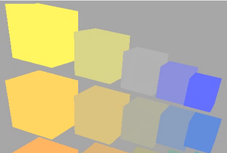{:height 168, :width 236}
- 带有shading的效果如下：
	- {:height 174, :width 244}
- 在本课中，shading 被定义为：**[[$red]]==对不同物体应用不同材质(Material)的过程==**
	- 不同的材质和光线的相互作用不同，所以最后的着色效果也就不经相同
- **在一个光照系统中，往往有三种[[$red]]==光照类型==**
	- 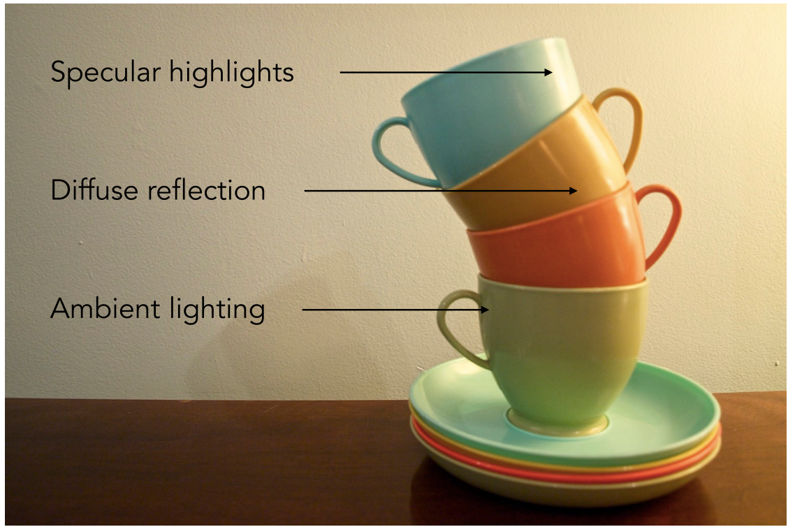{:height 204, :width 290}
	- 直面光源的部分可能会呈现出**高光(Specular Highlights)**
	- 没有被光源直射的部分可能会呈现出**漫反射(Diffuse Reflection)**
	- 背朝光源的地方也不一定就是漆黑一片，因为还有可能接收到**环境光(Ambient Lighting)**，也称**间接光照**
		- 由于环境光非常复杂，因此一般在实践中可能会把环境光照的量设为一个常量，即一个物体的任何部位都会受到一定的环境光照
- # 着色本质
	- {:height 208, :width 210}
	- 将着色看作一个函数，其作用是计算**特定[[$red]]==着色点==**所反射的射向相机的光
	- **输入**：
		- 观察者的方向，一个单位向量$\hat{v}$
		- 表面的法向量(Surface Normal)，单位向量$\hat{n}$
		- 光照方向，单位向量$\hat{l}$，可能有多个，对于每一个光源都要计算，通过光源点减去shading point后做归一化得到
		- 表面参数，例如颜色，光泽度(shininess)等
	- **[[$red]]==Shading is Local！==**
		- 对于每一个着色点，其着色情况都只考虑其自身和一些全局条件，不会考虑其是否在阴影中等情况，因此shading is local！
		- 也因此，**shading**$\ne$**shadow**
- # 一个简单的着色模型(Blinn-Phong Reflectance Model)
	- ## 漫反射(Diffuse Reflection)
		- 也称**Lambertian Term**
		- 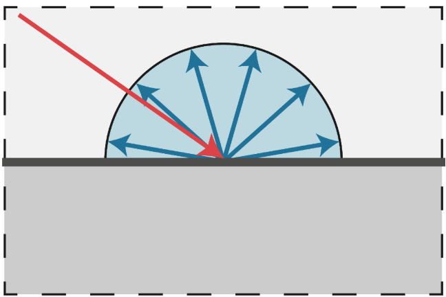{:height 246, :width 357}
		- 如果光纤会被均匀地反射到各个方向上(Scattered uniformly in all directions)，则这样的光照模式就叫做漫反射
		- 对于观测者来说，从任何方向观测，漫反射的材质的颜色都是相同的
		- ### 漫反射的光照强度
			- 但是粗暴地将漫反射规定为任何角度观测颜色都相同就会陷入最开始的问题，这样的图像并不真实
			- 和光照成不同角度的平面，吸收和反射的光应当是不同的，这就是**Lambert's Cosine Law**
				- 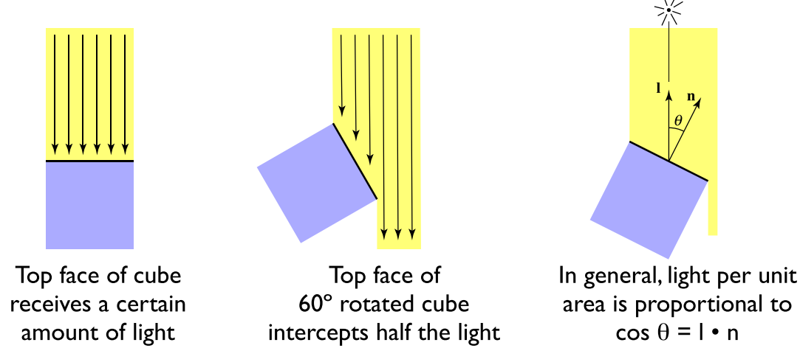{:height 195, :width 426}
				- 单位面积接受的光照强度和表面法向量与光照方向之间的夹角余弦成正比
			- **光的发散**
				- 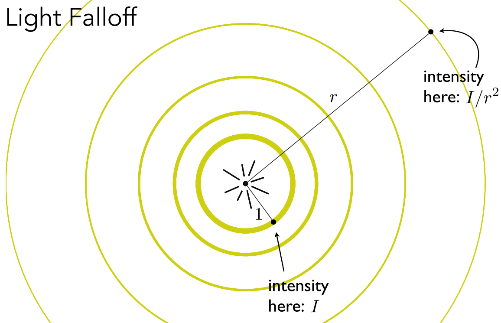{:height 174, :width 256}
				- 点光源的光线在传播过程中，光照强度和距离成反比
		- ### 漫反射着色公式
			- 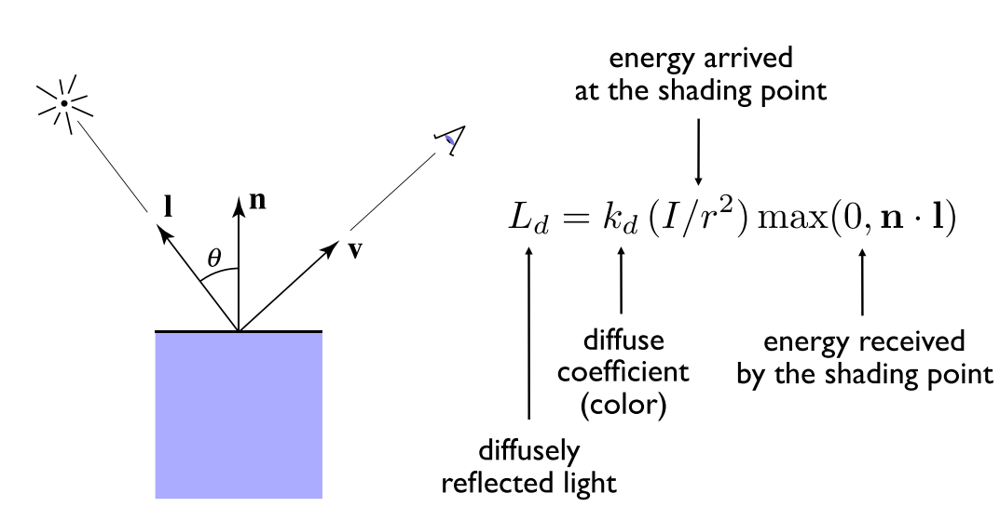{:height 246, :width 457}
			- 结合之前所提到的光照角度和能量接受的关系，以及光密度在距离上成反比，可以得到最终的漫反射着色公式
			- 若光线和表面所成角度为负，则光线已经照射到了表面的背面，这种情况在图形学中一般认为无意义，因此光照角度的余弦值会和0去最大值
			- $k_d$表示的是漫反射系数，也就是颜色。若为1表示所有的能量都不吸收，进多少出多少，这是最亮的材质；0表示所有的能量都被吸收，展示出的效果就是全黑
			- 如前所属，漫反射和观测角度无关，因为漫反射会像周围均匀反射光照，因此最终公式里也没有出现$\hat{v}$
	- ## 高光项(Specular Term)
		- 观测方向越靠近镜面反射方向则光照强度越大
			- 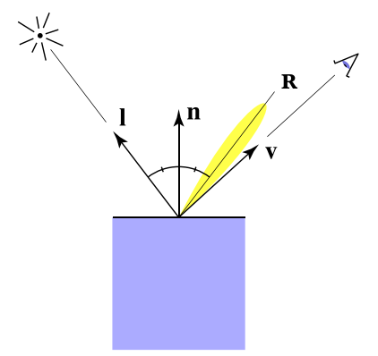{:height 157, :width 158}
		- 换一个说法，**[[$red]]==半程向量==离表面法向量越近，光照强度越大**
			- 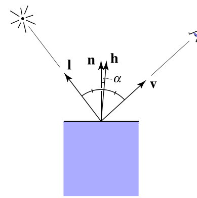{:height 188, :width 176}
			- 所谓半程向量就是两个向量之间夹角一般的向量，通过两个向量相加并归一化求得
				- $\bold{h}=\frac{\bold{v}+\bold{l}}{\| \bold{v}+\bold{l}\|}$
		- ### 高光光照公式
			- 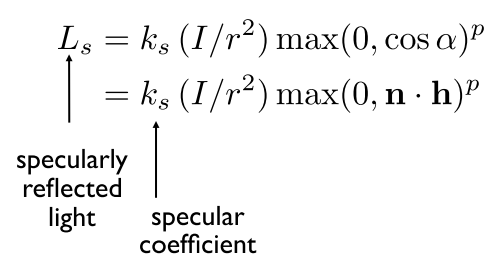{:height 184, :width 329}
			- 和光源距离无关，因为此模型(Blinn-Phong模型)是一个经验模型，将光照密度项去掉了，仅关心能否看到光源
			- $k_s$是**高光系数**，也称**镜面反射系数**，也可以理解为反射出的高光的颜色。一般都认为反射出的高光项的颜色是白的，取1
			- 使用$\hat{R}$和$\hat{v}$之间的夹角判断高光强度的是另一个模型
			- 注意夹角余弦项上有一个$p$指数，这是因为单纯$\cos$函数的递减太慢，在我们认为它们的方向其实离得很远(例如45度)，余弦值仍然相当可观，这会导致绘制出来的高光范围过大，因此引入一个指数常数，可以降低高光范围
				- 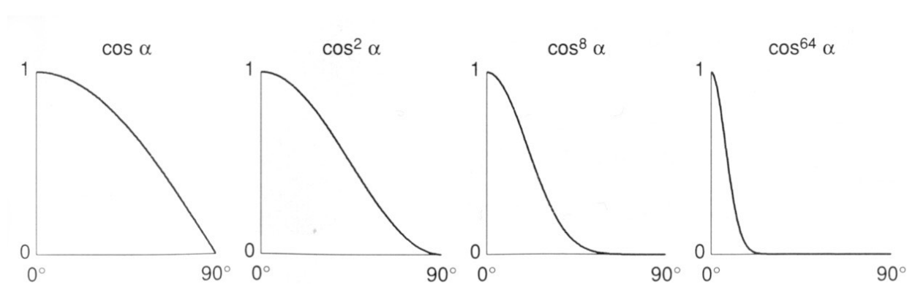{:height 172, :width 520}
				- 一般来说，在blinn-phong模型中，$p$**的取值为[[$red]]==100到200==**
				- 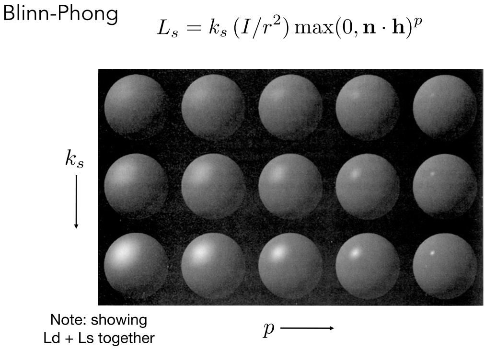{:height 266, :width 354}
	- ## 环境光项(Ambient Term)
		- 回忆：shading是每个shading point都独立进行的，因此在现有框架下想完全模拟环境光是不现实的
		- 一个简单的近似方法是，对每一个着色点，给其增加针对每一个光源的颜色常量
		- 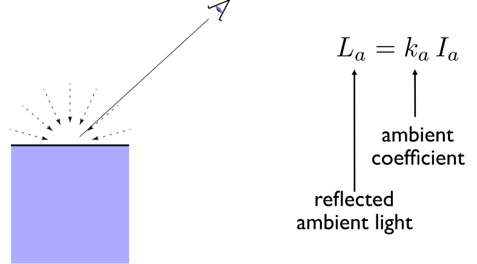{:height 197, :width 331}
		- 在这种假设下，**环境光就是用来提升亮度的**
	- ## 完整光照公式
		- $L = L_a+L_d+L_s=k_aI_a+k_d(I/r^2)\text{max}(0,\bold{n}\cdot\bold{l})+k_s(I/r^2)\text{max}(0,\bold{n}\cdot\bold{h})^p$
- # 着色频率(Shading Frequency)
	- 着色频率只在什么对象上应用着色操作
		- 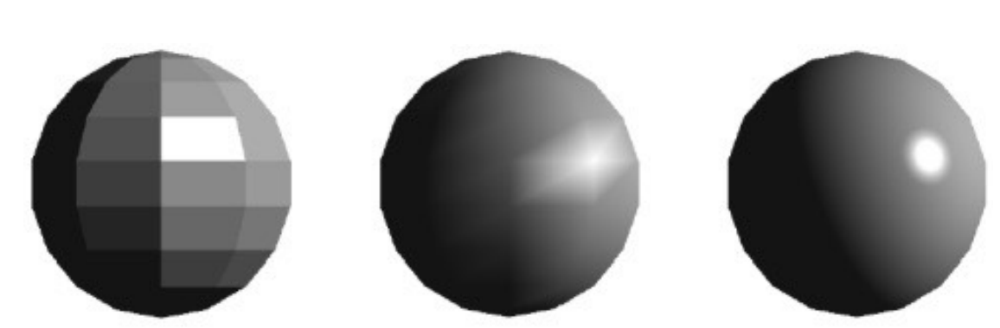{:height 163, :width 464}
		- 以上三种结果分别对应的是：在**几何面**上着色，在**三角形顶点**上着色然后三角形内部点的颜色通过插值确定，在每个**像素点**上着色
	- 根据着色频率的不同，可以**对shading进行分类**
		- ### Flat Shading
			- 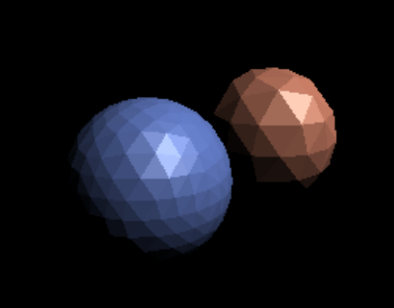{:height 159, :width 195}
			- 只对三角形面进行着色操作，对于每个三角面，只需要计算该面的法向量
			- 对于平滑的平面来说不太适用
		- ### Gouraud Shading
			- 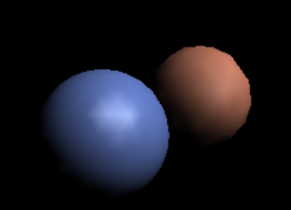{:height 148, :width 200}
			- Gouraud是个人名，也就是提出这种着色方式的人
			- 计算每个三角形顶点的颜色然后插值计算三角形内部的颜色
			- 对于每个顶点都要计算一次法向量
		- ### Phong Shading
			- 对每一个像素点进行着色计算
			- 每一个像素点的法向量通过和三角形进行插值来计算
			- **注意和Blinn-Phong反射模型做区分，一个是着色模型，一个着色频率分类**
	- 在低面数的情况下，不同的着色频率的最终效果差异明显，但随着面数的增加，三种着色频率的差异会逐渐缩小
		- 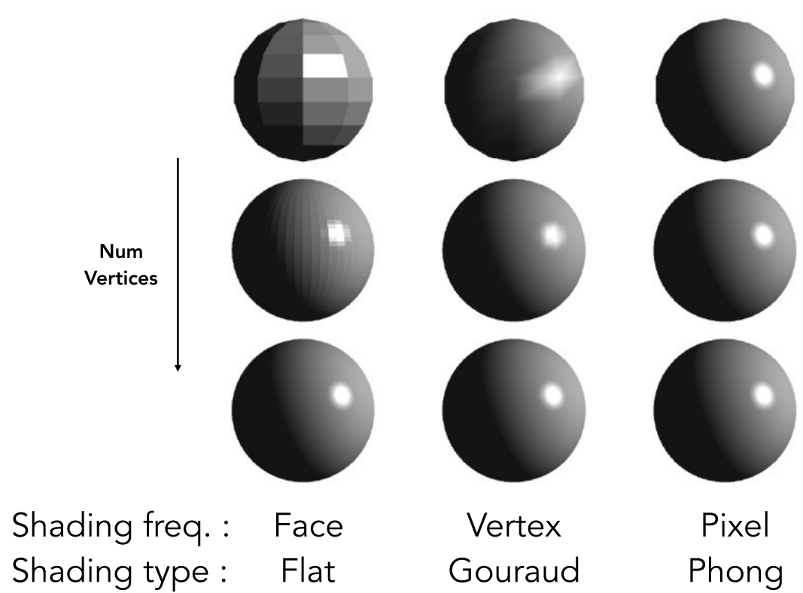{:height 258, :width 338}
	- ## 计算顶点的法向量
		- 在理想情况下，如果直到这些三角形想表示的几何解构到底是什么，例如说一个球体，那么对应顶点的法向量就很好得到，直接对球心做减法然后归一化即可
		- 实际操作中，**通过将顶点周围的三角形面的法向量相加，然后归一化**得到近似的顶点法向量
		- 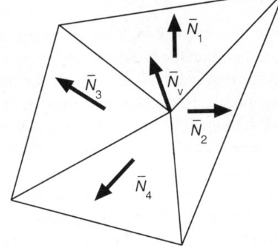{:height 176, :width 186}
		- $N_v = \frac{\sum_i{N_i}}{\| \sum_i{N_i}\|}$
	- ## 计算像素点的法向量
		- 通过插值来计算
		- 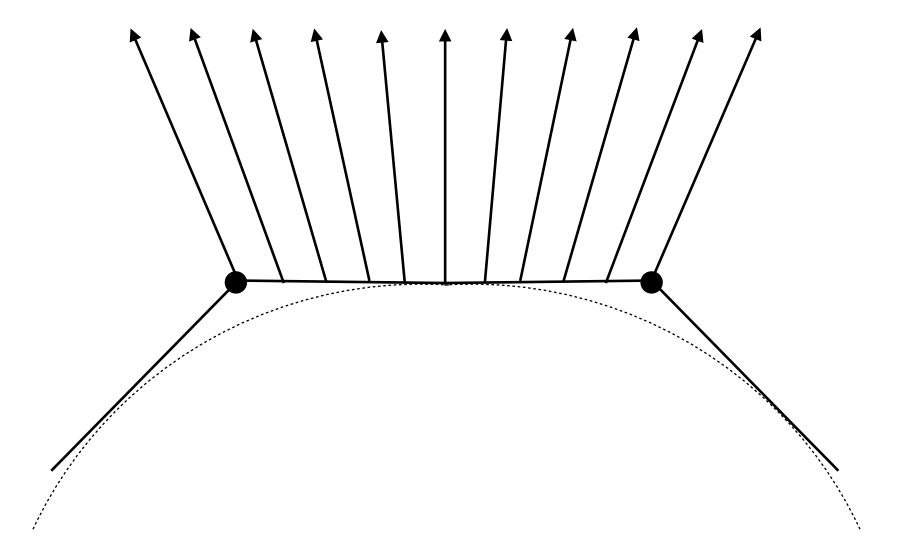{:height 217, :width 348}
		- 计算方法叫做**[[$red]]==重心插值==(Barycentric Interpolation)**
			- 会在后续课程中引入
	- **记住：所有的法向量计算，最后一步都是[[$red]]==归一化==**
- # 实时渲染管线
	- **Graphics (Real-time Rendering) Pipeline**
	-