- 着色的核心就是引入颜色的**明暗**，使图像看起来更加真实
- 例如，如果渲染一堆立方体，没有shading的话效果如下：
	- {:height 168, :width 236}
- 带有shading的效果如下：
	- {:height 174, :width 244}
- 在本课中，shading 被定义为：**[[$red]]==对不同物体应用不同材质(Material)的过程==**
	- 不同的材质和光线的相互作用不同，所以最后的着色效果也就不经相同
- **在一个光照系统中，往往有三种[[$red]]==光照类型==**
	- {:height 204, :width 290}
	- 直面光源的部分可能会呈现出**高光(Specular Highlights)**
	- 没有被光源直射的部分可能会呈现出**漫反射(Diffuse Reflection)**
	- 背朝光源的地方也不一定就是漆黑一片，因为还有可能接收到**环境光(Ambient Lighting)**，也称**间接光照**
		- 由于环境光非常复杂，因此一般在实践中可能会把环境光照的量设为一个常量，即一个物体的任何部位都会受到一定的环境光照
- # 着色本质
  collapsed:: true
	- 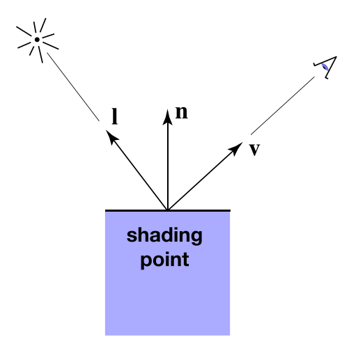{:height 208, :width 210}
	- 将着色看作一个函数，其作用是计算**特定[[$red]]==着色点==**所反射的射向相机的光
	- **输入**：
		- 观察者的方向，一个单位向量$\hat{v}$
		- 表面的法向量(Surface Normal)，单位向量$\hat{n}$
		- 光照方向，单位向量$\hat{l}$，可能有多个，对于每一个光源都要计算，通过光源点减去shading point后做归一化得到
		- 表面参数，例如颜色，光泽度(shininess)等
	- **[[$red]]==Shading is Local！==**
		- 对于每一个着色点，其着色情况都只考虑其自身和一些全局条件，不会考虑其是否在阴影中等情况，因此shading is local！
		- 也因此，**shading**$\ne$**shadow**
- # 一个简单的着色模型(Blinn-Phong Reflectance Model)
	- ## 漫反射(Diffuse Reflection)
		- 也称**Lambertian Term**
		- {:height 246, :width 357}
		- 如果光纤会被均匀地反射到各个方向上(Scattered uniformly in all directions)，则这样的光照模式就叫做漫反射
		- 对于观测者来说，从任何方向观测，漫反射的材质的颜色都是相同的
		- ### 漫反射的光照强度
			- 但是粗暴地将漫反射规定为任何角度观测颜色都相同就会陷入最开始的问题，这样的图像并不真实
			- 和光照成不同角度的平面，吸收和反射的光应当是不同的，这就是**Lambert's Cosine Law**
				- 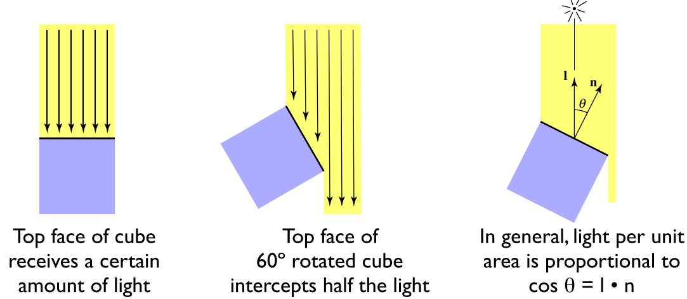{:height 195, :width 426}
				- 单位面积接受的光照强度和表面法向量与光照方向之间的夹角余弦成正比
			- **光的发散**
				- 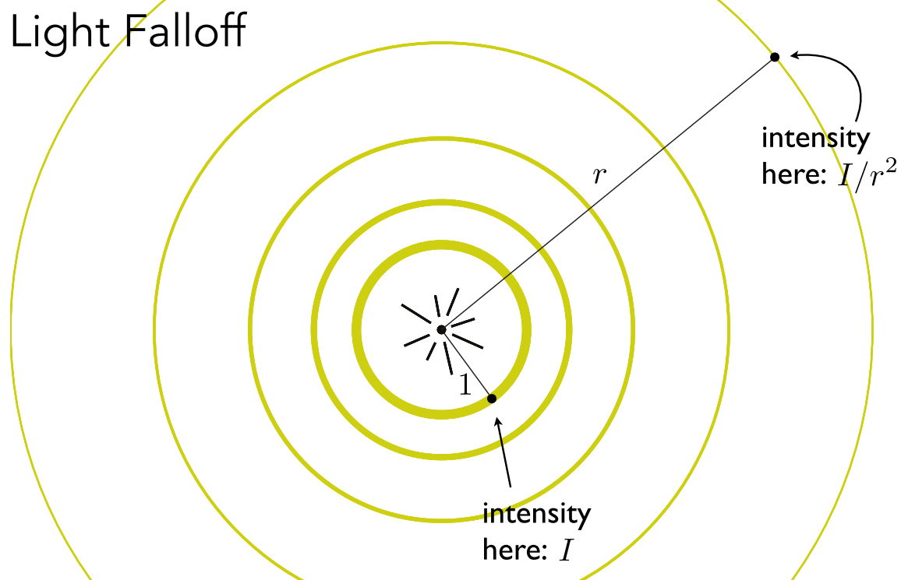{:height 174, :width 256}
				- 点光源的光线在传播过程中，光照强度和距离成反比
		- ### 漫反射着色公式
			- {:height 246, :width 457}
			- 结合之前所提到的光照角度和能量接受的关系，以及光密度在距离上成反比，可以得到最终的漫反射着色公式
			- 若光线和表面所成角度为负，则光线已经照射到了表面的背面，这种情况在图形学中一般认为无意义，因此光照角度的余弦值会和0去最大值
			- $k_d$表示的是漫反射系数，也就是颜色。若为1表示所有的能量都不吸收，进多少出多少，这是最亮的材质；0表示所有的能量都被吸收，展示出的效果就是全黑
			- 如前所属，漫反射和观测角度无关，因为漫反射会像周围均匀反射光照，因此最终公式里也没有出现$\hat{v}$
	- ## 高光项(Specular Term)
		- 观测方向越靠近镜面反射方向则光照强度越大
			- 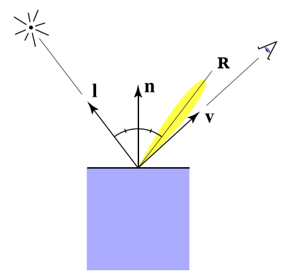{:height 157, :width 158}
		- 换一个说法，**[[$red]]==半程向量==离表面法向量越近，光照强度越大**
			- {:height 188, :width 176}
			- 所谓半程向量就是两个向量之间夹角一般的向量，通过两个向量相加并归一化求得
				- $\bold{h}=\frac{\bold{v}+\bold{l}}{\| \bold{v}+\bold{l}\|}$
		- ### 高光光照公式
			- {:height 184, :width 329}
			- 和光源距离无关，因为此模型(Blinn-Phong模型)是一个经验模型，将光照密度项去掉了，仅关心能否看到光源
			- $k_s$是**高光系数**，也称**镜面反射系数**，也可以理解为反射出的高光的颜色。一般都认为反射出的高光项的颜色是白的，取1
			- 使用$\hat{R}$和$\hat{v}$之间的夹角判断高光强度的是另一个模型
			- 注意夹角余弦项上有一个$p$指数，这是因为单纯$\cos$函数的递减太慢，在我们认为它们的方向其实离得很远(例如45度)，余弦值仍然相当可观，这会导致绘制出来的高光范围过大，因此引入一个指数常数，可以降低高光范围
				- 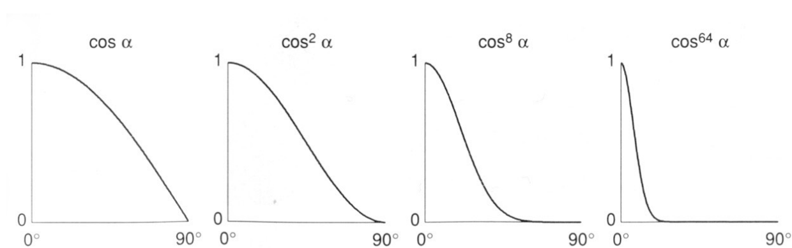{:height 172, :width 520}
				- 一般来说，在blinn-phong模型中，$p$**的取值为[[$red]]==100到200==**
				- 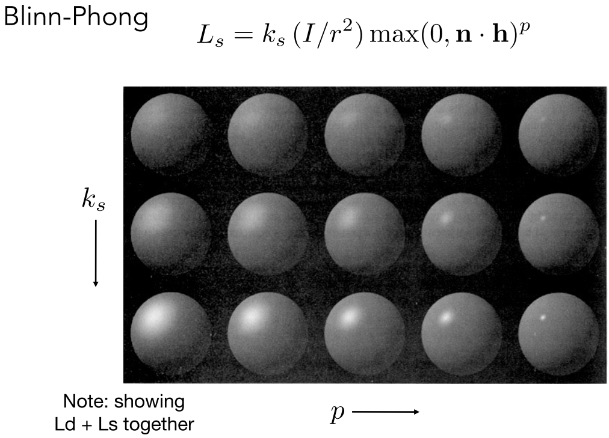{:height 266, :width 354}
	- ## 环境光项(Ambient Term)
		- 回忆：shading是每个shading point都独立进行的，因此在现有框架下想完全模拟环境光是不现实的
		- 一个简单的近似方法是，对每一个着色点，给其增加针对每一个光源的颜色常量
		- 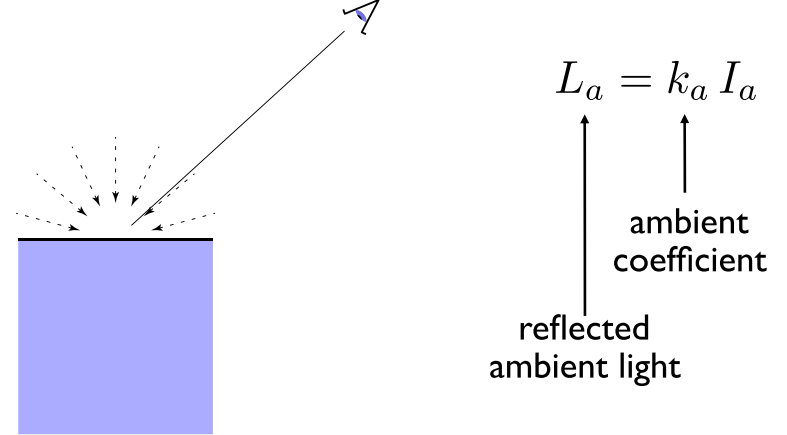{:height 197, :width 331}
		- 在这种假设下，**环境光就是用来提升亮度的**
	- ## 完整光照公式
		- $L = L_a+L_d+L_s=k_aI_a+k_d(I/r^2)\text{max}(0,\bold{n}\cdot\bold{l})+k_s(I/r^2)\text{max}(0,\bold{n}\cdot\bold{h})^p$
- # 着色频率(Shading Frequency)
	- 着色频率指在什么对象上应用着色操作
		- 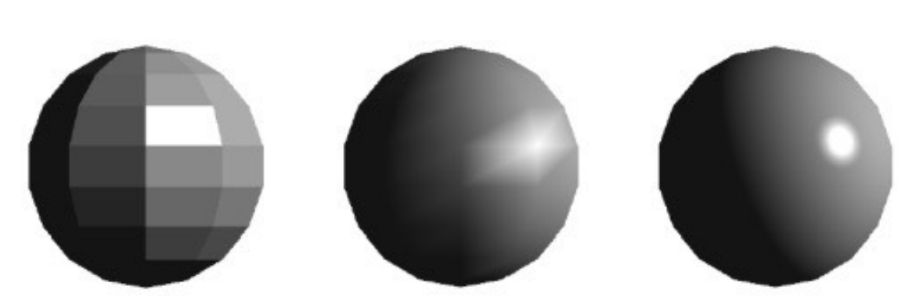{:height 163, :width 464}
		- 以上三种结果分别对应的是：在**几何面**上着色，在**三角形顶点**上着色然后三角形内部点的颜色通过插值确定，在每个**像素点**上着色
	- 根据着色频率的不同，可以**对shading进行分类**
		- ### Flat Shading
			- 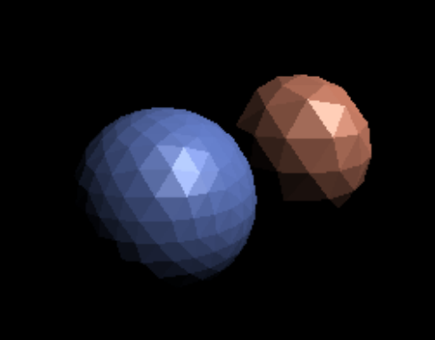{:height 159, :width 195}
			- 只对三角形面进行着色操作，对于每个三角面，只需要计算该面的法向量
			- 对于平滑的平面来说不太适用
		- ### Gouraud Shading
			- 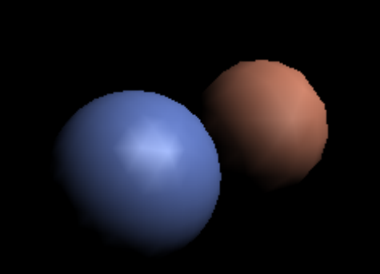{:height 148, :width 200}
			- Gouraud是个人名，也就是提出这种着色方式的人
			- 计算每个三角形顶点的颜色然后插值计算三角形内部的颜色
			- 对于每个顶点都要计算一次法向量
		- ### Phong Shading
			- 对每一个像素点进行着色计算
			- 每一个像素点的法向量通过和三角形进行插值来计算
			- **注意和Blinn-Phong反射模型做区分，一个是着色模型，一个着色频率分类**
	- 在低面数的情况下，不同的着色频率的最终效果差异明显，但随着面数的增加，三种着色频率的差异会逐渐缩小
		- 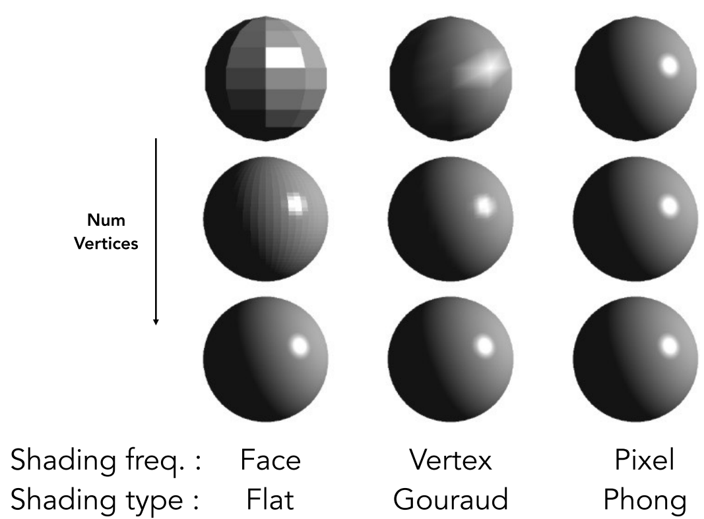{:height 258, :width 338}
	- ## 计算顶点的法向量
		- 在理想情况下，如果直到这些三角形想表示的几何解构到底是什么，例如说一个球体，那么对应顶点的法向量就很好得到，直接对球心做减法然后归一化即可
		- 实际操作中，**通过将顶点周围的三角形面的法向量相加，然后归一化**得到近似的顶点法向量
		- 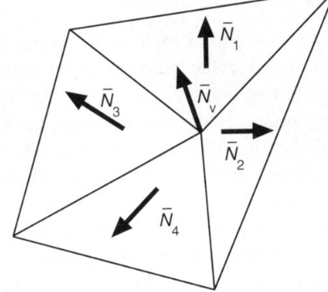{:height 176, :width 186}
		- $N_v = \frac{\sum_i{N_i}}{\| \sum_i{N_i}\|}$
	- ## 计算像素点的法向量
		- 通过插值来计算
		- 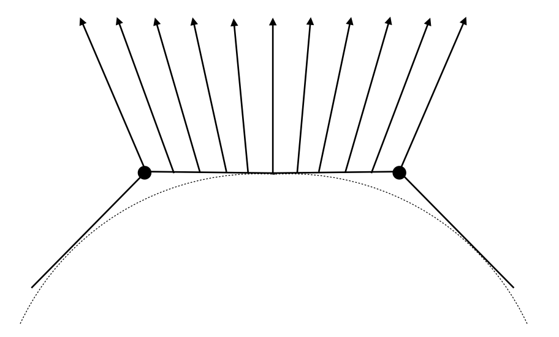{:height 217, :width 348}
		- 计算方法叫做**[[$red]]==重心插值==(Barycentric Interpolation)**
			- 会在后续课程中引入
	- **记住：所有的法向量计算，最后一步都是[[$red]]==归一化==**
- # 实时渲染管线
  collapsed:: true
	- **Graphics (Real-time Rendering) Pipeline**
	- 现代GPU基本上已经在硬件层面上实现了这一系列过程
	- 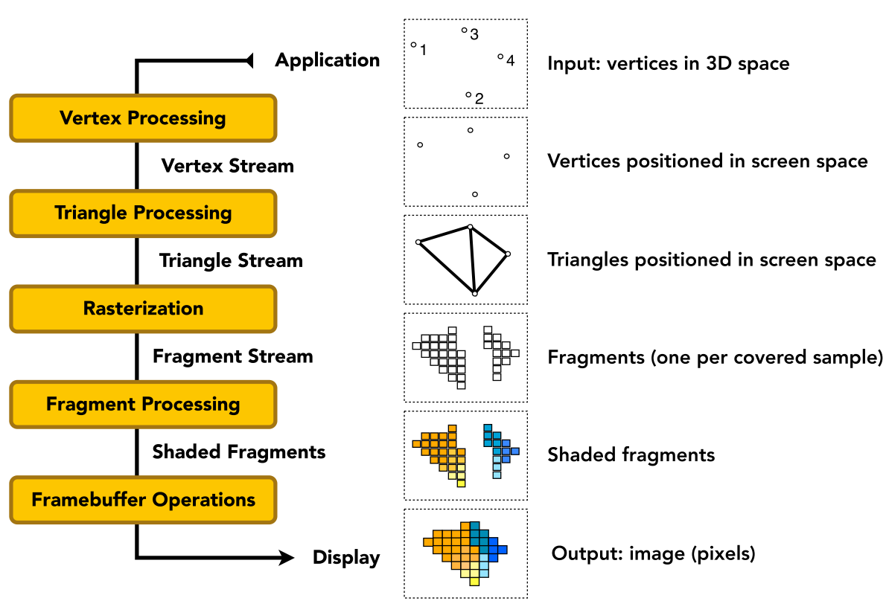{:height 264, :width 383}
	- 上图中有一些术语和课程不太相同，主要是因为使用了一些图形API中的观念
		- 顶点是模型描述中最终要的东西，优先被处理
		- 每三个顶点构成一个三角形，即先处理要绘制的点，然后在点之间连线构成三角形
		- 通过光栅化得到将被绘制到屏幕上的内容
		- fragment是OpenGL的概念，类似于像素点，如果启用了MSAA，那么fragment可以理解为一次采样，fragment处理可以理解为着色
	- 主要的步骤包括三步：**顶点处理**，**光栅化**，**着色**
	- ## 顶点处理
		- 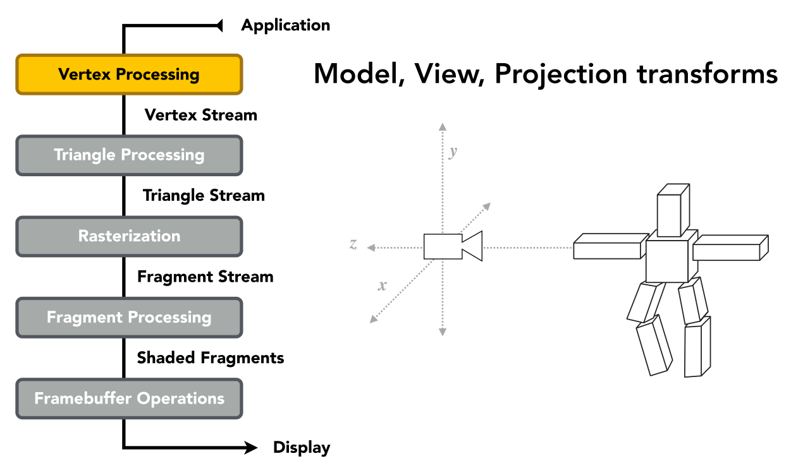{:height 243, :width 407}
		- MVP变换就是作用在每一个顶点上的
	- ## 光栅化
		- 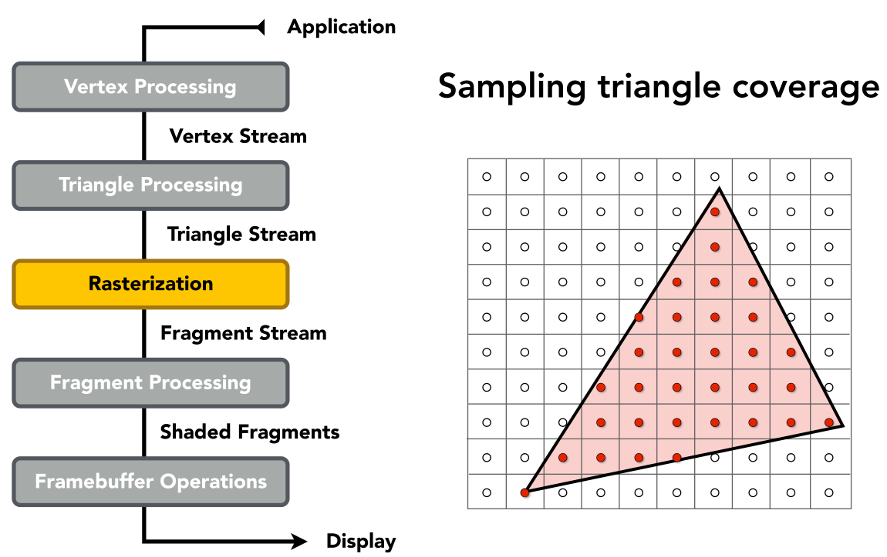{:height 237, :width 363}
		- 采样，得知哪些像素点要绘制哪些内容
	- ## fragment processing
		- 深度测试(Z-buffering)，着色，纹理映射(Texture Mapping)都有可能在这一步执行
		- 由于着色可以发生在很多过程，因此**现代GPU往往都是可编程的**，用户可以通过自己编写**shader**程序，控制着色行为
		- ### Shader程序
			- 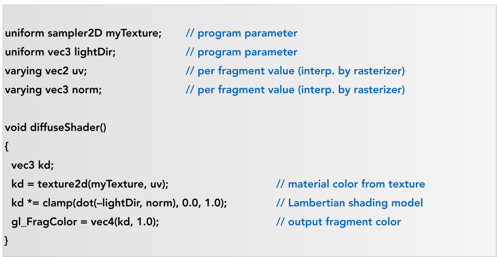{:height 210, :width 406}
				- 这一段shader代码是使用GLSL(OpenGL)编写的
			- 在顶点处进行着色的着色器叫做顶点着色器
			- 在像素或者说fragment处进行着色的叫做像素着色器
				- **在每个fragment上都会执行一次**的函数
			- 输出**在当前fragment采样位置的表面的颜色**
- # 纹理映射(Texture Mapping)
	- 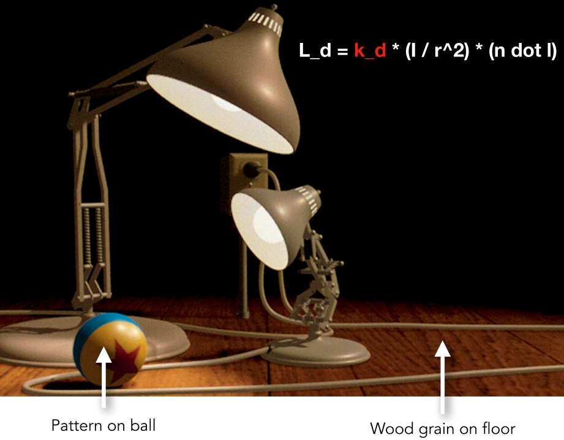{:height 334, :width 419}
	- 本质上是某个物体表面上的颜色不再是均匀的，即漫反射系数不再是一个常数，而可以看作一个函数，该函数的输入是uv坐标，返回的是在该uv坐标系所对应的颜色(某张图片的一部分)
	- 纹理映射就是将一张图片(纹理)覆盖到某个三维物体的表面，这样一来三维物体表面每一个点的颜色都和该图像某一个点的颜色一一对应
	- 纹理也有一个坐标，这个坐标叫做**uv坐标系**
		- {:height 240, :width 385}
	- 纹理可以被重复使用，设计好的纹理可以做到在重复自己时能做到无缝衔接
		- 这样的纹理也被叫做**tilable texture**
		- 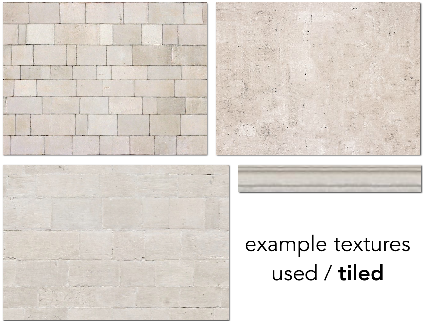{:height 266, :width 338}
- # 三角形插值
	- 三角形顶点处的值往往容易求得(着色过程，深度测试，贴图坐标，法向量等)，但是三角形内部平滑过渡的值，往往需要通过插值获得
	- ## 重心坐标(Barycentric Coordinates)
		- 使用于三角形内部点的一种坐标系，可以用于对三角形进行插值
		- 三角形中任意一个点都可以被表示为三个顶点的某种和(线性组合)
			- 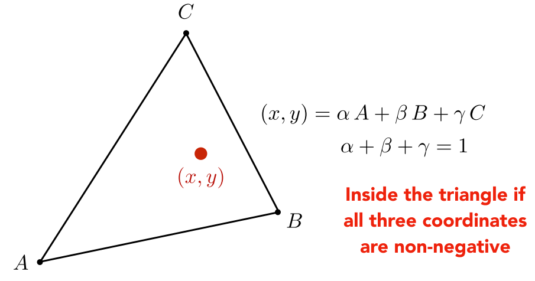{:height 206, :width 384}
		- 每一个顶点前的系数$(\alpha,\beta,\gamma)$就是该内部点的**重心坐标**
			- 由于$\alpha+\beta+\gamma=1$的限制，实际上只需要两个其中两个值，另外一个便可以自然求得
		- 每一个顶点自己的坐标是自己的系数为1，其余两项系数均为0
			- 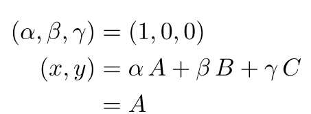{:height 100, :width 249}
		- 三角形重心的坐标为$(\frac{1}{3},\frac{1}{3},\frac{1}{3})$
		- ### 任意一点的重心坐标
			- 通过三角形面积比求得
			- 将任一点和三个顶点连线可以得到三个三角形，顶点对面的三角形就是该顶点所对应的三角形
			- 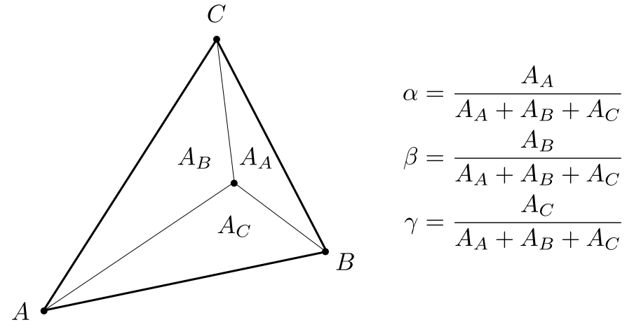{:height 195, :width 367}
			- 对应三角形的面积和整个三角形面积的比值便分别是$\alpha,\beta,\gamma$的值
			- 一般化的形式为：
				- 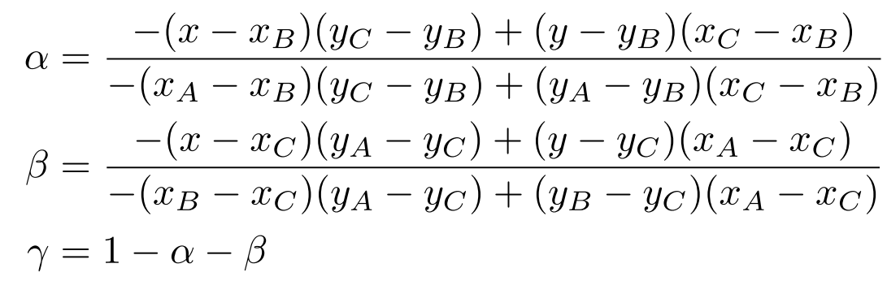{:height 146, :width 443}
		- 得到三角形中任意一点的重心坐标之后，其点的插值便是
			- $V = \alpha V_A+\beta V_B+\gamma V_C$
			- 每一个顶点的值可以是位置，贴图坐标，颜色，法向量，深度，材质等等
			- ### 重心坐标的[[$red]]==缺点==
				- 重心坐标在投影变换中**[[$red]]==无法保持不变==**
				- 因此如果要插值一些**三维属性**，需要在投影变换之前完成，否则无法得到正确的三维属性插值
					- 例如深度测试，这一步实际上应该把投影变换之后的点逆变换回三维空间之后再做插值
- # 纹理的运用
	- 对于每一次光栅化的采样$(x,y)$(通常是像素的中心点)
		- 通过重心采样计算出uv坐标
		- 通过uv坐标获取纹理在uv处的颜色
		- 将采样的颜色置为刚获得的颜色(通常是用于替代漫反射中的albedo $k_d$)
	- 但是使用以上步骤简单处理纹理映射会**出现一些[[$red]]==问题==**，例如：
		- ### 纹理放大(Texture Magnification)(纹理过小)
			- 如果物体的分辨率很大，但是纹理的分辨率很低，就会出现这种情况，导致纹理变得模糊
				- 一般是因为由于分辨率过大，获取到的uv坐标往往不是整数
			- 纹理中的一个像素我们叫做**texel**(纹理元素，文素)
			- 有一些手段可以处理这样的模糊，例如直接取最近文素(把uv坐标取整)，或者是进行插值
				- 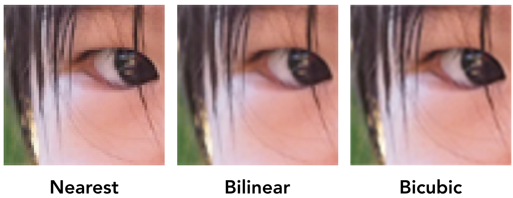{:height 214, :width 534}
			- ### 纹理缩小(Minification)(纹理过大)
				- 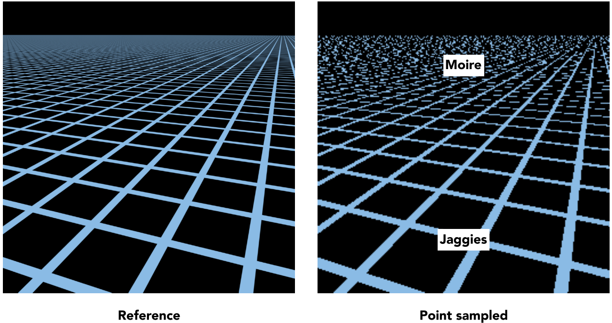{:height 208, :width 371}
				- 实际上，纹理过大比纹理过小带来的问题**更为严重**，不仅会产生锯齿，还会产生摩尔纹
				- 本质上还是因为下采样所导致的失真
					- 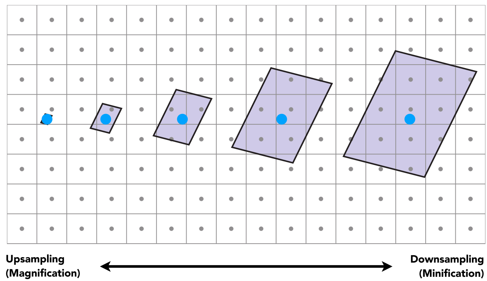{:height 226, :width 378}
					- 当一个像素需要覆盖多个文素时，就会出现下采样问题，上图中的各个平行四边形代表的就是不同大小的像素
					- 这个单个像素在蔡志忠的覆盖面积又称“**footprint**”
				- 使用超采样技术可以解决，但是代价很高
				- 另一种解决方法是，**将该像素点的颜色置为它所覆盖的区域内所有文素颜色的平均值**，这是一个**范围查询问题(Range Query)**。
				- 而快速获得一个区域内所有文素平均值的方法就是**[[$red]]==mipmap==**
	- ## 双线性插值(Bilinear Interpolation)
		- 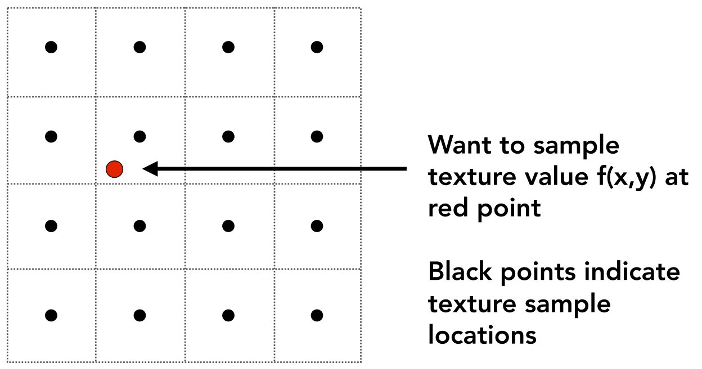{:height 168, :width 302}
		- **给出一个非整数坐标，想知道在该非整数坐标处的值(颜色)**，整数坐标处的像素(文素)的值是确定且正确的
		- 双线性插值即选取离该坐标最近的四个整数坐标的值进行三次插值运算得到该点的值
			- 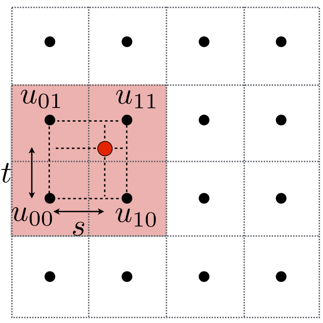{:height 214, :width 207}
		- 定义一维线性操作：lerp($x,v_o,v_1$) = $v_0+x(v_1-v_0)$
		- 则$f(x,t) = \text{lerp}(t,u_0,u_1)$，其中：
			- $u_0 = \text{lerp}(s,u_{00},u_{10})$
			- $u_1 = \text{lerp}(s,u_{01},u_{11})$
		- **[[$red]]==注意==**：上述**插值**公式中，$0\le s,t,x\le 1$
	- ## Mipmap
	  collapsed:: true
		- 可以做**快速**，但是是一种**近似([[$red]]==Approximate==)**的**正方形(square)**范围查询
		- mip来自于拉丁语:multum in parvo，意为multitude in a small space
		- 核心是从一张图片生成多张不同层次的图片
			- 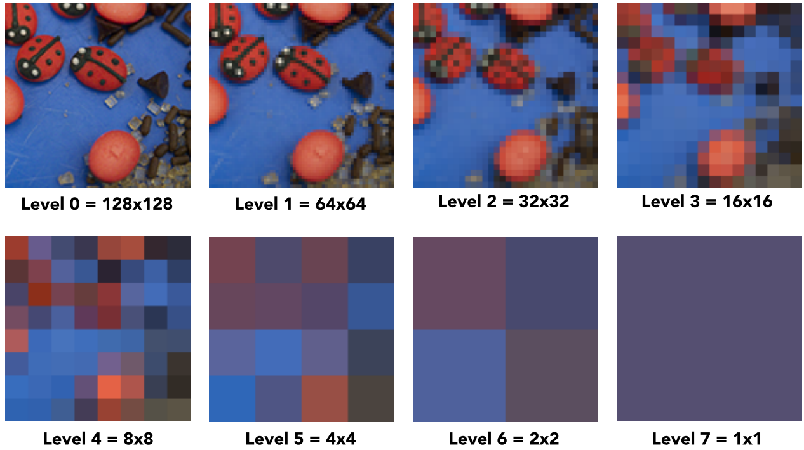{:height 240, :width 413}
			- 每一层的一个下你告诉都是上一层相邻四个像素的平均值(缩小到一半)
		- 这些不同层次的图片会形成一个金字塔型解构
			- 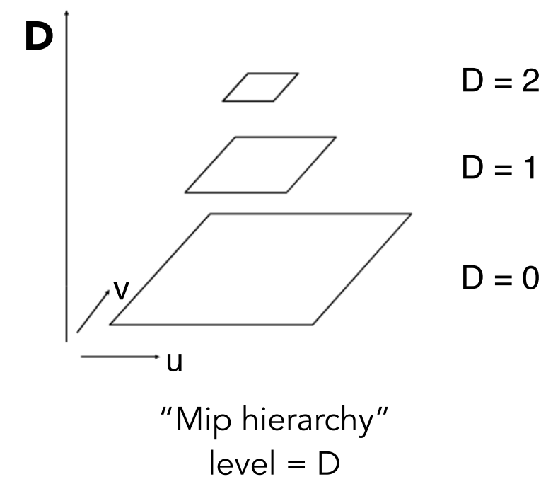{:height 240, :width 261}
			- 只需要付出**[[$red]]==额外==**$\frac{1}{3}$的存储空间
		- ### 确定像素覆盖的大小
			- 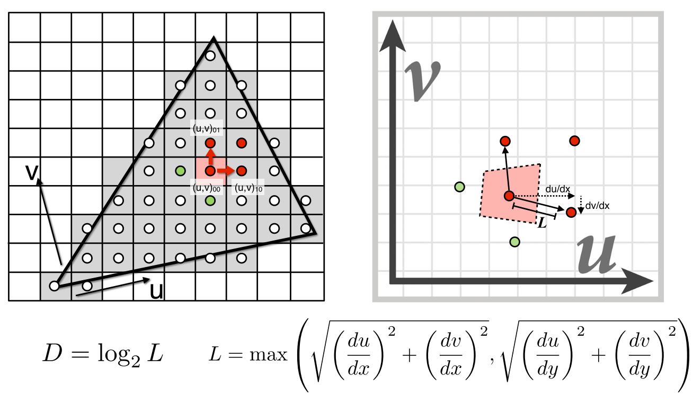{:height 279, :width 483}
			- 本质上是要求，我在屏幕空间上移动一个像素单位，对应在纹理空间会移动多少个单位
				- 因为像素空间一个单位的长度定位1
			- 将相邻的上方和右方的两个点和自己一起映射到纹理空间，然后分别求两个边长的比值吗，取最大值定为近似的覆盖区域的边长
			- 在mipmap中的层级则使用$\log_2L$得到
			- 如果一个像素的层级不是整数倍，那么在两层中做一个插值得到值(例如，得到1.8层，那么在1层和2层之间做插值)，这个插值结合之前的双线性插值被称为**[[$red]]==三线性插值==(Trilinear Interpolation)**
				- 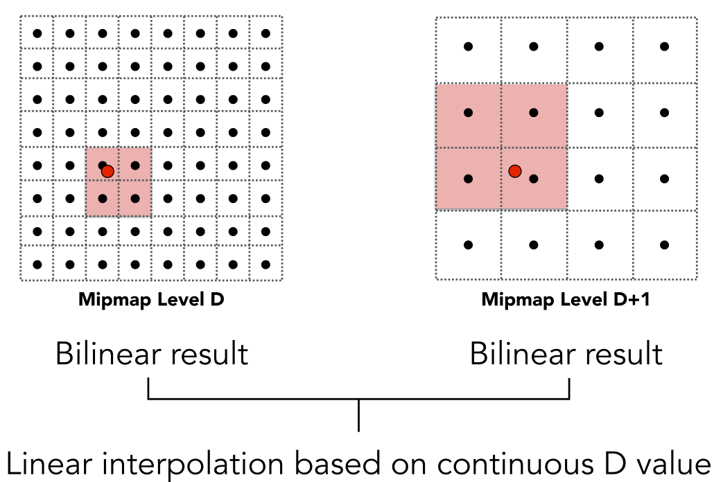{:height 244, :width 351}
				- 通过三线性插值可以得到连续的层级值
				- 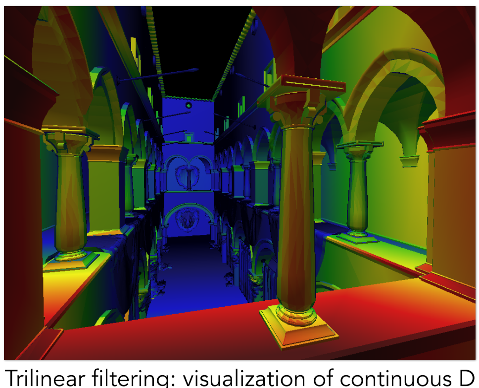{:height 256, :width 306}
		- ### Mipmap的缺陷
			- 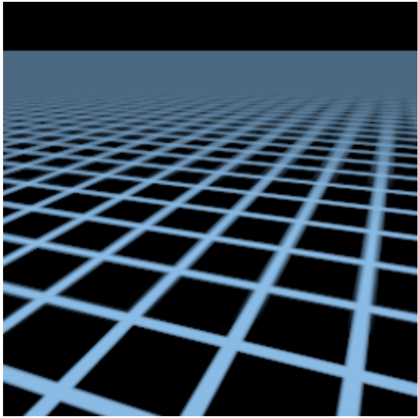{:height 301, :width 293}
			- Mipmap会导致**过模糊(Overblur)**，尤其是在远处
				- 产生问题的原因是因为mipmap只能做正方形的范围查询，而远方的像素覆盖的范围因为投影变换的原因，覆盖的区域往往已经即便为了矩形，因此出现问题
				- 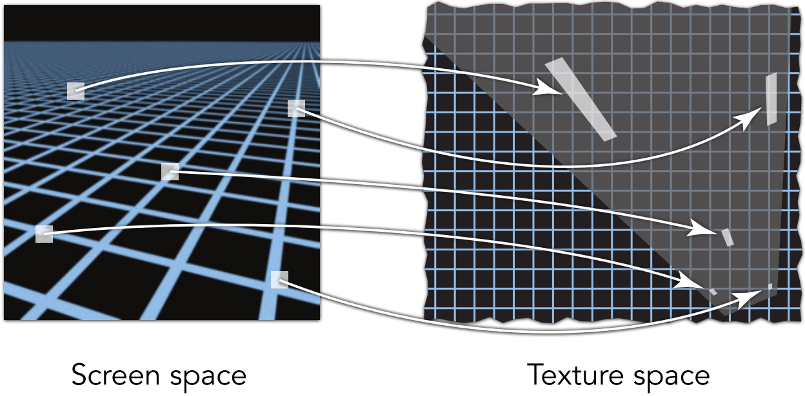{:height 210, :width 422}
			- 这个问题可以通过**各向异性过滤(Anisotropic Filtering)**来部分解决
				- 各项异性过滤本质上是在不同的长宽比上做预计算
				- 一半在提到各向异性过滤有多少X,例如16x，8x就是指在水平和垂直方向各计算多少次压缩
					- 例如2x那么各个方向上只压缩一次，4x就是压缩四次，预压缩次数越多，精度越高，效果越好
					- 随着x的提升，**[[$red]]==空间开销==**最终会收敛到原图的三倍
					- 下图中应该是8x
				- 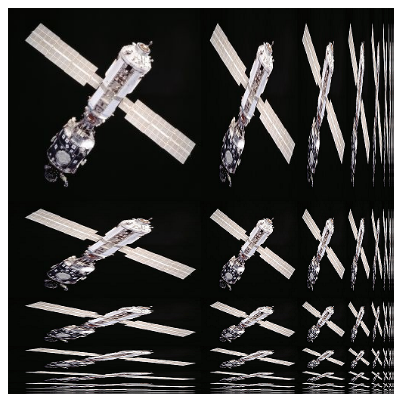{:height 253, :width 249}
				- 通过这种方式可以查询任意**周堆成矩形(Axis-aligned Rectangular)**区域的平均值
				- 生成的一系列图片叫做**ripmap**
				- 这样就能部分解决mipmap造成的过模糊问题
					- 之所以说是部分解决，是因为对于非轴对称(也就是斜着的)矩形覆盖区域，各向异性过滤也无法解决
					- 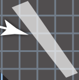{:height 89, :width 83}
				- 如果要进一步解决非轴对称问题，有人引入了**[[$red]]==EWA过滤==**
					- 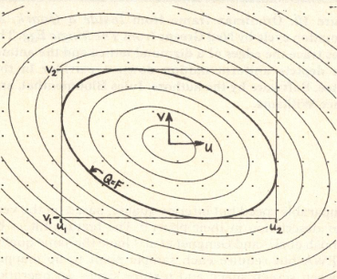{:height 162, :width 191}
					- 用圆形取逼近区域，可以处理不标准的footprint
					- 加权平均值
					- 代价是更多更多的计算
- # 纹理的高级运用
	- 在现代GPU中，纹理等于**内存+范围查询**
		- 本质上是一种将数据应用到像素计算中的通用方法
		- 而应用不同的数据能得到一些不同的，意料之外的效果
	- ## 环境光映射(Environment Map)
		- 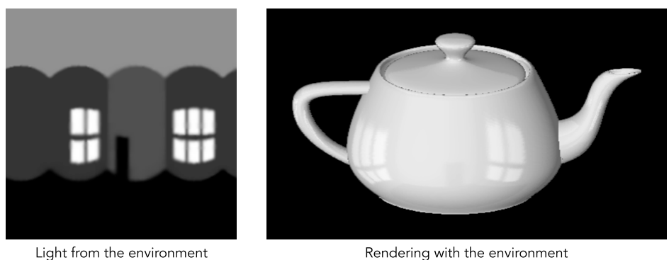{:height 204, :width 501}
		- **把环境中可能出现的光用图片表示出来**，然后在渲染的时候作为texture参与计算，能得到环境光反射的效果
		- 环境光贴图假设所有环境光源都来自**无限远**，因此光照强度和距离无关，在任何角度任何位置接收到的环境光照都相同
		- 通常在实际操作中，环境光的贴图节录有多种方式
		- ### 球状环境光映射(Spherical Environment Map)
		  collapsed:: true
			- {:height 229, :width 410}
			- 将环境光信息记录在球状的texture中
			- 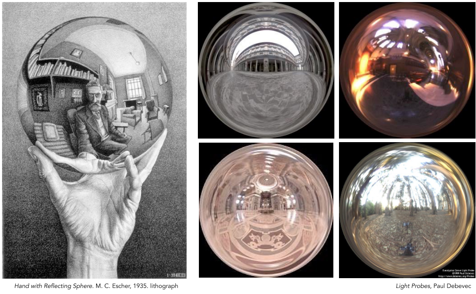{:height 296, :width 472}
			- **[[$red]]==球状环境光映射的问题==**
				- 在顶部和底部会产生非常明显的**扭曲(distortion)**
					- 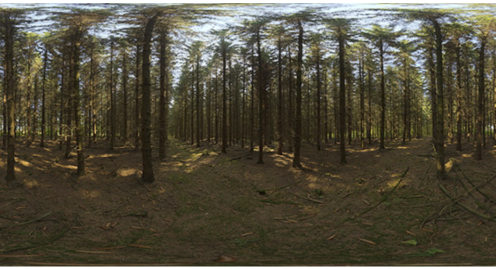{:height 188, :width 339}
		- ### 立方体映射(Cube Map)
		  collapsed:: true
			- 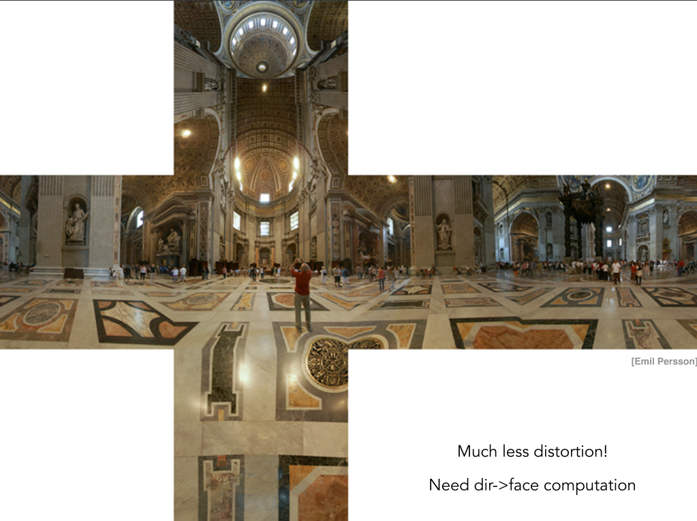{:height 332, :width 436}
			- 用于解决球状环境光映射导致的顶部底部扭曲问题
			- 假设球体上的光继续向外发散，直到打到一个bounding box上，记录bounding box每个面的图像信息即可
				- 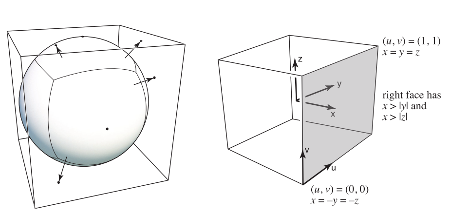{:height 216, :width 440}
			- **[[$red]]==缺点==**：会导致额外的计算，给出某一个方向，想得到该方向的环境光照信息，需要额外计算一次该方向的信息在哪个面上
	- ## 凹凸(法线)贴图(Bump Mapping)
		- 纹理不仅仅只能用于描述颜色信息，甚至可以存储一些其他信息以影响着色过程，以此**伪造(fake)**一些geometry detail
		- “**其他信息**”包括：高度/法向量，Bump映射等
		- 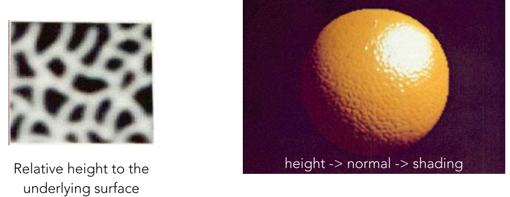{:height 213, :width 528}
		- 能达到在不定义复杂几何物体的情况下，实现一些复杂的效果的生成
		- 原理是：**干扰每一个像素的表面法向量生成**
			- 每一个纹素定义的不再是在该uv坐标下的颜色，而是“**高度变化**”
		- ### 计算过程
			- 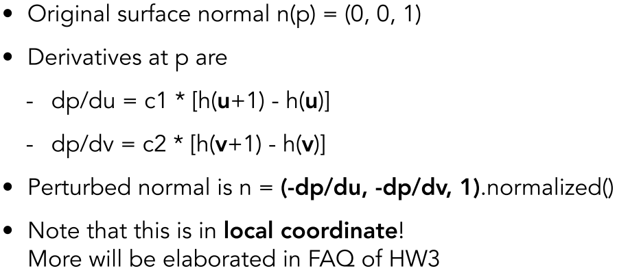{:height 224, :width 493}
	- ## 位移贴图(Displacement Mapping)
		- 更加现代化的方式
		- 位移贴图会实际去移动三角形顶点
		- 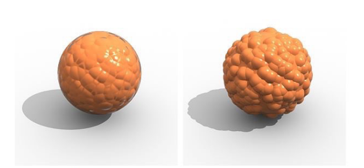{:height 233, :width 463}
		- **[[$red]]==缺点==**：位移贴图要求模型本身面数足够多，多到顶点的数量高于位移贴图的变换频率
			- 在DirectX图形API中，有动态的tessellation技术用于解决这个问题，当三角形面数不够时，在三角形内部分出更多子三角形
	- ## 3D生成性噪声(Procedural Noise)+实心模型(Solid Modeling)
		- 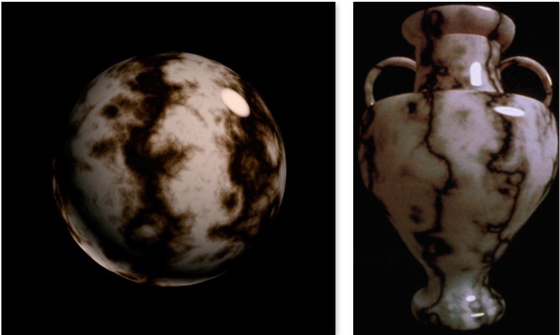{:height 284, :width 464}
		- 这种纹理定义了空间中任意一点的纹理颜色，且是生成性的，不需要实际的贴图文件
		- 加上是新模型可以做到物体内部仍然能被渲染，而不是只有表面
	- ## 提供预计算的信息
		- 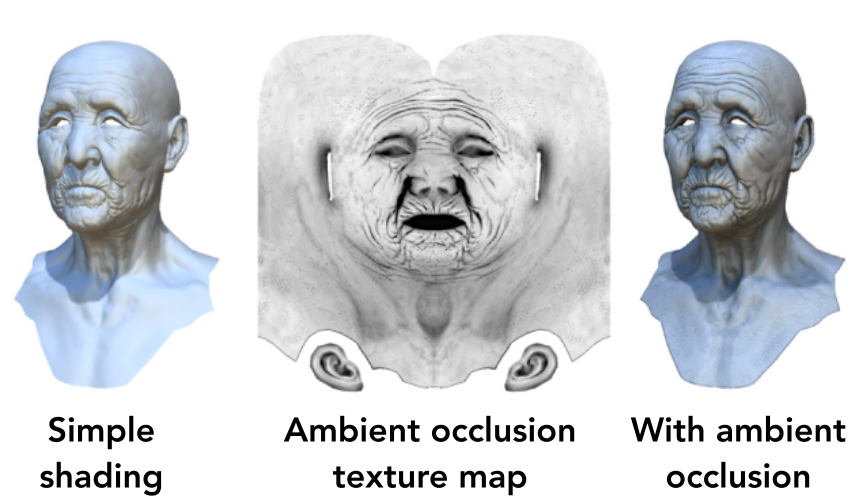{:height 199, :width 328}
		- 通过加上环境光遮蔽贴图，可以做到更好的渲染效果
	- ## 3D纹理和体积渲染(Volume Rendering)
		- 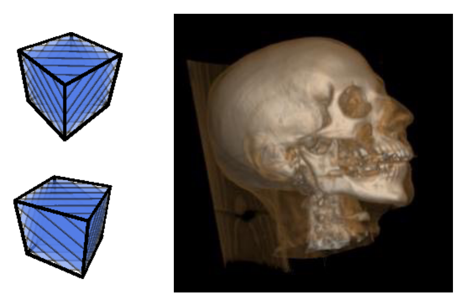{:height 354, :width 525}