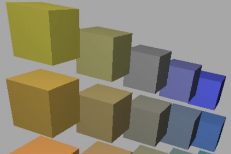

- 着色的核心就是引入颜色的**明暗**，使图像看起来更加真实
- 例如，如果渲染一堆立方体，没有shading的话效果如下：
	- {:height 168, :width 236}
- 带有shading的效果如下：
	- {:height 174, :width 244}
- 在本课中，shading 被定义为：**[[$red]]==对不同物体应用不同材质(Material)的过程==**
	- 不同的材质和光线的相互作用不同，所以最后的着色效果也就不经相同
- **在一个光照系统中，往往有三种[[$red]]==光照类型==**
	- {:height 204, :width 290}
	- 直面光源的部分可能会呈现出**高光(Specular Highlights)**
	- 没有被光源直射的部分可能会呈现出**漫反射(Diffuse Reflection)**
	- 背朝光源的地方也不一定就是漆黑一片，因为还有可能接收到**环境光(Ambient Lighting)**，也称**间接光照**
		- 由于环境光非常复杂，因此一般在实践中可能会把环境光照的量设为一个常量，即一个物体的任何部位都会受到一定的环境光照
- # 着色本质
	- {:height 208, :width 210}
	- 将着色看作一个函数，其作用是计算**特定[[$red]]==着色点==**所反射的射向相机的光
	- **输入**：
		- 观察者的方向，一个单位向量$\hat{v}$
		- 表面的法向量(Surface Normal)，单位向量$\hat{n}$
		- 光照方向，单位向量$\hat{l}$，可能有多个，对于每一个光源都要计算，通过光源点减去shading point后做归一化得到
		- 表面参数，例如颜色，光泽度(shininess)等
	- **[[$red]]==Shading is Local！==**
		- 对于每一个着色点，其着色情况都只考虑其自身和一些全局条件，不会考虑其是否在阴影中等情况，因此shading is local！
		- 也因此，**shading**$\ne$**shadow**
- # 一个简单的着色模型(Blinn-Phong Reflectance Model)
	- ## 漫反射(Diffuse Reflection)
		- {:height 246, :width 357}
		- 如果光纤会被均匀地反射到各个方向上(Scattered uniformly in all directions)，则这样的光照模式就叫做漫反射
		- 对于观测者来说，从任何方向观测，漫反射的材质的颜色都是相同的
		- ### 漫反射的光照强度
			- 但是粗暴地将漫反射规定为任何角度观测颜色都相同就会陷入最开始的问题，这样的图像并不真实
			- 和光照成不同角度的平面，吸收和反射的光应当是不同的，这就是**Lambert's Cosine Law**
				- {:height 195, :width 426}
				- 单位面积接受的光照强度和表面法向量与光照方向之间的夹角余弦成正比
			- **光的发散**
				- {:height 174, :width 256}
				- 点光源的光线在传播过程中，光照强度和距离成反比
		- ### 漫反射着色公式
			- {:height 246, :width 457}
			- 结合之前所提到的光照角度和能量接受的关系，以及光密度在距离上成反比，可以得到最终的漫反射着色公式
			- 若光线和表面所成角度为负，则光线已经照射到了表面的背面，这种情况在图形学中一般认为无意义，因此光照角度的余弦值会和0去最大值
			- $k_d$表示的是漫反射系数，也就是颜色。若为1表示所有的能量都不吸收，进多少出多少，这是最亮的材质；0表示所有的能量都被吸收，展示出的效果就是全黑
			- 如前所属，漫反射和观测角度无关，因为漫反射会像周围均匀反射光照，因此最终公式里也没有出现$\hat{v}$
	- ## 高光项(Specular Term)
		- 观测方向越靠近镜面反射方向则光照强度越大
			- {:height 157, :width 158}
		- 换一个说法，**[[$red]]==半程向量==离表面法向量越近，光照强度越大**
			- {:height 188, :width 176}
			- 所谓半程向量就是两个向量之间夹角一般的向量，通过两个向量相加并归一化求得
				- $\bold{h}=\frac{\bold{v}+\bold{l}}{\| \bold{v}+\bold{l}\|}$
		- ### 高光光照公式
			- {:height 184, :width 329}
			- 和光源距离无关，因为此模型(Blinn-Phong模型)是一个经验模型，将光照密度项去掉了，仅关心能否看到光源