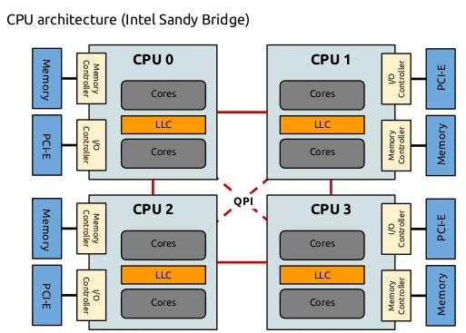

- **Non-Uniform Memory Access**，**非一致性内存访问**
- # 发展历史
	- 在前多核时代CPU和内存的通信由北桥芯片完成
	- 进入多核时代之后一段时间，所有核仍然都通过北桥核内存通信，这种每个核心都通过一致的方式访问所有内存的模式叫做**Uniform Memory Access**，而使用总线实现的UMA也称**Symmetric Multiprocessing(SMP)**，即对称多处理
	- 在UMA下，针对某个内存地址的访存时间是核核心无关的，即任何核访问某一个地址的时间应该是相同或者受与CPU核无关的因素制约
	- 很明显，在多核CPU下使用UMA相当影响访存性能，所有的核都只能共用一条相同的通道去核内存互动。在此insight下，NUMA应运而生
- # NUMA结构
	- 
	- 在NUMA下，不同的内存器件和若干核心从属于各自的Node，每个node都有自己的**集成内存控制器(Integrated Memory Controller, IMC)**和一些独立的资源
	- 在intel的NUMA架构下，不同的核心之间通过**QPI(Quick Path Interconnect)**通信
	- 一般来说，IMC的延迟低于QPI，因此在这种情况下，CPU访存有了远近之分(Remote/Local)，也正是**Non-Uniform**这一词的体现。
	- 常见情况下，一个内存插槽对应一个Node，在linux下，NUMA有以下特点：
		- 内核一般不会把一个内存页从一个node迁移到另一个node
		- 有现成的工具可以实现将**冷页面(大概率不存在于任何一个核心的cache中的页面)**迁移到另一个node