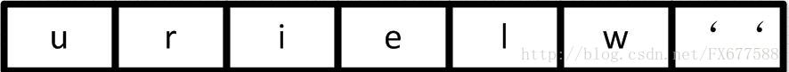
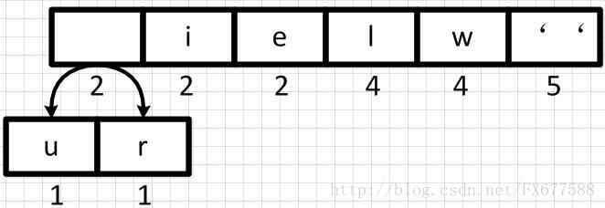
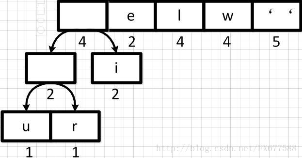
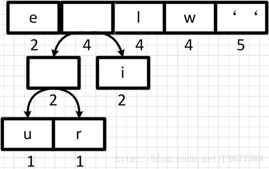
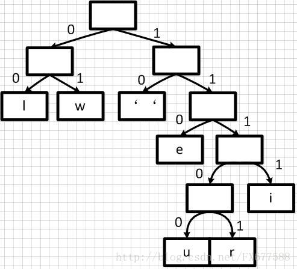

# 随机算法
collapsed:: true
	- ## 洗牌算法
		- ### 洗牌算法正确性判断
			- 序列打乱的结果有$n!$种，且每种概率出现的概率一样
				- 若打乱的种数小于$n!$，有情况未考虑到，错误
				- 若每种情况出现的概率不同，错误
			- 每个元素出现在每个位置的概率都是$\frac{1}{n}$
				- 其实和上一种叙述等价
					- 因为任意一个元素出现在任意位置的排列有$(n-1)!$，因此任意元素出现在任意位置的概率为$\frac{(n-1)!}{n!}=\frac{1}{n}$
		- ### 正确性验证
			- **理论证明**
				- 数理推导是否满足上述两个准则之一
			- **试验检验**
				- 使用蒙特卡洛法检验
		- ### Fisher-Yates Shuffle 算法
			- 最原始的洗牌算法
			- **流程**
				- 初始化答案数组
				- 从还没有处理的源数组中随机取出一个数
					- 通过随机生成下标完成
				- 将这个数从源数组中抹除并加入到答案数组中
				- 重复上述步骤直到源数组为空
			- **实现**
				- ```c++
				  vector<int> fisher_yates(vector<int> array){
				      vector<int> ans;
				      while(array.size()){
				          int cur = rand()%array.size();
				          ans.emplace_back(array[cur]);
				          array.erase(array.begin()+cur);
				      }
				      return ans;
				  }
				  ```
			- **正确性证明**
				- 每个数出现在第i个位置的概率为：
					- $$\frac{n-1}{n}\times\frac{n-2}{n-1}\times\cdots\times\frac{1}{n-i}=\frac{1}{n}$$
			- **复杂度**
				- 时间：$O(n)$
				- 空间：$O(n)$
			- **优缺点**
				- [[$blue]]==简单易懂，实现方便==
				- [[$red]]==移除操作会增添额外复杂度(常数)==
		- ### Knuth-Durstenfeld Shuffle算法
			- 在Fisher-Yates的基础上可是实现本地修改，不消耗额外空间
			- **流程**
				- 每次从剩余未处理的数中选取一个，放置于属于末尾
			- **实现**
				- ```c++
				  vector<int> knuth(vector<int> array){
				      int n = array.size();
				      for(int i = 0;i<n;i++){
				          swap(array[rand()%(n-i)],array[n-1-i]);
				      }
				      return array;
				  }
				  ```
			- **正确性证明**
				- 每个数出现在索引$n-i$的概率为
					- $$\frac{1}{n-i+1}\times\cdots\times\frac{n-2}{n-1}\times\frac{n-1}{n}=\frac{1}{n}$$
			- **复杂度**
				- 空间：如果不保留源数组位置信息则为$O(1)$，否则$O(n)$
					- 上面实现中即为$O(n)$
				- 时间：$O(1)$
			- **优缺点**
				- [[$blue]]==实现简单，复杂度较低==
				- [[$red]]==必须事先知道源数组长度(Fisher-Yates同样如此)==
		- ### Inside-Out 算法
			- 可以处理在线数组(长度动态扩展)
			- **流程**
				- 从前向后遍历数据，把位置i的元素和i之前(包括i)的任意一个元素交换
			- **实现**
				- ```c++
				  vector<int> inside_out(vector<int> array){
				      for(int i = 0;i<array.size();i++){
				          int k = rand()%(i+1);
				          swap(array[i],array[k]);
				      }
				      return array;
				  }
				  ```
			- **正确性证明**
				- 源数组中第i个数字在i之前(包括i)的某个位置的概率为
					- $$\frac{1}{i}\times\frac{i}{i+1}\times\frac{i+1}{i+2}\times\cdots\times\frac{n-1}{n}=\frac{1}{n}$$
					- 即在向前插入时被插入到某一位置且在之后的交换中不被选中
				- 源数组中第i个数字在i之后(不包括i)的某个位置的概率为
					- $$\frac{1}{i+k}\times\frac{i+k}{i+k+1}\times\frac{i+k+1}{i+k+2}\times\cdots\times\frac{n-1}{n}=\frac{1}{n}$$
					- 即在之后的某一个位置的元素进行交换时被选中且后续不再被选中
			- **复杂度**
				- 空间：如果直接在原地修改为$O(1)$，否则$O(n)$
				- 时间：$O(n)$
			- **优缺点**
				- [[$blue]]==可以处理动态增加(在线)的数据流==
		- ### 蓄水池采样(Reservoir sampling)
			- 可以看作inside-out算法的泛化版本
				- inside-out是从长度为n的数组中抽取n个，且任意元素出现在这n个位置中某一位置的概率为$\frac{1}{n}$
				- 蓄水池采样是从长度为n的数组中抽取m个，且任意元素出现在这m个元素中的概率为$\frac{m}{n}$
			- **流程**
				- 将源数组的前m个数据直接放入大小为m的蓄水池数组中
				- 对于后面的每一个数据，选取一个0到其下标中的随机数，若该随机数在m以内，则将蓄水池数组中下表为此随机数的元素替换为当前元素
			- **实现**
				- ```c++
				  vector<int> reservoir(const vector<int>& data, int m){
				      vector<int> ans(m);
				      for(int i = 0;i<m;i++) ans[i] = data[i];
				      for(int i = m;i<data.size();i++){
				          int cur = rand()%(i+1);
				          if(cur<m) ans[cur] = data[i];
				      }
				      return ans;
				  }
				  ```
			- **正确性证明**
				- 当数据量小于m时，所有数据直接进入蓄水池
					- 对于这些数据来说，其最终留存在蓄水池的概率为其之后每一次抽样都不被替换出去的概率
					- $$\begin{align*}&(\frac{m}{m+1}\times\frac{m-1}{m}+\frac{m+1-m}{m+1})\times(\frac{m}{m+2}\times\frac{m-1}{m}+\frac{m+2-m}{m+2})\\&\times\cdots\\&\times\frac{m}{n}\times\frac{m-1}{m}+\frac{n-m}{n}\\&=\frac{m}{m+1}\times\frac{m+1}{m+2}\times\cdots\times\frac{n-1}{n}=\frac{m}{n}\end{align*}$$
				- 当数据量大于m时，某个数据能最终留存在蓄水池的概率等于其被选进蓄水池的概率乘以之后不被换出的概率
					- $$\begin{align*}&\frac{m}{m+i}\times(\frac{m}{m+i+1}\times\frac{m-1}{m}+\frac{m+i+1-m}{m+i+1})\\&\times(\frac{m}{m+i+2}\times\frac{m-1}{m}+\frac{m+i+2-m}{m+i+2})\times\cdots\\&\times (\frac{m}{n}\times\frac{m-1}{m}+\frac{n-m}{n})\\&=\frac{m}{m+i}\times\frac{m+i}{m+i+1}\times\frac{m+i+1}{m+i+2}\times\cdots\frac{n-1}{n}\\&=\frac{m}{n}\end{align*}$$
			- **复杂度**
				- 空间：$O(m)$
				- 时间：$O(n)$
			- **扩展：分布式蓄水池**
				- 使用k台机器对数据量为n的数据抽取m个数据，要求时间复杂度为$O(n)$
				- 将数据均分为k个数据块
				- 每一台机器都在本地执行一次蓄水池抽样，抽选出m个数据
				- 重复m次如下操作：
					- 选取一个[1,n)之间的随机数，若d落在[(i-1)*k,i*k)之间，则从第i台机器的m个选取的数据中等概率选取一个数据加入最终的大小为m的蓄水池中
				- 正确性证明：
					- 每一个数据被自己所在计算机选中的概率为$\frac{m}{n/k}=\frac{km}{n}$
					- 最终每一次抽样时，选中某一个计算机的数据的概率为$\frac{n/k}{n}=\frac{1}{k}$
					- 被选中的机器中某一个数据被抽取的概率为$\frac{1}{m}$
					- 最终的抽取会重复m次
					- 因此最终中的概率为$m\times\frac{km}{n}\times\frac{1}{k}\times\frac{1}{m}=\frac{m}{n}$
- # 编码
  collapsed:: true
	- ## 哈夫曼(Huffman)编码
		- 哈夫曼编码用于将不同数据根据出现频率的不同映射为变长的二进制编码
		- 可用于**数据压缩**，尤其是文字编码压缩，相较于ASCII码字符，可以节省大量空间
		- 基本思路是将数据按权重(出现频率)排序，然后两两合并最小的两项，最终以左为0，右为1构造二进制编码
		- 图解过程：
		  collapsed:: true
			- 
			- 
			- 
			- 
			- 最终结果如下
			- 
		- 平均码长为各个编码出现的概率乘以其码长相加
		- ### 扩展：变长编码
			- 变长编码常用于压缩编码空间
			- 理想状态下的最佳码称为**最佳变长编码**
		- ## L-Z编码
			- 待补完
		- ## WPL问题
			- 由哈夫曼编码思路构建起来的树也叫哈夫曼树
			- 哈夫曼树除了可用于压缩编码外，还可以用于解决**最小WPL和问题**
			- 所谓WPL即**带权路径长度(weighted path length)**，其含义是，二叉树中，某条路径的长度为其节点权重乘以路径长度
			- 最小WPL和问题直接使用哈夫曼树构造即可
		- ## 实现代码
		  collapsed:: true
			- ```c++
			  #include <cstdint>
			  #include <iostream>
			  #include <cstdlib>
			  #include <cmath>
			  #include <queue>
			  #include <vector>
			  
			  
			  using namespace std;
			  
			  template<typename T>
			  struct HufNode{
			      T val;
			      uint64_t weight;
			      HufNode<T>* left;
			      HufNode<T>* right;
			      // bool operator<(const HufNode<T>& right) const{
			      //     return weight<right.weight;
			      // }
			      HufNode(uint64_t weight,T val):val(val),weight(weight),left(nullptr),right(nullptr){}
			      HufNode(uint64_t weight,T val, HufNode<T>* left, HufNode<T>* right):val(val),weight(weight),left(left),right(right){}
			  };
			  
			  namespace{
			      template<typename T>
			      struct compare{
			          bool operator()(const HufNode<T> *a, const HufNode<T> *b){
			              return a->weight>b->weight;
			          }
			      };
			  }
			  
			  
			  template<typename T>
			  class HuffTree{
			  private:
			      HufNode<T>* root;
			  public:
			      HuffTree(const vector<pair<uint64_t,T>>& v){
			          priority_queue<HufNode<T>*, vector<HufNode<T>*>,compare<T>> q;
			          for(auto& [weight,val]:v){
			              q.push(new HufNode<T>(weight,val));
			          }
			          while(q.size()>1){
			              auto* left = q.top();
			              q.pop();
			              auto* right = q.top();
			              q.pop();
			              q.push(new HufNode<T>(left->weight+right->weight,NULL,left,right));
			          }
			          root = q.top();
			      }
			      void print_root(HufNode<T>* root, string s){
			          if(root->left==nullptr&&root->right==nullptr){
			              cout<<root->val<<": "<<s<<endl;
			              return;
			          }
			          print_root(root->left,s+'0');
			          print_root(root->right,s+'1');
			      }
			      void print(){
			          print_root(root,"");
			      }
			  };
			  
			  
			  int main(){
			      int n;
			      cin>>n;
			      vector<pair<uint64_t,char>> v;
			      for(int i = 0;i<n;i++){
			          uint64_t weight;
			          char c;
			          cin>>weight>>c;
			          v.emplace_back(pair<uint64_t,char>{weight,c}); 
			      }
			      HuffTree<char> t(v);
			      t.print();
			  }
			  ```
- # 数学
	- ## 求素数
		- ### 判断素数
			- 给定一个整数n，判断其是否是素数的一个简单方法就是枚举$i\in[2,\sqrt{n}]$，看有无i能被n整除
			- ```C++
			  bool isPrime(int i){
			      if(i==1) return false;
			      int ma = sqrt(i);
			      for(int j = 2;j<=ma;j++){
			          if(!(i%j)) return false;
			      }
			      return true;
			  }
			  ```
		- ### 求小于n的所有素数
			- ### 埃拉托斯特尼(Eratosthenes)筛
				- 复杂度为$O(n\text{loglog}n)$
				- 
				- 在找出一个质数之后，将其所有后续的倍数都标记为非质数
				- ```c++
				      int countPrimes(int n) {
				          bool dp[n+1];
				          for(bool& i : dp) i = false;
				          int ans=  0;
				          for(int i = 2;i<n;i++){
				              if(dp[i]) continue;
				              ans++;
				              for(int j = 2;j*i<n;j++){
				                  dp[j*i] = true;
				              }
				          }
				          return ans;
				      }
				  ```
		- ### 欧拉筛
			- 能做到线性复杂度($O(n)$)
			- 埃式筛仍然有重复计算的地方，例如6和9都会重复标记18
			- 欧拉筛的和心思想是对于一个被遍历到的数将所有已知的质数和其相乘之后，将乘积标记为非质数
			- ```c++
			      int countPrimes(int n) {
			          bool dp[n+1];
			          for(bool& i : dp) i = false;
			          vector<int> v;
			          for(int i = 2;i<n;i++){
			              if(!dp[i]) v.emplace_back(i);
			              for(int j : v){
			                  if(i*j>=n) break;
			                  dp[i*j] = true;
			                  if(!(i%j)) break;
			              }
			          }
			          return v.size();
			      }
			  ```
			- 第10行之所以在i能被j整除时break，是因为避免重复计算的关键在于每个合数一定要被其最小质因数筛调，而如果一个合数已经能被某个质数整除，那么不妨假设其为$p_i \times k$，又因为质数是从小到大排好序的，那么如果$p_i\times k$继续往下筛，筛掉$p_i\times k \times p_{i+1}=y$，则此时y就不是被最小质因数筛掉的，其在后续某个合数乘以$p_i$时由会被筛一次
			- 例如，6会被2整除，因此不应该进一步在6处筛掉18，而因该让后续的9乘以2筛掉18
- # 动态规划
	- ## 背包问题
		- ### 0/1 背包
			- 每个物体只有一个，要么取要么不取
			- 先遍历物品再遍历容量，遍历容量是从后往前
				- 否则会导致遍历某个容量的时候重复使用已经被取过的物品
		- ### 完全背包
			- 每个物体有无数个
			- 先遍历物品再遍历容量，遍历容量时从前往后
		- ### 多重背包
			- 每个物体有确定数量个
			- 先遍历物品再遍历容量，遍历容量从后往前
				- 但是在遍历容量的循环中需要再套一个循环来处理每个物品取一个和多个直到全部取完或背包装不下的情况