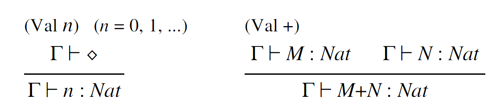
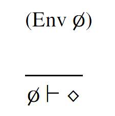
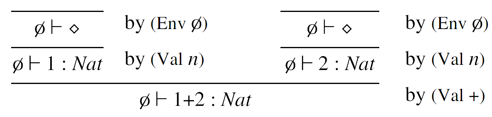

- # 类型系统的语言
	- 使用一种来自于自然推演的语言来描述类型系统
	- ## judgement
		- judgement是一条断言，形式如：
			- $\Gamma \vdash \mathfrak{I}$
				- 表示$\Gamma$ entails $\mathfrak{I}$
			- $\Gamma$表示已知的事实，$\mathfrak{I}$表示推导的结果
				- $\mathfrak{I}$中的所有自由变量都应该在$\Gamma$中被定义
			- 最终要的一类断言是**类型断言**
				- 表示每个变量的类型为X，形如：
				- $\Gamma \vdash M:A$
				- 表示类型环境$\Gamma$中，自由变量$M$具有类型$A$
			- 另一类常用的断言是
				- $\Gamma \vdash \diamond$
				- 表示类型环境$\Gamma$是良好**(Well Formed)**的
				- 即推不出矛盾([[$red]]==个人理解==)
		- 对于judgement 是否有效(valid)有很多种**语义表述（[[$red]]==个人理解==）**，但是最为有效且形式化的还是一种基于**type rules**的形式推演方法
	- ## Type Rules
	  collapsed:: true
		- 一种形式推演的方法
		- 一般形式为：
			- $$\begin{align*}&(\text{Rule Name} )\ (\text{Annotaions})\\ &\frac{ \Gamma_1 \vdash \mathfrak{I}_1\ldots \Gamma_n\vdash \mathfrak{I}_n\ (\text{Annotations})}{\Gamma \vdash \mathfrak{I}}\end{align*}$$
		- 例如：
			- {:height 120, :width 505}
			- 即，所有的自然数都有类型$Nat$，所有自然数相加得到的类型仍然是$Nat$
			- 第一个rule不需要任何前提，只需$\Gamma$是well formed
		- 一个非常基础的type rule是：
			- {:height 149, :width 139}
			- 一个空的类型环境一定是well formed的
		- 一个type rules 的集合叫做**(形式化)类型系统**
	- ## Type derivation
		- 类型系统的推导框架，根在下，judgement叶节点在上
		- 一个**有效的**judgement就是可以通过一步一步使用type rules 形成一个以该judgement为根的type derivation
		- 说白了，就是能给出一个形式推导的过程
		- 例子：
			- {:height 108, :width 436}
	- ## Well typing and type inference
		- 在一个给出的类型系统中，如果在一个类型环境下，能做出一个针对项 $M$的有效judgement，即$\Gamma \vdash M:A$，则称项$M$是well typed的（换言之，$M$能够被赋予一个类型）
		- 在一个类型环境下找到一个可以适用于项$M$的type derivation被叫做**type inference**问题
		- 如果无法找到一个项的类型，则该项会触发**typing error**
			- 例如，在上述的简单类型系统中，1+true无法找到任何类型
		- 由于type inference的具体方法对于具体的类型系统十分敏感，因此针对不同类型系统的type inference 算法的难度可能大相径庭
		- **多态（polymorphism）**的引入使得type inference变得十分困难
	- ## Type soundness
		- 一个类型系统并不是一些随意的type rules的集合，其必须满足最基本的类型正确性
	-
	-