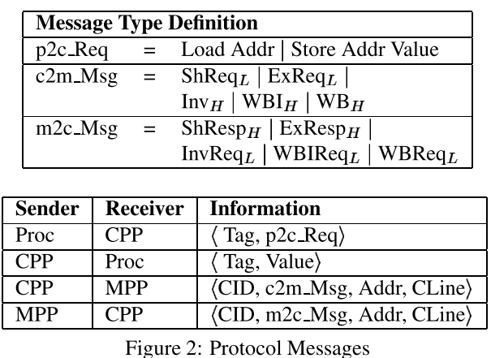
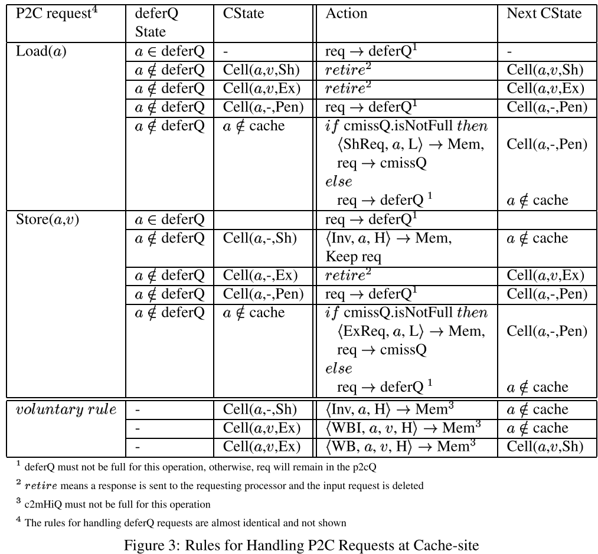
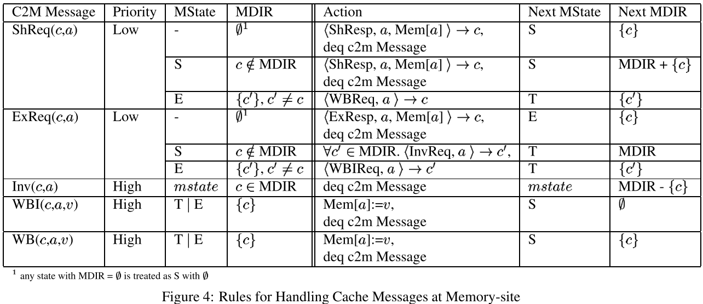
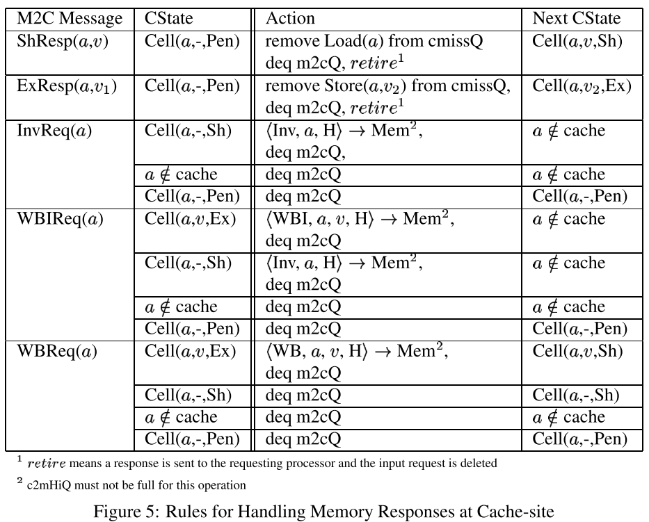

- ## [[$red]]==注意！==
	- 此篇笔记仅仅是记述论文 中对于MSI协议的一种实现
	- 因此本笔记的内容[[$red]]==**不一定具有普遍性**==，仅作为对于阅读论文Modular Deductive Verification of Multiprocessor Hardware Designs时的补充笔记
- # 状态
	- ## cache中内存地址的状态
		- **Sh**(are)：存在于cache的某个子集中，**只读**
		- **Ex**(clusive)：在某一个cache中独有，已被修改
		- **Inv**(alid)：仅存在于主存中
		- **Pen**(ding)：中间状态，因为状态的迁移无法原子执行而存在
	- ## directory中的状态
		- 每一个processor都有一个directory(MDIR)来追踪每一个内存地址的状态
		- **E**，在某一个cache中，exclusively
		- **S**，在某个cache的子集中被共享
		- **T**，处于一个迁移中的状态
- # 信息
	- 
	- **CPP**：Cache Protocol Processor
	- **MPP**：Memory Protocol Processor
	- 消息被分为两种**[[$red]]==优先级==**
		- **低优先级**：代表新的请求的消息
			- InvReq
			- WBReq
			- WBIReq
			- ShReq
			- ExReq
		- **高优先级**：对于请求做出的回应
			- Inv
			- WB
			- WBI
			- ShResp
			- ExResp
	- 为了防止死锁，低优先级的消息不能阻止高优先级消息流
- # 协议描述
	- ## 在cache层面处理processor的请求
		- 
		- 处理器通过向Processor-to-Cache queue(p2cQ)中放置请求的方式来做出请求
		- CPP额外还维护两个队列
			- **deferred queue**(deferQ)
				- 存放可能因为各种原因被延期的请求
				- 如果此队列满了，则CPP会停止处理新的请求直到来自processor的请求能够被处理
			- **cache miss queue**(cmissQ)
				- 存放由cache转发到内存的请求
				- 如果此队列满了，则接下来的cache miss请求可能会被防区deferQ或者留在p2cQ中
		- CPP处理请求时从p2cQ头部开始
			- 如果该请求的地址在deferQ中找到，则该请求也会被放入deferQ
			- 否则CPP在cache中查找该请求的地址：
				- 对于一个load请求，如果地址在cache中(状态为Sh或Ex)，则返回值
				- 对于一个store请求，仅在该地址处于Ex状态则立即处理该请求
				- 如果以上任和一种情况发生，则立即处理该请求，然后将回应写入c2pQ
				- 对于一个store请求，如果该地址处于Sh状态，则CPP无效化该条目，并发送ExReq请求
			- 反之，如果cache中该地址处于Pen状态，该请求会被放入deferQ
			- 又或者，如果该地址不在cache中
				- 如果cache未满，则cache向内存发去请求（将请求压入c2mQ）
					- 如果是load请求，压入ShReq请求
					- 如果是store请求，压入ExReq请求
					- 并把当前的地址在cache中标记为Pen
				- 如果cache已满
					- 需要替换掉某一entry，并向directory发送消息
						- 如果该entry处于Sh状态，发送 Invalidate message（Inv）
						- 如果该entry处于Ex状态，发送 write back and invalidate消息(WBI)
		- 当deferQ头部的的请求的也可以被处理时，则将其作为一个新的请求处理
			- 一般来说，为了性能考量，新来的请求的优先级高于deferQ中的请求
	- ## 在内存层面处理cache请求
		- 
		- MPP维持两个队列，一个高优先级队列和一个低优先级队列
		- 每一条送达的请求都会被放入对应优先级的队列，即[[$red]]==**先处理回应，再处理请求**==
		- **只有当高优先级的队列为空时才会处理低优先级队列中的请求**
		- 当某队列满时，停止接受对应的消息直到由请求出列
		- 为了避免死锁，低优先级的队列要足够大，大到能够收下来自所有cache的最大数量的低优先级请求
			- 和cmissQ的最大大小有关
		- MPP收到一个来自缓存c关于地址a的ShReq请求时
			- 如果a的状态是S且c不是该地址的directory的member，则向c发送ShResp的消息，并且把c加入directory的member列表
			- 如果a是被某一个缓存c' exclusively held，则MPP stalls，并向c'发送一个WBReq，要求c'将值写回，并将a的状态改为T
		- MPP收到一个来自缓存c有关地址a的ExReq请求时
			- 如果没有其他的cache持有a的copy，则向c发送ExResp消息，并在directory中标记c exclusively holds a
			- 如果a处于S状态，向所有持有a的cache发送InvReq消息，该地址被标为T状态
			- 如果a处于E状态，则向exclusively持有a的缓存发送write back and invalidate(WBIReq)消息，a被标记为T状态
		- MPP收到一条来自缓存c的Invalidate消息时
			- 将c从a的directory中去除
		- MPP收到一条来自c的WBI消息时
			- 将值写回内存，并从a的directory中去掉c
		- MPP收到一条来自c的WB消息时
			- 将值写回内存，并将a的状态改为S
	- ## 在cache层面处理来自内存的消息
		- 
		- 当CPP收到来自内存的回应(ShResp,ExResp)时
			- 将对应的cache entry的状态改变
			- 将cmissQ中对应的条目出列
			- 在c2pQ中添加一条回应
			- 做完上述处理之后，将此来自内存的回应出列
		- 当CPP收到来自内存的请求时
			- 如果cache条目处于合适的状态，则改变cache条目的状态
				- 否则直接删除该请求
			- 如果需要发送回应则发送，
			- 举例：
				- 对于InvReq，将对应的处于Sh状态的copy无效化
				- 对于WBIReq，发送写回回应，并无效化该处于Ex状态的copy
				- 对于WBReq，发送协会回应，并将处于Ex状态的copy改变为Sh状态
- # Voluntary Rules
	- 对于CPP或MPP，并不是要收到请求才会进行处理
	- 对于CPP
		- 可以自发在prefetch阶段发送消息
		- 可以抢先无效化或者写回值
	- 对于MPP
		- 可以抢先要求任何cache无效化
	- 这些自愿规则用于处理capacity miss(因为容量不够大导致的miss)