- **四元数：Quaternion**
- 在计算机图形学中，常用于表示三维空间下的旋转
- 本笔记页不记载四元数相关性质的详细推导，仅记载四元数的**表示方式**，**在表示三维空间下旋转的作用**和一些**实用性质**。
	- 具体的推导过程可参看pdf文件 和作者的这个[github repo页面](https://github.com/Krasjet/quaternion/tree/master)
	- 至于为什么要使用四元数，四元数和欧拉角之间的区别以及欧拉角会导致的**[[$red]]==万向锁(Gimbal Lock)==**，可参看这个pdf文件 
- # 三维空间的轴角式(Axis-Angle)旋转
	- 这种旋转的定义方式用于定义在三维空间下，绕任意一个**过原点轴**旋转任意角度的旋转方式
		- 如果需要绕一个不过原点的轴旋转，可以先将轴和物体(点)一并平移直到轴过原点，再进行旋转，之后再做平移的逆变换。
		- 这一部分在games101课程的[[第二课：变换]]中也有记录
	- 假设一个向量$\bold{v}$，绕着单位向量(轴)$\bold{u}$旋转$\theta$角之后得到$\bold{v}'$，则有：
		- $\bold{v}' = \cos(\theta)\bold{v}+(1-\cos(\theta))(\bold{u}\cdot\bold{v})\bold{u}+\sin(\theta)(\bold{u}\times\bold{v})$
	- 使用矩阵表达为：
		- 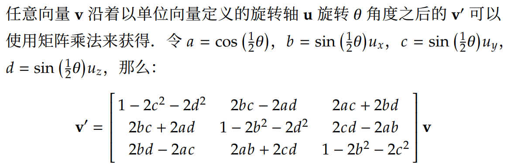{:height 168, :width 494}
- # 四元数的表示方式
	- 一个四元数可表示为：
		- $q=a+bi+cj+dk,\  (a,b,c,d\in \R)$
		- 其中$i,j,k$可类比虚数的部分定义，有：$i^2=j^2=k^2 = ijk = -1$
	- 一个四元数还可以表示为一个**向量**：
		- $q=[a,b,c,d]^T$
	- 还可以将四元数的实部和虚部分开：
		- $q=[s,\bold{v}], \bold{v} = [x,y,z]^T, s,x,y,z\in \R$
	- ## 一些关于四元数的定义
		- ### 模长(范数，Norm)
			- $\| q\| = \sqrt{a^2+b^2+c^2+d^2}$
			- 如果使用$q=[s,\bold{v}]$的表示方式，则还有：
				- $\| q\| = \sqrt{s^2 + \| \bold{v} \|} = \sqrt{s^2+\bold{v}\cdot\bold{v}}$
		- ### 加减法
			- 若$q_1 = [s,\bold{v}],q_2 = [t,\bold{u}]$，则有：
				- $q_1\pm q_2 = [s\pm t,\bold{v}\pm\bold{u}]$
				- 其中$\bold{v}\pm \bold{u}$定义同向量加减法
		- ### 标量乘法
			- 设一个标量$a$和一个四元数$q=[s,\bold{v}]$，有：
				- $aq = [as,a\bold{v}]$
				- 其中$a\bold{v}$定义同向量标量乘法
			- 四元数标量乘法满足交换律，即：$aq = qa$
		- ### 四元数乘法
			- 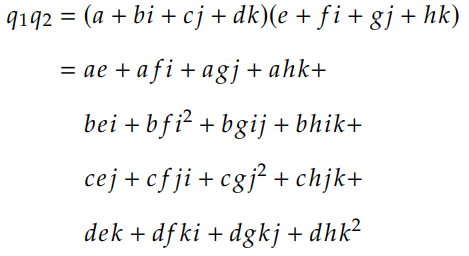{:height 182, :width 318}
			- 根据$i^2=j^2=k^2 = ijk = -1$可推出一张$i,j,k$之间相乘结果的表
				- 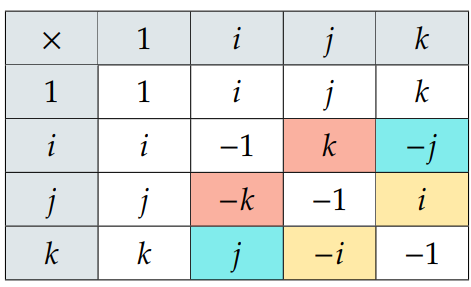{:height 135, :width 206}
				- 其中带颜色的格子表示乘法**[[$red]]==不满足==交换律**
					- 例如$ij$和$ji$的结果并不相同，需要注意
			- 根据上表化简的到四元数相乘的结果：
				- 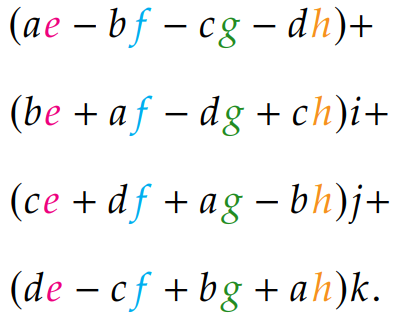{:height 141, :width 171}
			- #### 使用矩阵形式表达
				- 若$q_1 = [a,b,c,d],q_2=[e,f,g,h]$，则$q_1$**左乘**$q_2$，即$q_1q_2$为：
					- 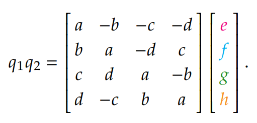{:height 112, :width 226}
				- $q_1$**右乘**$q_2$为：
					- 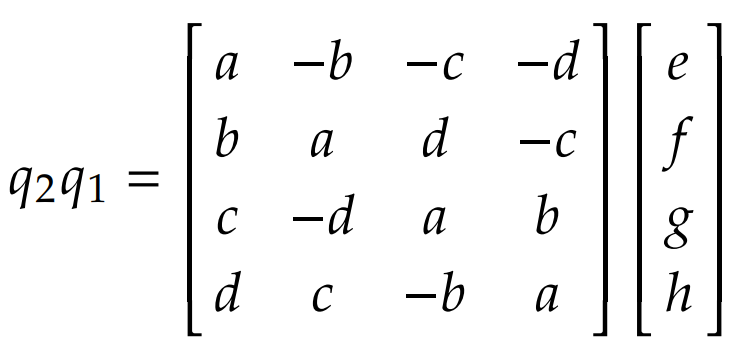{:height 112, :width 220}
			- #### Graßmann 积
				- Graßmann 积是四元数乘积的一种表示方式，可用于各种四元数相关的推导过程中
				- 若$q_1 = [s,\bold{v}],q_2 = [t,\bold{u}]$，则有：
					- $q_1 q_2 = [st-\bold{v}\cdot\bold{u},s\bold{u}+t\bold{v}+\bold{v}\times\bold{u}]$
		- ### 纯四元数(Pure Quaternion)
			- **实部为0**的四元数
			- 对于两个纯四元数$v=[0,\bold{v}],u= [0,\bold{u}]$，有：
				- $vu = [-\bold{v}\cdot{u},\bold{v}\times\bold{u}]$
		- ### 逆和共轭
			- 四元数$q^{-1}$是四元数$q$的**逆**，规定：
				- $qq^{-1} = q^{-1}q = 1, q\ne \bold{0}$
			- 对于一个四元数$q=[s,\bold{v}]$，其**共轭四元数**为：
				- $q^*=[s,-\bold{v}]$
			- $qq^*=[s+\bold{v}\cdot\bold{v},\bold{0}]$，这个结果是一个实数，等于：
				- $s^2+x^2+y^2+z^2 = \| q\|^2$
			- 同时还有：$q^*q = qq^*$，所以：$q^{-1} = \frac{q^*}{\| q\| ^2}$
			- 对于$\| q\|=1$的**单位四元数**来说，$q^{-1}=q^*$
- # 四元数表示三维旋转
	- 任意向量$\bold{v}$绕单位向量$\bold{u}$旋转$\theta$度之后的$\bold{v'}$可通过四元数乘法表示为：
		- $v' = qvq^* = qvq^{-1}$
		- 其中：
			- $v = [0,\bold{v}],v' = [0,\bold{v'}],q = [\cos(\frac{1}{2}\theta),\sin(\frac{1}{2}\theta)\bold{u}]$
		- 因此任意**单位**四元组$[a,\bold{b}]$都可表示一次旋转，其旋转角度$\theta = 2\cos^{-1}(a)$，旋转轴$\bold{u} = \frac{\bold{b}}{\sin(\cos^{-1}(a)}$
	- ## 旋转复合
		- 可以证明：对于任意四元数$q_1,q_2$，有$q_1^*q_2^*=(q_2q_1)^*$
		- 通过这一引理，可以得到旋转的复合为：
			- $q_2q_1vq_1^*q_2^* = q_2q_1v(q_2q_1)^*$
	- ## 双倍覆盖(Double Cover)
		- 任意一个旋转角度都能找到两个四元数以完成旋转到相同方向，分别是$q$和$-q$，因为：
			- 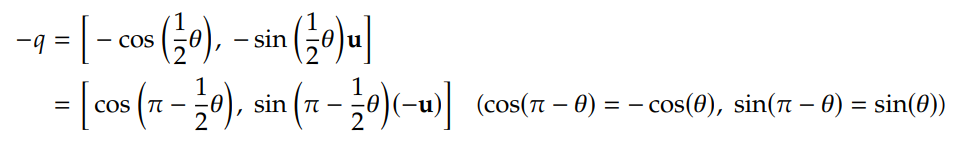{:height 92, :width 517}
		- 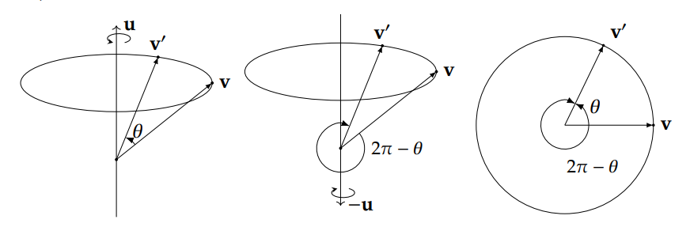{:height 180, :width 540}
		- 也可以简单通过四元数旋转公式推导得出：
			- $(-q)v(-q)^*=(-1)^2qvq^* = qvq*$
		- 同时可以证明：**任何一个单位四元数都对应一个3D旋转**，这也能表达为，**单位四元数与3D旋转[[$red]]==2对1满射同态(2-1 Surjective Homomorphoism)==**，更简单的表述就是单位四元数**双倍覆盖**3D旋转
	- ## 四位数指数形式表示旋转
		- 对于一个单位四元数$u=[0,\bold{u}]$，有：
			- $e^{u\theta} = \cos(\theta)+u\sin(\theta)= \cos(\theta)+\bold{u}\sin(\theta)$，其中$\bold{u}$是一个单位向量
		- 根据这一表达，$q=[\cos(\theta),\sin(\theta)\bold{u}]$可以表示为$e^{u\theta}$
		- 进一步，旋转可被表示为：
			- 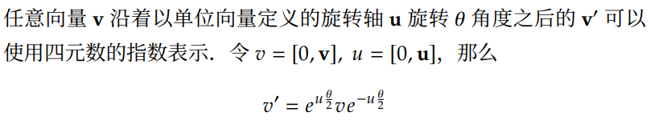{:height 106, :width 529}
		- 根据这一指数表达还可以定义两个运算：
			- **单位四元数**$q=[\cos(\theta),\sin(\theta)\bold{u}]$的**对数运算**为：
				- $\log(q)=\log(e^{u\theta})=[0,\bold{u}\theta]$
			- **单位四元数的幂运算**
				- $q^t = (e^{u\theta})^t = [\cos(t\theta),\sin(t\theta)\bold{u}]$
					- 可以看到幂运算就相当于把旋转角放大了$t$倍，并不改变旋转轴
- # 四元数插值
	- 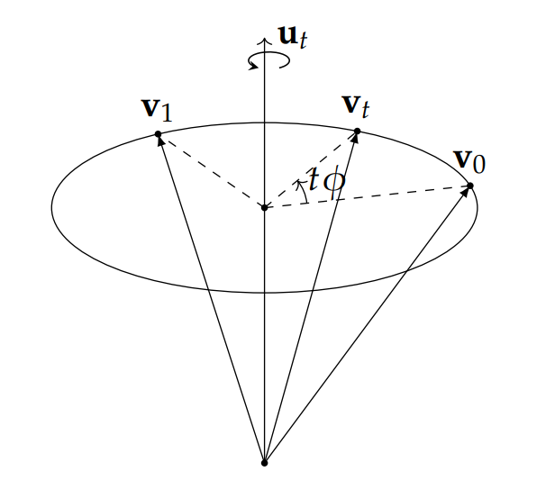{:height 261, :width 297}
	- 假设一个四元数将向量$\bold{v}$旋转为$\bold{v}_0$，另有一个四元数将$\bold{v}$旋转为$\bold{v}_1$，则希望找到一个四元数$q_t$将$\bold{v}$旋转到某个中间位置$\bold{v_t}$
	- 可以先考察什么四元数会将$\bold{v}_0$旋转到$\bold{v}_1$，即$\Delta q$
		- $\Delta q q_0 = q_1$
		- $\Rightarrow \Delta q = q_1q_0^*$
	- 若对$\Delta q$取$t$次方，便能控制这个中间旋转的角度，即
		- $q_t = Slerp(q_0,q_1;t) = (q_1q_0*)^tq_0$
	- 这个公式简洁明了，但是涉及到多个四元数乘法，还需要幂运算，成本过高，实际使用频率并不高
	- ## Slerp与Nlerp
		- Slerp的实际使用形式为：
			- 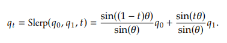
			- 其中$\theta = \cos^{-1}(q_0\cdot q_1)$
			- 但是其存在$\theta$过小时容易出现除0错误的情况
		- Nlerp的表达式如下
			- 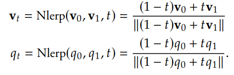{:height 110, :width 346}
			- 其性能会好不少，但是存在插值变化速度不平均的问题
			- 不过在$\theta$足够小的情况下误差会很低，且不会出现除0错误
		-