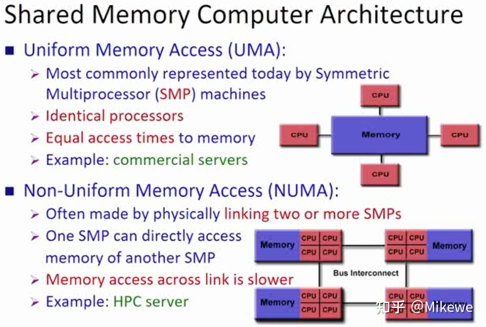
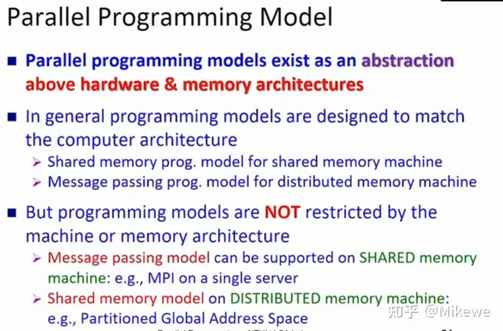

- # 并行计算机的分类和编程模型
	- ## Flynn经典分类法
		- 按照处理器的角度进行分类
		- 两个维度，**指令**和**数据**
		- ### SISD
			- 单指令，单数据，即串行计算机
		- ### SIMD
			- 同时执行一条命令，但是该指令可以同时处理多个数据
		- ### MISD
			- 数据项通过指令不同，不常用
		- ### MIMD
			- 现代常用结构
	- ## 按内存分类
		- ### 共享式内存
			- 又分为UMA和NUMA
			- 
		- ### 分布式内存
			- 不是使用内部总线，而是使用互联网来链接
			- https://pic1.zhimg.com/v2-f6c3c9b7e90ddd492e1c4ee8e299f670_r.jpg
	- ## 信息传递方式
		- 
		-