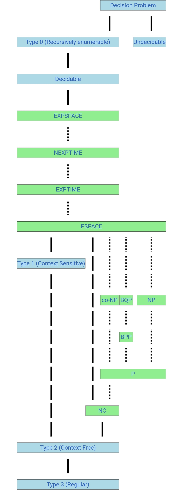

- # P和NP问题
	- {:height 294, :width 465}
	- ## P问题
		- 可以给出一个多项式时间复杂度算法的问题
	- ## NP问题
		- 无法确定是否有多项式时间复杂度算法，但是给出一个答案，可以在多项式时间内验证该答案是否正确的问题
		- P问题是NP问题的子集
	- ## NP-COMPLETE问题
		- 满足两条：
			- 是一个NP问题
			- 所有的NP问题都可以归约到这个问题
		- 一般证明一个问题是否是NPC问题的方法是先证明该问题是一个NP问题，然后再将一个一致的NPC问题归约到该问题
	- ## NP-HARD问题
		- 满足NPC问题定义的第二条，但不一定要满足第一条
		- 范围比NPC更广
- # 复杂性类
	- 实际上P和NP问题只是复杂性类中的一个小分类
	- {:height 1038, :width 392}
	- {:height 266, :width 284}
	- **PSAPCE**：再多项式空间内能解决的问题
	- **NEXPTIME**：再**非确定性图灵机**上，再指数时间能够解决的问题