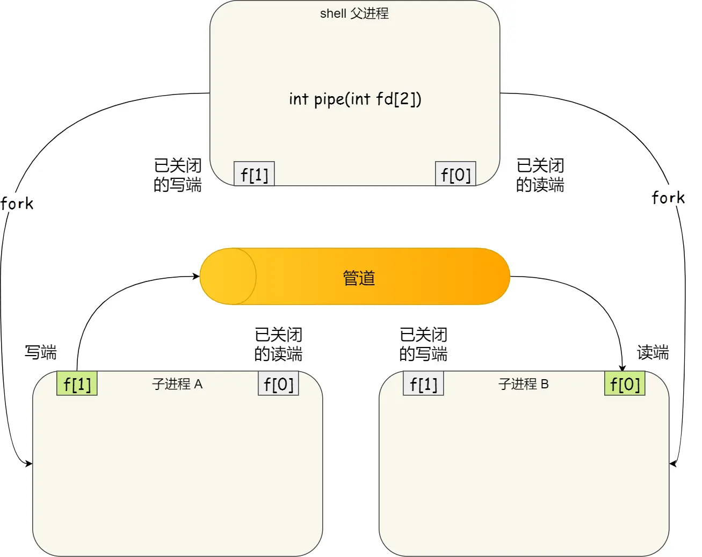
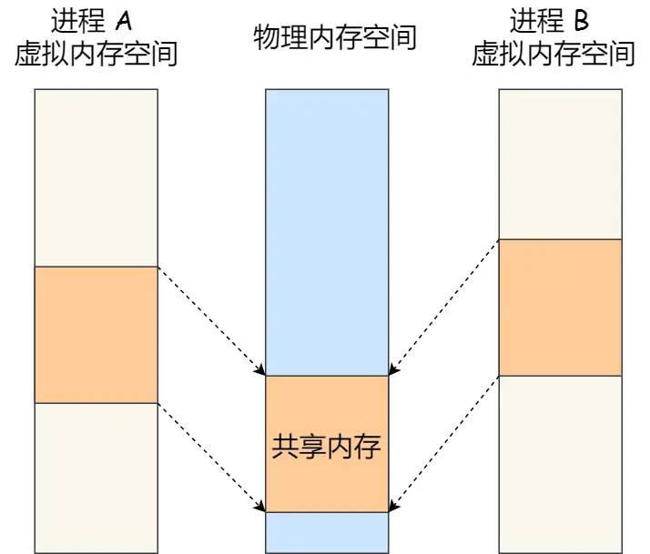
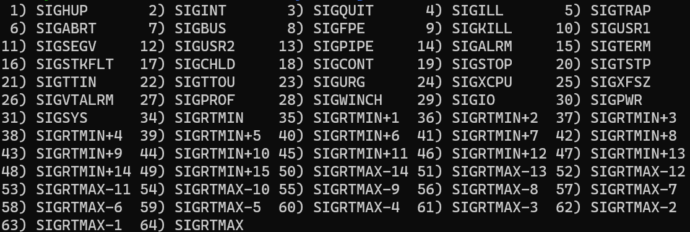

- 进程间地址空间是独立的，如果需要互相访问或通信，必须经过内核
- # 管道
	- 是一种**[[$red]]==同步==**通信方式
	- 在linux的shell命令之间可以使用`|`将上一个程序的输出作为下一个程序的输入，这就是一个**匿名管道**
	- linux下也可以创建**命名管道**，也即`FIFO`
		- 使用`mkfifo`来创建管道，并指定名字
			- `mkfifo Pipe0`
		- 利用输出重定向来向管道中输出
			- ``ls -lah > Pipe0``
		- 利用输入重定向来从管道中读取数据
			- ``cat < Pipe0``
	- linux下的匿名管道实际上是利用了``pipe``系统调用
		- 
	- ## pipe和fifo的区别
		- pipe完全存在于内存中，在磁盘上不会留下痕迹，因此只能在父子进程之间使用
		- fifo会在磁盘上创建一个管道文件，但是这个管道文件并不会存储实际的管道数据，管道数据还是存储在内核内存中
			- 如果要使用fifo， 那么需要先使用open打开管道文件，再从中读取数据
			- 没有父子关系的进程之间也可以通过操作这个管道文件完成通信
		- fifo是全双工，pipe是单向的
- # 消息队列
	- 是一种**[[$red]]==异步==**通信方式，效率更高
	- 若A进程要给B进程发送消息，直接把数据放入消息队列即可
	- 本质是保存在内核中的**消息链表**，消息数据会按照双方约定的格式分成若干**数据块**，区别于管道的**无格式字节流**
	- 消息队列生命周期同内核保持一致，没有被消耗的数据会在关机或重启之后才被销毁，匿名管道则会随着进程的退出而被销毁
	- ## 缺点
		- **不适合大数据量传输**
			- Linux内核中定义了两个宏，``MSGMAX``和``MSGMNB``分别表示一条消息的最大长度和一个队列的最大长度，单位为字节
		- **存在用户态和内核态之间的数据拷贝开销**
			- 进程需要将用户态的数据写入内核地址空间，或反之从内核地址空间拷贝到用户地址空间，这一过程会伴随状态转移的开销
- # 共享内存
	- 将两个进程之间的某一段虚拟内存地址全都映射到相同的物理地址上，即可进行通信
	- 不进行用户态和内核态的迁移，也不会发生数据拷贝，效率更高
	- 
- # 信号量
	- 用于同步
- # 信号
	- 主条目：[[Linux信号概览]]
	- 
	- 对于一个，信号有如下处理方式
		- **执行默认操作**。linux对每种信号都有默认的处理函数
		- **捕捉信号**。为信号自定义信号处理函数，执行自己的期望的操作。``SIGKILL``和`SIGSTOP`**[[$red]]==无法被捕捉==**
			- 这两个无法被捕捉的信号，一个直接终止调进程，一个暂停进程执行，后续可以通过``SIGCONT``继续执行
- # Socket