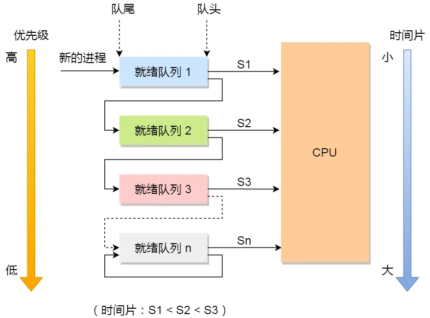

- 关于Linux中进程线程，稍微详细一点的阐述见 [[Linux下的线程实现概览]]
- # 进程
	- 一个加载进内存中，处于运行状态的程序
	- ## 对于进程的经典教科书阐释(八股)
		- 一个进程从创建到执行结束一共可能经历七个状态
			- {:height 435, :width 689}
			- **创建态(new)**：进程刚被创建或正在被创建的状态
			- **就绪状态(ready)**：处于内存中，随时可以被调度执行
			- **运行状态(running)**：正在占用CPU时间片
			- **阻塞状态(blocked)**：正在等待某一时间发生(如输入输出，信号量，互斥量)。也称等待状态(wait)
			- **挂起阻塞(suspended blocked)**：进程被**换出到外存(磁盘)**中，等待某个事件发生
			- **挂起就绪(suspended ready)**：进程被换出到外存中，如果被加载到内存中随时可以被执行
			- **结束态(end)**：完成执行，正在从系统中退出的状态
		- **挂起(suspend)**指的是从内存中换出到硬盘上的行为。一般在内存不够的情况下，操作系统会选择将一些进程换出。被换出的进程重新在入内存的过程被称为换入
		- 用户也可以主动将内存挂起，例如使用``<C-Z>``发送信号或使用``sleep``库函数
	- ## 进程控制结构
		- 操作系统利用**PCB(Process Control Block)**记录和描述进程
		- PCB是**进程存在的唯一标识**，一个PCB实例一般包含：
			- **进程描述信息**，包含
				- 进程标识符，每个进程的唯一标识符
				- 用户标识符，标识进程所归属的用户，主要为了共享和安全性
			- **进程控制和管理信息**，包含
				- 进程当前状态，即上文中的new，ready等状态
				- 进程优先级，在支持抢占式调度时调度器需要根据进程优先级来确定下一个调度执行的进程
			- **资源分配清单**
				- 内存地址空间信息，所有打开的文件列表和使用的IO设备信息
			- **CPU相关信息**
				- CPU中各个寄存器的值和一些CPU状态信息，用于恢复执行时重建CPU状态
		- PCB通常通过**链表**的形式组织在一起，形成多个PCB队列
			- 将所有就绪的进程PCB通过链表组织在一起，构成：**就绪队列**
			- 将所有被阻塞的进程PCB通过链表组织在一起，构成：**阻塞队列**
	- ## 进程控制
		- ### 创建进程
			- 申请一个空白PCB，填入相关信息
			- 分配所需资源，如内存
			- 将新PCB插入就绪队列，等待被调度执行
		- ### 终止进程
			- 进程可通过三种方式被终止：
				- 正常结束
				- 异常(exception)结束
				- 外界干扰(kill信号)
			- 终止进程的过程一般为
				- 查找要终止的进程的PCB
				- 若处于执行状态，立即终止执行并释放CPU资源
				- 若其有子进程，将进程的子进程交予1号进程接管
				- 将该进程所拥有的资源(打开文件，占用的设备)释放
				- 将PCB出队
		- ### 阻塞进程
			- 找到需要阻塞的进程的PCB
			- 若该进程为运行状态，保存其上下文，将状态改编为阻塞态，停止运行
			- 将PCB插入到阻塞队列中
		- ### 唤醒进程
			- 一个进程从阻塞态中苏醒需要其他进程通知其所等待的事件已经发生，通常是负责处理这件事的进程来处理，例如处理IO的进程告知等待IO的进程IO操作已经完成
			- 唤醒步骤：
				- 在等待某事件的阻塞队列中哦找到相应进程的PCB
				- 将其出队，江金城状态置为就绪
				- 把PCB插入就绪队列，等待调度执行
			- 一个进程的阻塞语句和唤醒语句必须成对出现，否则可能出现死锁
	- ## 进程上下文切换
		- Context Switch
		- 在某一个核上，从一个进程切换到另一个进程运行的过程称为**进程上下文切换**
		- 上下文一般包括CPU通用寄存器，控制寄存器和程序计数器的值
		- 实际上，上下文切换是针对CPU状态而言，对于CPU自身来讲是**进程**还是**线程**抑或是**中断**导致的上下文切换，其并不可见，也不关心
		- 但是从程序员，或操作系统的角度来说，这三种不同的导致CPU上下文切换的原因需要被区别对待，因此细分出了：
			- 进程上下文切换
			- 线程上下文切换
			- 中断上下文切换
		- 进程的上下文资源还包括了内核堆栈等内核空间资源
		- 在进行进程上下文切换时，上下文会被保存在PCB中，以便后续恢复
- # 线程
	- 由于进程是一个正在运行的程序的抽象，因此如何让一个程序并发执行多个任务的问题自然而然导向了线程
	- 线程是进程下的某个具体任务的抽象，每个线程都共享进程资源，互相通信和任务调度的开销都明显小于进程
		- 所谓共享的进程资源，实际就是进程虚拟空间地址下的所有可访问资源
		- 由于线程并没有自己的虚拟地址空间，而是在进程地址空间下运行，因此进程地址空间下的所有资源都可供线程使用
	- 在进程内进行线程上下文切换时，由于大量的资源共享，只需要保存线程私有数据即可，即CPU寄存器和线程栈
- # 调度算法
	- 虽说有很多教材都将**线程**视作最小调度单位，但是对于linux来说，其内部实际参与调度的还是进程，不论是轻量级进程还是普通进程
	- 一个调度算法应该尽量按照以下五种原则来设计
		- **CPU利用率**：应尽量确保CPU始终在运行某个进程，提高CPU利用率
		- **系统吞吐量**：吞吐量表示的是单位时间内CPU完成的进程数量。因此长作业时间的进程会降低吞吐量，相反，优先安排短作业时间的进程可以提升吞吐量
		- **周转时间**：周转时间是一个进程从创建到运行结束的总时间，基本上等于运行时间+等待时间+阻塞时间，一般希望这个时间尽可能低
		- **等待时间**：进程处于就绪队列中的时间的总和。
		- **响应时间**：从用户提交请求到系统第一次产生响应所花费的时间。在交互式系统中，响应时间几乎可以说是最重要的指标
	- ## 先来先服务(FCFS)
		- **First Come First Served**
		- 字面意思，就绪队列工作模式完全遵从FIFO
	- ## 最短作业有限(SJF)
		- **Shortest Job First**
		- 选择运行时间最短的任务运行
		- 极端情况下长任务永远得不到执行
	- ## 高相应比优先(HRRN)
		- **Highest Response Ratio Next**
		- 计算每个任务的优先权=(等待时间+要求服务时间)/要求服务时间
		- 优先权最高的任务优先执行
		- 随着等待时间增大，优先权也增大，不会出现永远无法被调度的情况
		- 此调度算法和上一个算法都是**[[$red]]==理想算法==**，因为一个进程要执行多长时间**[[$red]]==无法提前预知==**
	- ## 时间片轮转(RR)
		- **Round Robin**
		- 每个进程被分配一个**时间片(Quantum)**，该进程只被允许在这个时间片中运行
		- 用完时间片的进程会被中止运行并重新回到就绪队列的队尾
		- 时间片长度过短会导致频繁的换入换出开销，过长会延长响应时间
		- 一般认为20~50ms是一个合适的时间片长度
	- ## 最高优先级(HPF)
		- **Highest Priority First**
		- 一个进程的优先级分为静态优先级和动态优先级
			- 静态优先级在进程创建时就确定
			- 动态优先级可能随着进程等待时间和运行时间的因素动态调整
		- 抢占式和非抢占式
			- 抢占式调度会在更高优先级的进程出现时直接中止当前进程的运行，换用更高优先级的进程
			- 非抢占式调度在更高优先级进程到来时会先完成当前进程的运行，再换入更高优先级的进程
	- ## 多级反馈队列(MLFQ)
		- **Multi-Level Feedback Queue**
		- 将时间片轮转和最高优先级算法结合得到的调度算法
		- 
		- **多级**：分为多个优先级的队列，每个队列的优先级从高到低，优先级越高，时间片越短
		- **反馈**：如果有新的进程加入高优先级队列，停止当前任务转而执行高优先级的队列
		- 新到来的进程会被放入最高优先级队列的末尾，队列内部按照先来先服务进行调度
		- 如果一个进程在时间片内没有执行完毕，那么将会被暂停执行并被加入到更低一级优先级队列的末尾